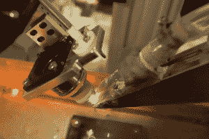
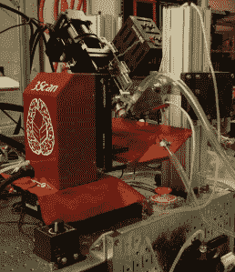

# 3Scan 为一台机器人显微镜筹集了 1400 万美元，这可能会加速药物发现

> 原文：<https://web.archive.org/web/https://techcrunch.com/2016/07/11/3scan-raises-14-million-for-a-robotic-microscope-that-could-accelerate-drug-discovery/>

机器人和软件不仅仅改变了仓库或厨房的体力劳动。他们也在改变医学研究。

旧金山一家名为 [3Scan Inc.](https://web.archive.org/web/20230404113734/http://www.3scan.com/) 的初创公司筹集了 1400 万美元的风险投资，以其专有的机器人显微镜和计算机视觉系统为参与药物发现的科学家自动进行组织分析。

据该公司的联合创始人兼首席运营官 [Megan Klimen 称，](https://web.archive.org/web/20230404113734/http://www.3scan.com/pandora-team/megan-klimen/) 3Scan 可以为一直坚持使用手动过程进行组织分析的药物研究人员消除一些繁重的工作。

但更重要的是，她说，3Scan 为科学家提供了比他们以前更好的视角和更全面的来自任何给定组织样本的数据集。

今天，如果研究人员需要检查患病组织，他们通常会获得 1 厘米的组织块，将其包埋在石蜡之类的东西中，然后将其切片，染色，在水浴中漂浮，并在不同类型的显微镜下检查。他们通常只取不到 12 个切片，并从这几个切片中得到的数据中推断出一切。

*3Scan 的系统使用机器人和机器视觉来分析组织样本。*

3Scan 的机器人显微镜可以非常精确地切割组织样本。Klimen 解释说，类似于微型熟食切片机，3Scan 的系统可以从每个组织样本中提取 10，000 个切片。机器人显微镜然后使用机器视觉生成一个数字的三维空间地图，研究人员可以在屏幕上查看和探索，就像地球的地形图一样。

Klimen 说，3Scan 的机器非常高效，它可以在一天内完成一年的组织样本分析，这是病理学家使用传统方法需要一年才能完成的。

这些扫描让研究人员能够看到以前没有看到的组织方面，如组织样本 A 和 b 之间的脉管系统或血流的变化。“你不必再使用采样技术来猜测组织中有什么，”首席运营官说。

[Lux Capital](https://web.archive.org/web/20230404113734/http://luxcapital.com/) 和 [Data Collective](https://web.archive.org/web/20230404113734/http://dcvc.com/) 领投了 3Scan 的 B 轮投资，参与投资的有杜比家族风险投资公司(Dolby Family Ventures)、OS Fund、Comet Labs 和 Breakout Ventures，以及这家初创公司无权命名的一家美国研究医院的风险部门。

这笔资金使该公司迄今为止的股本融资总额达到 2200 万美元。3Scan 于 2010 年由 Klimen 与首席执行官托德·霍夫曼(Todd Huffman)、首席技术官马修·古德曼(Matthew Goodman)和首席工程师科迪·丹尼尔(Cody Daniel)共同创立，在筹集股权融资之前，还从[突破实验室](https://web.archive.org/web/20230404113734/http://breakoutlabs.org/)和[初创企业智利](https://web.archive.org/web/20230404113734/http://startupchile.org/)筹集了 39 万美元的非稀释性赠款。

*3Scan 的机器人高通量显微镜正在工作。*

如今，该公司通过向参与临床前药物发现的制药公司、实验室或病理学家提供成像服务来创收。

未来，它将寻求 FDA 批准其机器用于检查人体组织。在临床前药物发现中，科学家正在评估来自小鼠或其他动物的组织。

Klimen 说，现在，“我们带着我们的仪器，我们已经用我们早期的融资超越了原型阶段，并向人们展示我们可以用它做什么。”

该公司目前在旧金山拥有约 30 名全职员工，旨在进入更大的药物发现项目，并为研究人员提供使用 3Scan 软件分析组织的新方法，包括:自动细胞计数和诊断。