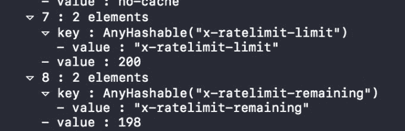
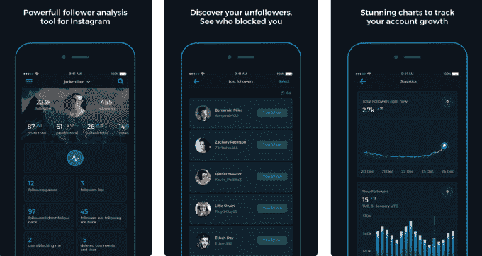

# 随着脸书追逐隐私，Instagram 突然扼杀了开发者——409 页

> 原文：<https://web.archive.org/web/https://techcrunch.com/2018/04/02/instagram-api-limit/409/>

毫无征兆地， [Instagram](https://web.archive.org/web/20191106092139/https://crunchbase.com/organization/instagram) 破坏了许多建立在其平台上的非官方应用。本周末，开发者们惊讶地发现，他们可以从 Instagram API 中获取的数据量大幅减少，API 限制从每小时每用户 5000 次调用缩减到 200 次调用。那些帮助人们了解他们的追随者是否追随他们或与他们互动、分析他们的受众或找到相关标签的应用程序现在很快就遇到了 API 限制，导致功能崩溃和用户愤怒。

两个消息来源证实了 TechCrunch 的新限制，开发人员抱怨 StackOverflow 上的情况。

令人费解的是，Instagram 拒绝对正在发生的事情发表评论，而其开发者费率限制了文档网站 [404s](https://web.archive.org/web/20191106092139/https://www.instagram.com/developer/limits/) 。它将确认的是，Instagram 已经停止接受新应用的提交，正如[脸书上周在剑桥分析公司(Cambridge Analytica)遭到强烈反对后宣布的那样。开发人员告诉我，他们感到被蒙在鼓里，并对变化](https://web.archive.org/web/20191106092139/https://developers.facebook.com/blog/post/2018/03/26/facebook-platform-changes/)[没有被安排](https://web.archive.org/web/20191106092139/https://developers.facebook.com/blog/post/2018/01/30/instagram-graph-api-updates/)甚至没有正式宣布感到愤怒，这阻止了他们重新构建应用程序以减少 API 调用。

一些开发人员怀疑，这一变化是 Instagram 母公司[脸书](https://web.archive.org/web/20191106092139/https://crunchbase.com/organization/facebook) 在接连不断的[数据丑闻](https://web.archive.org/web/20191106092139/https://techcrunch.com/2018/03/21/zuckerberg-cambridge-analytica/)之后争相改善数据隐私的一部分。在过去的一周，脸书宣布[关闭基于第三方数据经纪人的合作伙伴类别](https://web.archive.org/web/20191106092139/https://techcrunch.com/2018/03/28/facebook-will-cut-off-access-to-third-party-data-for-ad-targeting/)广告定位。TechCrunch 报道称，脸书还计划要求企业[承诺他们已经获得消费者的同意来获得他们的电子邮件地址](https://web.archive.org/web/20191106092139/https://techcrunch.com/2018/03/31/custom-audiences-certification/)，他们使用这些电子邮件地址通过定制受众进行广告定位。

像 Reports+这样的第三方 Instagram 平台应用程序为用户提供了对其受众的分析，但由于新的 API 限制，这些应用程序正在被打破

大多数公众的反弹都集中在#DeleteFacebook 上，而忽略了它的子公司 Instagram 和 WhatsApp。但 Instagram 可能希望通过将 API 调用限制削减至之前数量的 1/25 来防止不信任病毒感染其应用程序。

导致这种平台的过度使用可能会将开发者从 Instagram 生态系统中推开，并不是说该公司对其中的一些应用过于热衷。例如，Reports+每月收费 3.99 美元，为人们提供关于其 Instagram 粉丝的分析。Sensor Tower 告诉 TechCrunch，自 2016 年 10 月以来，Reports+在 App Store 和 Google Play 上的全球总收入超过 1800 万美元，仅上个月就超过 120 万美元。

Instagram 可能会理解地将这些应用视为寄生虫，向用户收取非官方功能的费用，或者鼓励受众增长黑客行为，从而导致垃圾邮件。今年 1 月，Instagram 宣布将在未来两年内关闭旧的 API，首先是在 7 月 31 日取消用户的关注者列表和关注/取消关注用户的功能。Instagram 多年来一直在慢慢尝试清理其平台，此前[在 2013 年威胁要对名称中带有“Insta”或“gram”的衍生应用](https://web.archive.org/web/20191106092139/https://www.cnet.com/news/instagram-dont-use-insta-gram-or-ig-in-your-app-name/)采取法律行动，而[在 2015 年关闭了允许非官方 Instagram feed 阅读应用的 feed API](https://web.archive.org/web/20191106092139/https://techcrunch.com/2015/11/17/just-instagram/) 。

Instagram 现在正在推动开发人员在一个更具限制性的平台上进行开发，该平台只允许经批准的合作伙伴按照用户的要求发布帖子，并且只能获得关于商业账户的提及和分析。这些变化将会杀死许多被本周末 API 限制降低所破坏的应用。

但至少开发商得到了关于 7 月 31 日截止日期的合理警告。由于脸书在上周一暂停审查任何新申请，试图在《剑桥分析》 事件后加强数据隐私保护，这一问题变得更加严重。Instagram 向 TechCrunch 证实，暂停应用程序提交延伸到 Instagram 的新图形 API，但没有解释任何关于 API 限制的内容。因此，Instagram 正在打破旧的应用程序，同时不允许开发者提交新的合规应用程序。

“Instagram 缺乏沟通让我感到沮丧，因为现在我正忙于更新我的应用程序，并处理大量不开心的客户，”一位不愿透露姓名的开发人员告诉我。“如果我有一个月的时间来准备，我可以调整事情，这样就更难达到极限。我会对我的要求更加节俭。突然之间，我在 Instagram 上收到了几十封电子邮件和短信，人们说这款应用程序不能用了。”

虽然脸书仔细检查引入大量用户数据的应用程序是明智的，但在没有警告甚至公告的情况下这样做是脸书在 2009 年左右试图快速控制垃圾邮件病毒时如何伤害其与开发者的关系的。脸书正在经历一场[良心危机](https://web.archive.org/web/20191106092139/https://techcrunch.com/2018/03/30/loose-lips-sink-apps/)，它的应用程序是否会被那些试图干涉选举或利用我们的数据牟利的人滥用为武器。

但作为世界上一些最受欢迎的开发者平台的所有者，看到它如此挣扎令人担忧。如果脸书和 Instagram 甚至不能以适当的程序和透明度传达其政策的变化，很难想象它有足够的决心坚定而公平地执行这些政策。

*关于脸书和 Instagram 的麻烦，请查看我们的专题文章:*