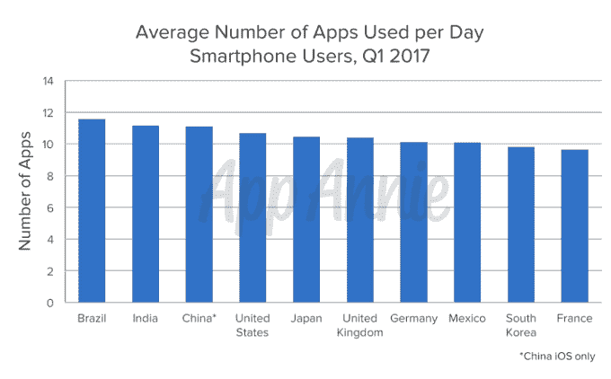
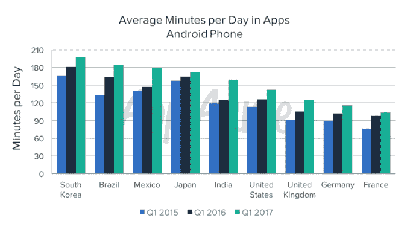
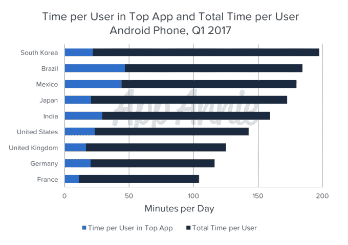

# 报告:智能手机用户每天使用 9 款应用，每月 30 款——第 423 页

> 原文：<https://web.archive.org/web/https://techcrunch.com/2017/05/04/report-smartphone-owners-are-using-9-apps-per-day-30-per-month/423/>

根据 App Annie 本周发布的一份新报告，智能手机用户在应用上花费的时间比过去几年多，现在每月访问 30 多个应用。这 30 个应用程序约占用户安装在智能手机上的应用程序的三分之一到二分之一。报告发现，使用这些应用程序是一种日常习惯，因为人们现在平均每天至少启动 9 个应用程序。

每月领先使用该应用程序的国家包括印度、巴西、中国、韩国、美国、法国、英国、日本和墨西哥。(见下文)

报告还指出，iPhone 用户倾向于比 Android 用户使用略多的应用程序，但 Android 用户使用的游戏要多 30%以上。

起初，用户每天访问近 10 个应用的消息听起来像是几年前的一份报告中的显著增长，该报告描绘了一幅不同的应用使用情况。根据 Forrester Research 2015 年的一项研究[，大部分用户的时间都花在了使用](https://web.archive.org/web/20190924201247/https://beta.techcrunch.com/2015/06/22/consumers-spend-85-of-time-on-smartphones-in-apps-but-only-5-apps-see-heavy-use/)[他们从 App Store 安装的五个非原生应用](https://web.archive.org/web/20190924201247/https://beta.techcrunch.com/2015/06/22/consumers-spend-85-of-time-on-smartphones-in-apps-but-only-5-apps-see-heavy-use/)上。(所谓非原生应用，是指你的手机没有附带的应用，比如电子邮件、日历、信息等。)

然而，Forrester 在其分析中排除了预装应用，而 [App Annie](https://web.archive.org/web/20190924201247/https://crunchbase.com/organization/app-annie) 则没有。事实上，它表示，iPhone 上的实用程序和 Android 上的工具占了最大的月使用量，这在很大程度上是由于 iOS 上的 Safari 和 Android 上的 Google 等预装应用程序。

换句话说，当你从 App Annie 的测量中剔除预装应用时，你可能会得出与 Forrester 相同数量的应用。

此外，App Annie 的新数据支持了之前尼尔森的一份报告，该报告声称消费者每月可以管理的应用数量有上限。同样在 2015 年，[尼尔森表示，消费者每月使用 26 至 27 款应用](https://web.archive.org/web/20190924201247/https://beta.techcrunch.com/2015/06/11/time-spent-in-apps-up-63-percent-over-past-two-years-but-apps-used-monthly-shows-little-change/)。App Annie 指出，这一趋势在很大程度上仍在继续，平均每月有 30 款应用被使用。

顺便说一下，这种趋势还有一个名字——30:10 规则(意思是每月大约 30 个应用，每天 10 个)。

除了实用程序和工具，其他受欢迎的应用程序类别包括社交网络(iOS)、通信(Android)、生产力(iOS 和 Android)和社交(Android)。约会和生产力应用程序是启动最多的，每天四个会话的数量最多。

App Annie 指出，过去两年花在应用上的时间也有所增加。如今，美国用户平均每天花在应用程序上的时间超过 2 小时 15 分钟，相当于一年中的一个多月。在韩国、巴西、墨西哥和日本，这个数字甚至更高，用户平均每天约 3 小时。

在巴西和墨西哥，一半的用户时间花在社交和通讯类应用上，而在韩国和日本，游戏占据了 25%的使用量。

App Annie 表示，同样值得注意的是，在所分析的大多数国家，超过 80%的应用使用发生在该国顶级应用之外的应用中——这意味着即使 WhatsApp 和脸书等应用占据主导地位，但用户仍有时间可以利用。