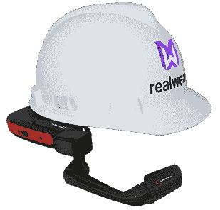
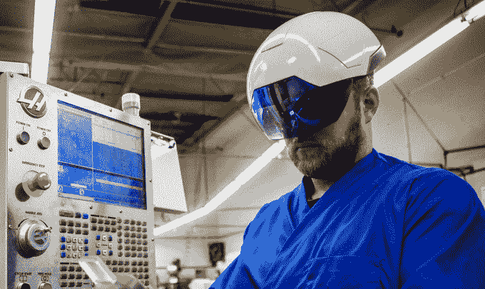

# RealWear 筹集了 1700 万美元，因为它希望采取更简单的方法来实现企业 ar 头盔——第 458 页

> 原文：<https://web.archive.org/web/https://techcrunch.com/2018/02/14/realwear-raises-17m-as-it-looks-to-take-a-simpler-approach-to-enterprise-ar-headgear/458/>

# RealWear 筹集了 1700 万美元，因为它希望对企业 ar 头盔采取更简单的方法

随着增强现实行业慢慢成熟，业内人士希望实现他们一直宣扬的无处不在的道路，事实证明，他们对谷歌多年前通过眼镜耳机展示的愿景表现出了更多的赞赏。

RealWear 的目标是避开其他人向企业客户推销的太空时代改变现实的头盔，支持 ar 耳机解决方案，让工业工人体验免提导航任务所提供的实用功能。

RealWear 的 HMT-1

该公司的 [HMT-1](https://web.archive.org/web/20190401222326/https://shop.realwear.com/collections/hmt/products/hmt-1) 耳机是对谷歌企业版眼镜的坚固、更强大的模仿，其操作更类似于免提平板电脑，而不是我们通常从 AR 眼镜公司看到的。该公司的产品为企业客户提供了一些不错的好处，这些客户专注于通过使用基本上是太阳镜的光学系统为用户的视觉增加不透明性，从而在不损害佩戴者视觉的情况下增加功能。

这家初创公司今天宣布，它已经在由哥伦比亚风险投资公司(Columbia Ventures Corporation)牵头的 A 轮融资中筹集了 1700 万美元。洛维里表示，他的公司已经卖出了数千个耳机，2017 年实现了 200 万美元的收入，他相信 2018 年可以实现 2000 万美元的收入。外部资金的一大重点将是扩大公司的销售和营销团队。

RealWear 首席执行官安迪·洛维里之前是企业 AR unicorn Daqri 的[总裁，他说他对这家初创公司忽视不那么显眼的外形因素的愿景感到失望。虽然 Daqri 一直专注于为企业客户构建具有环境意识的 HoloLens-lke 交互，但 RealWear 利用了一个不透明的 HUD 显示器，通过一个可以移开的手臂反映到用户的视觉中。我还没有机会尝试其中的一个，所以我不能说这种设计感觉如何，但很明显，这家初创公司希望将设备的重量从用户的脸上移开，这在视觉上与 Daqri、HoloLens 和 ODG 等竞争对手不同。](https://web.archive.org/web/20190401222326/https://beta.techcrunch.com/2014/06/05/ar-startup-daqri-hires-ex-raytheon-exec-andy-lowery-as-it-expands-sales-to-industrial-clients/)

Daqri 头盔

“增强现实领域有很多混乱，”洛维里告诉 TechCrunch。“它充斥着许多总体上不熟悉行业的技术专家。”洛维里在雷神公司工作了六年，领导该公司的电子战部门。

洛维里表示，他认为像 RealWear 这样的系统可以为工业过程的维护/维修/操作环节提供更多好处，而更复杂的带有空间感知传感器的 ar 耳机更适合制造业。

RealWear 技术的另一个优点是它的简朴；RealWear 专注于不需要太多想象力(或训练)的界面导航，而不是创建一个可以像朋友一样交谈并使用 3D 界面魔法导航的测试技术。你只需说出你想选择的菜单项，就可以了。这没什么特别有趣的，但也不是特别令人困惑，即使用户处于特别嘈杂的场景中，它也允许更高的准确性。

RealWear HMT-1 在网上出售，售价 2000 美元。