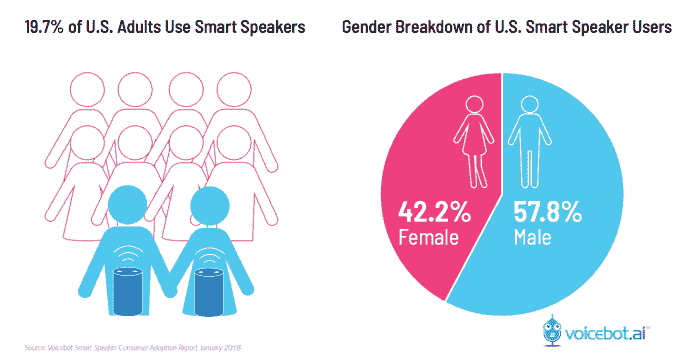
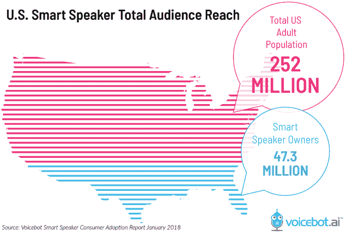
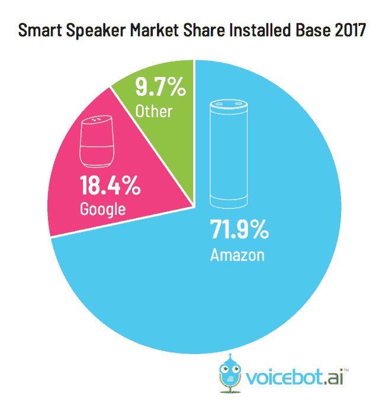
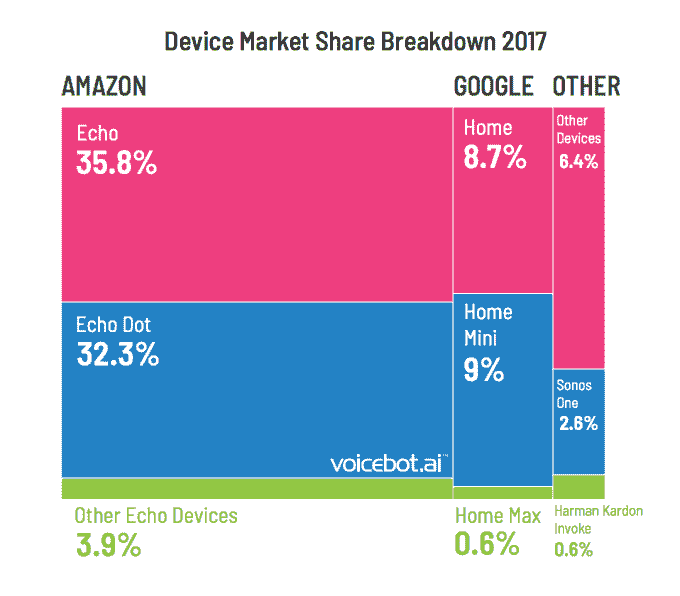
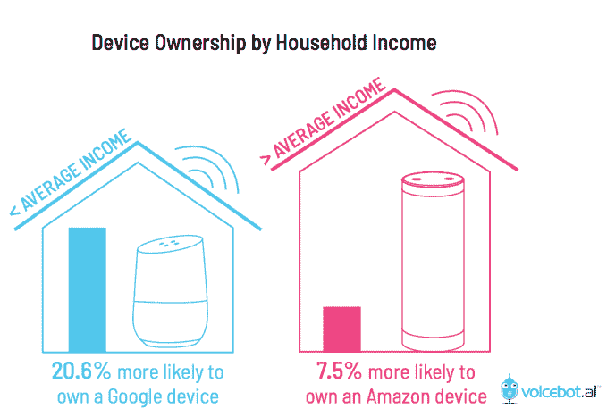

# 报告称，4730 万美国成年人拥有智能音箱

> 原文：<https://web.archive.org/web/https://techcrunch.com/2018/03/07/47-3-million-u-s-adults-have-access-to-a-smart-speaker-report-says/>

根据 Voicebot.ai 本周发布的新研究，如今近五分之一的美国成年人拥有智能音箱。这意味着这些语音驱动设备的采用在两年内增长到 4730 万美国成年人，占美国成年人口的 20%。

澄清一下，“使用智能音箱”是指成年人家里有一个，但他们可能不是主要用户。因此，根据这项研究，配偶、室友或同居伴侣也有资格成为智能音箱用户。

这是一个值得指出的差异，特别是如果与智能手机或可穿戴设备等其他技术设备进行比较的话，这些设备往往只有一个所有者。那么，[将](https://web.archive.org/web/20230327012845/https://visual.ly/community/infographic/technology/reaching-50-million-users)智能音箱的采用与其他技术进行比较可能更准确。

例如，电视机用了 13 年才达到 5000 万台，而智能音箱只用了 2 年。互联网用户达到 5000 万用了 4 年，脸书用了 2 年。当然，这些都不是苹果对苹果的比较，特别是考虑到所涉及的成本(或缺乏成本)，以及技术采用的速度越来越快。不过，看到智能扬声器的位置还是很有趣的。

该报告的调查结果基于 2018 年 1 月对 1，057 名美国在线成年人的调查，但设备所有权被下调，以补偿在线成年人占美国人口 88.5%的事实。

除了所有权，调查还揭示了智能音箱拥有者的特征。

例如，市场覆盖范围目前在性别上并不一致——57.8%的所有者认为是男性，而 42.2%是女性。大多数人(近三分之二)只拥有一台设备。这在某种程度上表明，用户没有看到在家中传播设备的需求(或者年轻一代向城市和他们的小公寓迁移的情况也在这里发挥了作用)。)

对于智能扬声器制造商，如亚马逊和谷歌，以及最近的苹果，这也意味着这是一个零和游戏。设备制造商正在努力成为*家庭的智能扬声器，因为人们通常不会买第二个。*

除了 67.5%的单设备用户，19.3%的用户拥有两个智能扬声器，更少的用户拥有三个或四个。平均每个消费者拥有 1.8 台设备。但鉴于目前的采用情况，设备制造商目前仍有大量潜在的新客户可以销售。

消费者倾向于在客厅(45.9%)或厨房(41.4%)使用智能扬声器，其次是卧室(36.8%)和家庭办公室(10.9%)。

对于语音应用开发者来说，这意味着专注于音乐和娱乐在短期内会卖得更好，但它也为那些开发工作场所应用的人描绘了一幅未来机会的图景——这是一个尚未被广泛采用的领域，但可能是下一个——[特别是如果亚马逊有自己的方式。](https://web.archive.org/web/20230327012845/https://techcrunch.com/2017/11/29/amazon-is-putting-alexa-in-the-office/)

该报告还再次确认了亚马逊在市场上的领先地位，其设备安装基数为 71.9%，而谷歌为 18.4%，还有 9.7%的“其他”设备(包括亚马逊和谷歌以外的其他公司的 Alexa 和谷歌助手驱动的设备，以及 Cortana 设备)。)

然而，请记住这些是美国的数字。与 iPhone/Android 之战类似，谷歌在全球其他国家领先，包括 2017 年的加拿大、法国和澳大利亚，亚马逊在英国和德国的领先优势缩小。

亚马逊的 Echo 和 Echo Dot 占据了近三分之二的市场份额，这主要是因为它们上市的时间更长。但新的销售表明，人们更喜欢更小尺寸和低价位的智能设备，如 Echo Dot 和 Google Home Mini，后者的销量在三个月内超过了 Google Home。

至于谁选择亚马逊还是谷歌，收入高于平均水平的家庭选择 Echo 的可能性高出 7.5%，而收入低于全国平均水平的家庭则倾向于拥有谷歌智能扬声器。

扬声器对 iPhone 用户也很有吸引力，22%的用户更有可能拥有扬声器，30%的用户不太可能从谷歌购买扬声器。

关于使用案例和语音商务的更多细节在完整的报告中，[这里](https://web.archive.org/web/20230327012845/https://www.voicebot.ai/2018/03/07/new-voicebot-report-says-nearly-20-u-s-adults-smart-speakers/)。

*更新:这篇文章的原始版本中一个错误标注了美国人口的图片被删除了。这幅图写着“美国总人口 2.52 亿；这是美国成年人口，这 20%的数字是从哪里来的。但是图表让这一点变得不清楚。* *我们要求图形的更新版本，现已提供。(美国东部时间 2018 年 2 月 7 日下午 3 点 40 分)*