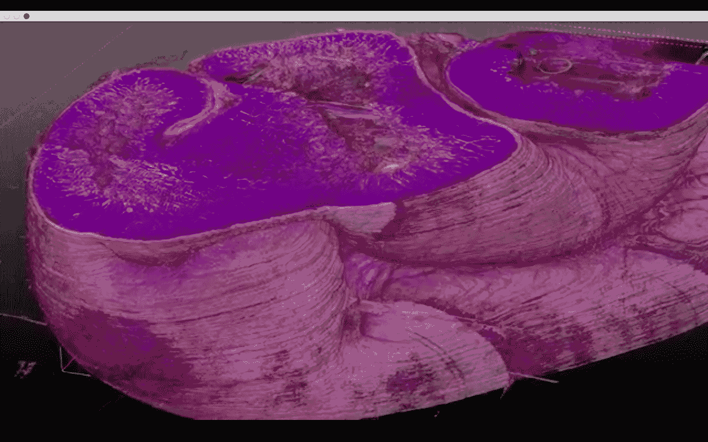

# 植入式 3D 打印器官的到来可能比你想象的要快——第 480 页

> 原文：<https://web.archive.org/web/https://techcrunch.com/2018/06/25/implantable-3d-printed-organs-could-be-coming-sooner-than-you-think/480/>

在旧金山 Dogpatch 社区的生物技术初创公司孵化器 MBC 生物实验室，一个由科学家和实习生组成的团队刚刚在开发可行的人类 3D 打印器官的道路上迈出了一大步，他们为小型初创公司 T2 prel lis Biologics 工作。

该公司由研究科学家梅勒妮·马修(Melanie Matheu)和诺埃尔·马林(Noelle Mullin)在 2016 年创立，将未来(以及 300 万美元的小额投资)押注于一种制造毛细血管的新技术，毛细血管是一种单细胞厚度的血管，是氧气和营养物质在体内流动以滋养组织的通道。

根据 Matheu 的说法，没有正常运作的毛细血管结构，就不可能制造器官。她说，在寻求打印可存活的心脏、肝脏、肾脏和肺的过程中，它们是最重要的一块拼图。

[莱斯大学](https://web.archive.org/web/20200222152632/https://crunchbase.com/organization/rice-university) 生物工程助理教授、3D 打印可植入生物材料结构专家乔丹·米勒在一份声明中说:“微血管系统是支持高级多细胞生命的基本建筑单位，因此它代表了自下而上的人类组织工程和再生医学的一个重要目标。”。

 [https://web.archive.org/web/20200222152632if_/https://www.youtube.com/embed/WlDnty_5YjU?version=3&rel=1&fs=1&autohide=2&showsearch=0&showinfo=1&iv_load_policy=1&wmode=transparent](https://web.archive.org/web/20200222152632if_/https://www.youtube.com/embed/WlDnty_5YjU?version=3&rel=1&fs=1&autohide=2&showsearch=0&showinfo=1&iv_load_policy=1&wmode=transparent)

视频

###### *这个实时视频显示了直径为 5 微米的微小荧光颗粒(与红细胞大小相同)，在一个直径为 700 微米的管子中，通过 105 个平行印刷的毛细管阵列移动。每个毛细管有 250 微米长。*

现在，Prellis [发表了研究结果](https://web.archive.org/web/20200222152632/https://www.prellisbiologics.co/prellis-literature)表明，它可以在未来五年内以一定的尺寸和速度制造这些毛细管，将 3D 打印的器官推向市场。

Prellis 使用全息打印技术，通过光诱导化学反应在五毫秒内产生三维沉积层。

据该公司称，这一特征对于构建肾脏或肺等组织至关重要。Prellis 通过将光敏光引发剂与传统生物链接结合在一起来实现这一目标，传统生物链接允许细胞材料在受到红外光照射时发生反应，从而催化生物链接的聚合。

普雷里斯没有发明全息印刷技术。一些研究人员正在寻求将这种新方法应用到许多行业的 3D 打印中，但该公司正在以一种似乎有前途的方式将这项技术应用到生物制造中。

据该公司称，速度很重要，因为这意味着细胞不会死亡，被打印的组织仍然可以存活，而在结构内打印的能力意味着 Prellis 的技术可以生成内部支架，以支持和维持周围的有机材料。

视频 

###### *上面的视频由 Prellis Biologics 提供，展示了一种细胞封装设备的实时打印，这种设备可用于生产含有类器官的小型人类细胞。该结构被设计成可渗透的，大小为直径 200 微米，可容纳多达 2000 个细胞。*

Prellis 并不是第一家开发三维器官打印的公司。对这项技术的研究已经进行了几十年，像 BioBots (在 TechCrunch 舞台上首次亮相)这样的公司已经在降低打印活体组织的成本。

根据 [Inc](https://web.archive.org/web/20200222152632/https://www.inc.com/kevin-j-ryan/biobots-allevi-30-under-30.html) 的一份报告，这家以前被称为 BioBots 的公司现在被称为 [Allevi](https://web.archive.org/web/20200222152632/https://allevi3d.com/) ，其创始人已经分道扬镳，其商业战略也发生了转变(它现在专注于开发软件，使其生物打印机更容易使用)。Allevi 已经用售价不到 1 万美元的设备削减了生物打印的成本，但 Prellis 认为，挤压打印的局限性意味着技术分辨率太低，速度太慢，无法创建毛细血管和保持细胞存活。

根据一份声明，在移植到动物体内之前，Prellis 的器官还需要放在生物反应器中进行维持，但不同的是，该公司的目标是生产完整的器官，而不是样本组织或小细胞样本。马修说，生物反应器可以模拟确保器官正常功能的生物力学压力。

“脉管系统是复杂组织的一个关键特征，对于具有治疗价值的工程组织至关重要，”高级数字组织成像和数据分析公司 [3Scan](https://web.archive.org/web/20200222152632/http://www.3scan.com/) 的首席执行官托德·霍夫曼(Todd Huffman)说。“Prellis 的进步代表了器官工程探索中的一个重要里程碑。"

Matheu 估计将花费两年半的时间和 1500 万美元使可植入的器官通过他们的第一次动物试验。“这将把一个试验肾脏移植到动物身上，”她说。

目标是打印出四分之一大小的肾脏，可以移植到老鼠体内。“我们想要一种能够处理移植到人体的肾脏的东西，”Matheu 说。

来自 3Scan 的一帧动物组织 3D 图。

今年早些时候，曼切斯特[大学](https://web.archive.org/web/20200222152632/https://crunchbase.com/organization/university-of-manchester) 的研究人员首次从干细胞中培养出功能性人类肾脏组织。科学家们将小簇毛细血管植入基因工程小鼠体内，这些毛细血管从培养皿中培养的血液中过滤废物。12 周后，毛细血管已经长出了肾单位——构成功能性人类肾脏的元素。

最终，我们的愿景是通过皮肤移植或血液、干细胞或骨髓采集来输出患者的细胞，然后使用这些样本来创造用于生长器官的细胞材料。Matheu 说:“组织排斥是我在设计过程中首先考虑的问题，也是我们如何去做的问题。”

虽然 Prellis 花时间致力于完善打印肾脏的技术，但该公司正在寻找合作伙伴，以利用其制造技术，研究开发其他器官的过程。

“我们将与其他团体合作，”Matheu 说。“我们的技术将在完整肾脏之前以许多其他方式进入市场。”

去年，该公司概述了一项走向市场的战略，其中包括开发实验室培养的组织，以生产用于治疗和药物开发的抗体。该公司为临床开发打印的第一批目标人体组织是称为“胰岛”的细胞，胰岛是胰腺内产生胰岛素的单位。

“1 型糖尿病患者在年轻时失去产生胰岛素的胰岛。如果我们能取代这些，我们就能为糖尿病患者提供一种无需每天注射胰岛素和血糖监测的生活，”Matheu 当时在一份声明中说。

马修认为，她和她的联合创始人开发的技术不仅是制造生物材料的根本转变，更是打印肾脏的新过程。

马修说:“我想象一下，如果你想制造一个肿瘤进行测试……在实验室里，打印一个肿瘤需要五个小时……而用我们的系统，只需要三秒半的时间。”。“这是我们的基线光学系统……在如何构建细胞和基本结构方面，速度是如此之快，我们将努力获得许可。”

与此同时，对解决器官捐献短缺的需求不断增长。Matheu 说，美国七分之一的成年人患有某种肾脏疾病，她估计有 9000 万人在一生中的某个时候需要肾脏。

马修说，每天大约有 330 人死于器官衰竭，如果有一种快速制造这些器官的方法，就没有理由发生这些死亡。Prellis 估计，由于对人体组织和器官替代物以及用于药物发现和毒理学测试的人体组织的需求，到 2024 年，全球组织工程市场将达到 940 亿美元，高于 2015 年的 230 亿美元。

“我们需要更快地帮助人们，”马修说。