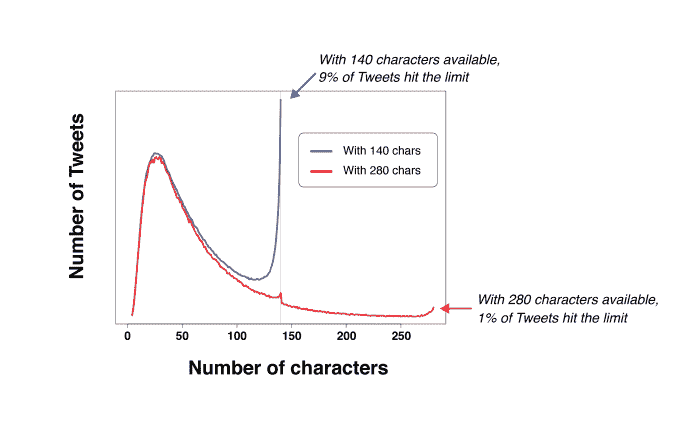

# Twitter 从今天开始正式将其字符数增加到 280 个——第 482 页

> 原文：<https://web.archive.org/web/https://techcrunch.com/2017/11/07/twitter-officially-expands-its-character-count-to-280-starting-today/482/>

Twitter 的 扩展到 280 个字符，今天向所有支持语言的用户公开推出，包括英语。早在 9 月份，该公司第一次[宣布了](https://web.archive.org/web/20191014010914/https://beta.techcrunch.com/2017/09/26/twitter-trials-an-expansion-beyond-140-characters/)超越传统的 140 个字符的有争议的计划，当时指出更长的字符数可以让用户表达更多的想法，而不会耗尽推特的空间。

这一扩展最初是作为一个试验提供给一组精选的 Twitter 用户的。

在最初发布[的时候，](https://web.archive.org/web/20191014010914/https://blog.twitter.com/official/en_us/topics/product/2017/Giving-you-more-characters-to-express-yourself.html)该公司引用了支持其决定的数据，这些数据提到了字符限制对用户的不同影响，这取决于他们的语言。

Twitter 表示，与说英语、西班牙语、葡萄牙语或法语的用户相比，用日语、韩语和中文等语言发推的用户能够在一个字符中表达大约两倍的信息。

有鉴于此，Twitter 决定，在测试期间，280 个字符的扩展将只适用于那些受到“填鸭式”影响的语言，即除日语、汉语和韩语之外的所有语言。

**第 280 号争议**

这一决定引起了相当大的争议，因为 Twitter 的一个显著特征就是用户帖子的简洁。

许多人认为增加到 280 个字符会降低 Twitter 的可读性，因为更长的推文占据了他们的时间表。

[其他人](https://web.archive.org/web/20191014010914/https://www.engadget.com/2017/09/27/twitter-280-characters-tweets/) [认为](https://web.archive.org/web/20191014010914/http://money.cnn.com/2017/09/27/technology/business/twitter-280-character-limit-critics/index.html)推特关注一个没有人真正要求的功能转移了它对更重要问题的注意力——比如猖獗的[滥用](https://web.archive.org/web/20191014010914/https://beta.techcrunch.com/2017/10/12/twitters-abuse-problem-is-absolutely-a-failure-of-leadership/)，骚扰和欺凌，不幸的是这已经变得众所周知。

更多的人认为，这种扩展并不真的意味着人们能够更好地表达自己——他们只会说同样的话，但会用更多的词来表达。

一条关于这个话题的特别有趣的推特甚至火了起来。

Twitter 首席执行官杰克·多西 280 个字符的推文的红线和编辑版本展示了如何在不失去其意义的情况下减少推文的字数。

Twitter 的用户群在这一变化是否会毁掉 Twitter 的问题上有些分歧。科技媒体——除了几个冷静的回应之外——似乎反对这一变化。

然而，媒体——一群主要是权力用户的人，哀叹失去了一个信息密集的时间线——可能并不代表 Twitter 更大的用户群，其中一些人从 9 月份开始就一直在乞求这个功能。

此外，上个月的一项民意调查发现，赞成扩张的美国人多于反对者，大多数人没有意见。

然而， [Crimson Hexagon](https://web.archive.org/web/20191014010914/https://www.crimsonhexagon.com/) 从 9 月 25 日至 11 月 6 日的 270 万条推文中提取了情绪数据，发现负面情绪比正面情绪更突出(63%比 37%)。

但它也指出，负面情绪——以及总体讨论——自 9 月份以来有所减少。

**推特关于#280 使用的数据**

在今天的[博客帖子](https://web.archive.org/web/20191014010914/https://blog.twitter.com/)中，关于 280 个角色的公开发布，Twitter 旨在缓解人们对他们的时间表将被扩展的推文填满的担忧。

该公司表示，在试验期间，人们大部分时间继续在 140 个字符以下发推文——在能够使用更多字符的新鲜感消退后。具体来说，Twitter 发现只有 5%的推文超过 140 个字符，其中只有 2%超过 190 个字符。

它还表示，一旦人们获得了更多发推的能力，他们所做的许多愚蠢的事情——比如[每行只写几个字符](https://web.archive.org/web/20191014010914/https://twitter.com/Chiefs/status/913097686466928641)来发超大推——都只是暂时的影响。(尽管它预计随着公开发布，许多人会再次这样做。)

Twitter 补充说，在扩展到 280 条后，只有 1%的推文达到了字符限制，而历史上有 9%的推文达到了字符限制。

值得注意的是，Twitter 声称，那些有更多空间发推的人获得了更多的赞、转发和@提及，获得了更多的关注者，并在 Twitter 上花了更多的时间。然而，它没有用硬数据量化这些发现。

不过，它的样本量可能很小。Twitter 告诉我们，在测试期间，只有“个位数百分比”的用户能够访问 280 个字符。(截至 2017 年第三季度财报，Twitter 如今拥有 3.3 亿月用户。)

最终，正是这些参与度数据推动了 Twitter 的决策。该公司相信，扩大用户基础的关键是让新用户更容易获得服务。减少障碍——比如无法完成一个想法——会有所帮助。(可以说，创建一个无毒的社区，在那里网上滥用[的问题](https://web.archive.org/web/20191014010914/https://beta.techcrunch.com/2017/10/12/twitters-abuse-problem-is-absolutely-a-failure-of-leadership/)会得到严肃处理*会更有帮助。)*

我们被告知，在太平洋时间今天下午 1 点发布之后的几个小时内，将完成 280 种语言的推广。