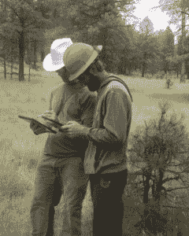
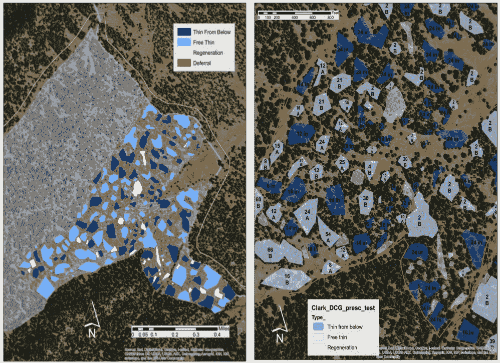
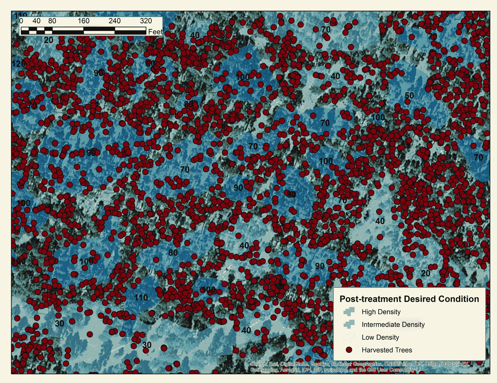

# 大自然保护协会给森林管理一个数字化改造——第 494 页

> 原文：<https://web.archive.org/web/https://techcrunch.com/2017/04/19/nature-conservancy-gives-forest-management-a-digital-makeover/494/>

保持森林健康通常意味着一棵树一棵树地决定该做什么。这对于一平方英里的土地来说很容易，但是一千平方英里呢？大自然保护协会(Nature Conservancy)正在[开发工具](https://web.archive.org/web/20190314151158/https://www.nature.org/ourinitiatives/regions/northamerica/unitedstates/arizona/fighting-mega-fires-by-restoring-arizonas-forests.xml)，这将使公园服务、消防和自然资源保护主义者更容易保持整个森林的生机勃勃和繁荣——你知道，不会着火。

森林管理是一个复杂的行业，但对我们来说，重要的是这部分是以一种非常老派的方式完成的。

一种方法是让某人在森林里走来走去，观察周围的情况，然后用一罐喷漆一棵接一棵地指定某些树被砍掉或留下。有个人接触很好，但执行起来不太快。

另一种方法是让专家在地图上标出每个地区的“处方”:砍伐什么类型的树木，留下什么，等等。但是，这不仅缺乏之前方法的细节，而且伐木工人将会移动得更慢，因为他们依赖他们的判断力来确定什么符合处方的要求，或者争论他们在哪个区域。

在这种情况下，技术实际上可以提供帮助。大自然保护协会的尼尔·查普曼正在领导一个项目，旨在使这部分林业更简单、更便宜、更快捷。随着最近野火造成的破坏，这不再仅仅是一个健康森林的问题，而是防止严重灾害的问题。

## 减少延误

“亚利桑那州北部是全国最大的连续黄松森林的所在地，在过去的 15 年里，我们有一百万英亩的黄松森林在灾难性的野火中被烧毁，”查普曼在接受 TechCrunch 采访时说。

工人们在地里的平板电脑上标记树木。

“为了解决这个问题，需要扩大林业做法的规模。但是他们没有时间也没有钱来为每年 50，000 英亩的树木上色。所以我们说，我们必须设计一些东西，让林业加快步伐，同时仍然依赖地面部队。”

由此产生的数字修复指南结合了绘画的直接性和处方的可扩展性。

本质上，一个林业工人会像在直接观察森林之前一样四处走动。“但他们手中拿的不是颜料罐，而是平板电脑，”查普曼说。

他们可以用 GPS 坐标标注单棵树或一群树的位置，但不需要标记每一棵树。相反，在获得一个区域的要点后，他们可以在平板电脑的地图上画一个小多边形，上面有所有的细节。

这些数据可以在事后进行调整，存档并发送给采集者，采集者可以通过驾驶室内的平板电脑查阅这些数据。(您可以在顶部的图片中看到该应用程序。)

 他们不仅得到了更具体的指令和更好的粒度，而且平板电脑还会记录砍伐树木的确切位置、时间和直径(以及其他事项)。这节省了后端的时间——更少的文书工作——让收割机更容易跟踪进度。

查普曼说，这一点很重要，因为林务局在恢复和采伐方面有更复杂的指导方针，比城市或县当局更复杂，因为城市或县当局要管理相对较小和同质的森林。

## 树林中的科技

一项在 327 英亩土地上进行的试点部署发现，与直接给树木涂色相比，数字处方方法的成本不到一半，速度却快了五六倍。生产率类似于旧的处方方法，查普曼称之为胜利。

“如果在这些早期阶段，我们能够在城市和国家土地上跟上 DxP 的步伐……林业的要求会高得多，”他说，这正好发挥了数字处方的优势。这还没有考虑到工作流在跟踪和易用性方面的巨大优势。

 “标记通过后，我们的工作人员能够计算大小、间距、树木数量……在过去，他们必须出去采集样本。”

他们不得不修改界面和硬件来回应反馈，例如提高平板电脑的功率。

“事实证明，一些地图突破了我们正在使用的平板电脑的处理器速度极限。“伐木工人放大缩小 300 兆字节的图像，速度不够快，”查普曼说。“现在好多了。我的意思是，你不能坐在出租车里等着图像渲染。”

激光雷达和无人机，当涉及到数字和现实世界之间的交叉时，也在发挥作用。

[gallery ids="1478447，1478446，1478445"]

“我们一直在研究如何在规划和监测阶段使用激光雷达，”他说。“通常我们必须出去做耗时的地面实况调查。使用激光雷达或 structure from motion(另一种 3D 成像技术)，如果我们有 5 万英亩的图像，那么在我们切割这些英亩后，我们就不需要去那里使用地面数据了。”

固定翼和多旋翼无人机混合在一起，前者用于较大的勘测任务，后者用于监测较小的区域和快速地面实况。

试点研究给林务局留下了深刻的印象，该技术已被批准用于可可尼诺国家森林的 5000 英亩土地和凯巴布国家森林的 3800 英亩土地；这是正在进行的四个森林恢复计划的一部分。前者已经绘制完成，测试将是使用新工具在指定区域部署强化收割小组。

如果这种方法流行起来，它确实应该流行起来，那么它将会极大地提高保护我们森林的护林员和伐木工的效率。你可以在大自然保护协会的网站或亚利桑那州[的 4FRI 页面](https://web.archive.org/web/20190314151158/http://4fri.org/index.html)跟踪项目进展[。](https://web.archive.org/web/20190314151158/https://www.nature.org/ourinitiatives/regions/northamerica/unitedstates/arizona/fighting-mega-fires-by-restoring-arizonas-forests.xml)