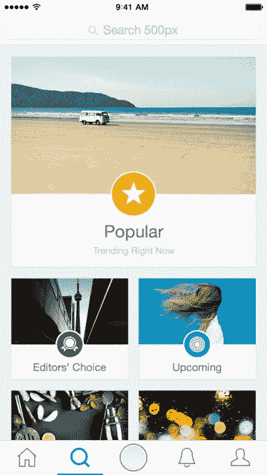

# 500px 改进其应用程序，以更好地吸引 Instagram 人群 

> 原文：<https://web.archive.org/web/https://techcrunch.com/2015/08/06/500px-revamps-its-app-to-better-appeal-to-the-instagram-crowd/>

在线照片分享社区 500px 最近又筹集了 1300 万美元来挑战 Flickr 和 Getty。从更新 iOS 开始，该公司彻底重新设计和重建了其应用程序，旨在使其应用程序吸引更主流的消费者群。

通过这次改造，该公司希望吸引 Instagram 人群，或者至少吸引那些准备扩大对摄影理解的人，同时仍然享受社交功能，如关注其他用户或喜欢他们喜欢的照片。

500px 首席执行官[杨安迪](https://web.archive.org/web/20221207014556/https://www.crunchbase.com/person/andy-yang)解释说，通过这次更新，公司希望在更广泛的用户群中为人所知。他说，这项服务是为“那些想把自己的创造力提升到一个新水平的人……学习摄影，学习编辑和视觉创意——这就是我们想要给自己定位的地方。”他说。

更新后的应用程序引入了许多新功能，并针对主流用户群对现有功能进行了改进。首先，现在有一个全新的主页，你可以看到你关注的人的照片，以及基于你的活动的个性化建议，这是为了增强发现。同时，一个改进的“发现”部分包括一个“首次亮相”功能，突出显示社区中的新创建者。

搜索和用户配置文件也得到改进，500px 现在包括一个更好的照片上传程序，允许您从相机、照片库或 Adobe Lightroom 导入照片。对于创作者来说，新体验中还有 Adobe 提供的高级编辑工具和预设。

该应用程序还采用了更新的设计语言，更加完美——这是另一个旨在吸引更广泛社区的变化。

迄今为止，500px 在很大程度上被认为是 Flickr 的竞争对手，目标是更专业的人群，这个社区也有助于提高其创收能力。

500px 的商业模式依赖于摄影师及其粉丝可以买卖照片的市场——事实上，新的战略投资者视觉中国(像中国的 Getty Pictures)在新一轮融资后开始分发 500px 的照片。

[gallery ids="1192202，1192203，1192204，1192205"]

然而，令人惊讶的是，500px 的大多数用户群不是“专业”摄影师，而是摄影爱好者。

杨解释说，“10%到 20%的用户是专业的或非常专业的业余爱好者，其余的则是更多的摄影爱好者，对摄影有鉴赏力的普通用户。”

换句话说，就像其他互联网服务一样，500px 的内容创作者是少数。因此，新的应用程序旨在为大众提供更好的照片消费体验，同时通过添加更好的上传和编辑工具，轻轻地推动他们成为内容创作者。

该公司认为，这反过来将有助于向市场提供更多照片，因为更多的临时用户受到激励参与进来。

更新的 iOS 应用程序今天上线，但 Android 版本将于今年晚些时候推出。500px 也在进行网站改造，但目前还没有准备好。