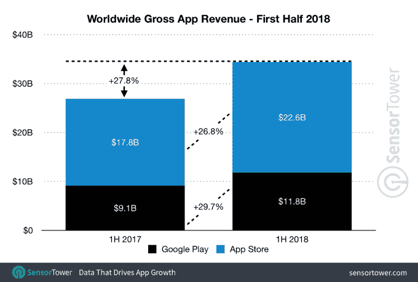
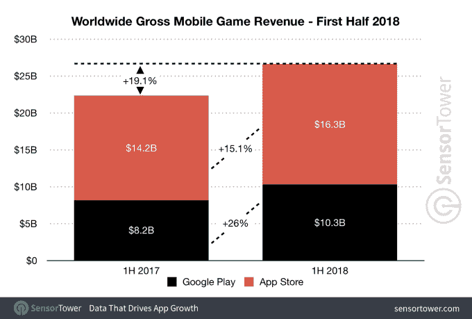
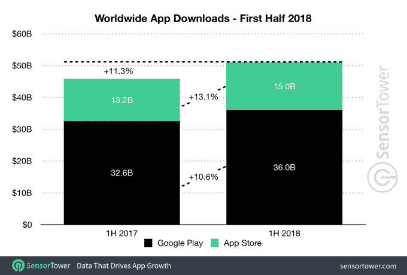

# 2018 年上半年，苹果应用商店收入是 Google Play 的近两倍——第 519 页

> 原文：<https://web.archive.org/web/https://techcrunch.com/2018/07/16/apples-app-store-revenue-nearly-double-that-of-google-play-in-first-half-of-2018/519/>

[苹果的](https://web.archive.org/web/20191026112231/https://crunchbase.com/organization/apple) 应用商店的收入继续超过[谷歌的](https://web.archive.org/web/20191026112231/https://crunchbase.com/organization/google) Play。根据 Sensor Tower 今天发布的一份新的[报告](https://web.archive.org/web/20191026112231/https://sensortower.com/blog/app-revenue-and-downloads-1h-2018),今年上半年，App Store 在一半的下载量上创造了将近两倍于 Google Play 的收入。就美元和美分而言，App Store 的全球总收入为 226 亿美元，而 Google Play 为 118 亿美元，或者说，在 App Store 上的支出是 Google Play 的 1.9 倍。

这种趋势并不新鲜。多年来，苹果 iOS 商店的收入一直高于安卓商店，这是由多种因素造成的，包括安卓用户在应用上的支出历来低于 iOS 用户，以及消费者可以在其他安卓应用商店购物，例如亚马逊应用商店或三星商店。另外，Google Play 在中国没有，但是苹果的 App Store 有。

去年，消费者在 App Store 上的支出达到 385 亿美元，再次接近 Google Play 201 亿美元的两倍。

正如 2018 年上半年的新数据所示，今年消费者支出有所增加。

[Sensor Tower](https://web.archive.org/web/20191026112231/https://crunchbase.com/organization/sensor-tower) 估计，与 2017 年同期相比，它在 iOS 上增长了 26.8%，在 Google Play 上增长了 29.7%。

正如之前报道的那样，支出的增长可以部分归因于网飞、腾讯视频甚至 Tinder 等订阅应用。

根据一项早期研究，基于订阅的应用程序如今是大生意，帮助[在 2017 年将应用程序收入提高了 77%，达到 7.81 亿美元](https://web.archive.org/web/20191026112231/https://techcrunch.com/2018/01/24/top-subscription-video-on-demand-apps-boosted-revenue-77-last-year-to-reach-781-million/)。根据 App Annie 的 App Store 回顾，[网飞也是 2017 年收入最高的非游戏应用](https://web.archive.org/web/20191026112231/https://techcrunch.com/2018/01/12/netflix-was-2017s-top-non-game-app-by-revenue/)，最近又成为全球消费者支出最高的[(非游戏)应用](https://web.archive.org/web/20191026112231/https://techcrunch.com/2018/07/02/these-are-the-top-iphone-apps-of-all-time/)。

继网飞之后的许多其他前所未有的顶级应用程序也是基于订阅的，例如 Spotify(排名第二)、Pandora(排名第三)、腾讯视频(排名第四)、Tinder(排名第五)和 HBO NOW(排名第八)。

Sensor Tower 指出，网飞再次成为 2018 年上半年消费者支出最高的非游戏应用。

然而，游戏支出仍占收入的很大一部分。

两家商店的游戏支出在 2018 年上半年增长了 19.1%，达到 266 亿美元，约占总支出的 78%(App Store 为 163 亿美元，Google Play 为 103 亿美元)。腾讯的《王者荣耀》、Mixi 的《怪物来袭》和索尼 Aniplex 的《命运/大令》是两家商店票房收入最高的游戏。

今年上半年，应用下载量也有所增长，尽管增幅较小。

2018 年 1 月，全球首次应用安装量增长至 510 亿，比去年同期增长 11.3%，去年同期两个应用商店的下载量为 458 亿。

脸书 在这方面领先，WhatsApp、Messenger、脸书和 Instagram 成为 App Store 和 Google Play 的四大应用。下载量最多的游戏是腾讯的 PUBG Mobile、巫毒的 Helix Jump 和 Kiloo 的 Subway Surfers。

由于 Android 在发展中市场的影响力，Google Play 应用下载量同比增长更多(13.1%，iOS 为 10.6%)，达到 360 亿次。这大约是 App Store 150 亿的 2.4 倍。

尽管如此，苹果的平台仍然以不到一半的下载量获得了超过两倍的收入，这是非常了不起的。这不能都归咎于中国。(去年上半年，美国贡献了 App Store 约 31.7%的收入，即 71 亿美元，给你一个概念。)

Sensor Tower 告诉 TechCrunch，即使中国被排除在外，App Store 也将在 2018 年上半年产生 154 亿美元的总收入，比 Google Play 的 118 亿美元高出约 30%。

*更正:中国在 App Store 去年上半年的收入中约占 31.7%，而不是之前所说的那个季度。*