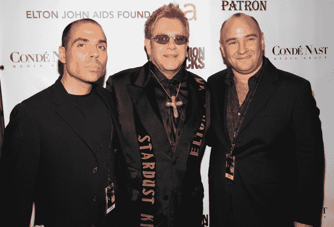

# 音乐版权之战——第 522 页

> 原文：<https://web.archive.org/web/https://techcrunch.com/2018/09/30/the-war-over-music-copyrights/522/>

风险投资公司并不是唯一筹集数亿美元投资于繁荣市场的 T2 公司。在成为人们最不愿意投资的行业超过 15 年后，音乐行业正在回归，资金正涌入购买流行歌曲的版权。

随着付费流媒体订阅成为主流，大型音乐流媒体服务——即 Spotify、Apple Music 和腾讯音乐，以及 Pandora、亚马逊音乐、YouTube 音乐、Deezer 等——已经进入了鼎盛时期。在美国的音乐流媒体服务中，现在有超过 5100 万个付费订阅账户。受流媒体收入增长 41%和付费流媒体收入增长 45%的推动，去年全球音乐产业增长 8%，达到 173 亿美元。

音乐流媒体的激增意味着那些拥有歌曲版权的人的收入激增，新兴市场的娱乐增长、数字视频的使用增长以及音乐在虚拟现实等新内容格式中的潜在使用只会进一步扩大这种增长。不出所料，私人股本公司、家族理财室、企业和养老基金都想分一杯羹。

一首歌曲的版权一般有两种类型:出版权和著作权。一首歌的音乐作品——歌词、旋律等。–来自拥有出版权的词曲作者(尽管通常他们会签署出版协议，除了一半的版税之外，他们的出版商还会获得版权)。与此同时，正在演奏的歌曲版本来自拥有原版版权的录音艺术家(尽管通常他们会签署唱片协议，唱片公司会获得原版的所有权和大部分版税)。

流行歌曲拥有起来很有价值，因为它们收取了所有的版税:每当歌曲在流媒体服务上播放，从 iTunes 下载，或在 YouTube 上覆盖(机械许可证)，在电台或杂货店播放(表演许可证)，在电影或电视节目上作为配乐播放(同步许可证)，以及用于其他用途。更多来自歌曲的版税收入进入了版权所有者的口袋，因为他们承担了更多的营销财务风险，但是出版商从一些版权所有者没有的渠道收取版税(比如广播剧)。

对于流行歌曲背后的词曲作者来说，这些版税形成了可预测的收入流，每年可达数万、数十万甚至数百万美元。当然，大多数创作或录制的歌曲都不赚钱:创造一首在拥挤的行业中爆发的歌曲很难。这种稀缺性——只有成千上万的流行音乐人和数量有限的传奇艺术家，他们的音乐可以保持几十年——意味着成功音乐人的版权在他们或他们的出版商决定出售时可以获得溢价。

## **投资流媒体经济**

2017 年，流媒体服务的收入占全球音乐产业收入的 [38%](https://web.archive.org/web/20191016032853/http://www.ifpi.org/downloads/GMR2018.pdf) ，终于超过了传统专辑销售和歌曲下载的收入。订阅流媒体服务在获得主流采用方面达到了一个转折点，但它们仍有很长的路要走。高盛媒体部门分析师 [杨静怡预测](https://web.archive.org/web/20191016032853/https://www.musicbusinessworldwide.com/goldman-sachs-universal-is-worth-23-5bn-and-streaming-revenues-will-jump-500-by-2030/) 到 2030 年，随着全球流媒体市场规模倍增至 340 亿美元(几乎全部来自付费订阅)，全球音乐产业的市场规模将达到 410 亿美元。

左边是默克公司的 Mercuriadis。(图片由 KMazur/WireImage 为康泰纳仕传媒集团提供)

本周早些时候，我与 Merck Mercuriadis 进行了交谈，他曾管理过 Elton John、Guns N' Roses 和 Beyoncé等偶像，并于 6 月份在伦敦证券交易所筹集了 2 亿英镑(2.6 亿美元)用于投资工具，以收购顶级歌曲作者的目录。他的计划是在未来的三到五年内筹集并投资 10 亿英镑，他认为向被动消费者付费音乐的转变将把这个行业带到前所未有的高度。

的确，流媒体音乐是对过去的一种范式转变。随着世界上所有的音乐都可以在一个界面上免费(带广告)或以可承受的价格订阅(不带广告)，消费者不再需要主动选择购买哪些特定的歌曲(甚至是非法下载哪些歌曲)。

所有这些都摆在他们面前，并且都包含在价格中，人们正在听更广泛的音乐:他们正在探索更多的流派，发现更多不是传统电台明星的音乐家，并回到过去几十年的音乐。以前不经常购买音乐的消费者现在每年订阅 120 美元，并将其传播给更多的艺术家。

零售企业也在做同样的事情:通过 Soundtrack Your Brand(从 Spotify 剥离出来)等流媒体服务，他们使用更昂贵的商业许可，在商店里播放更广泛的音乐，而不是打开收音机或播放同样的几张 CD。

音乐产业的大部分市场增长发生在中国、印度、拉丁美洲和尼日利亚等新兴市场，在尼日利亚，订阅应用正在取代普遍的音乐盗版或非消费。腾讯音乐娱乐(Tencent Music Entertainment)旗下的三个流媒体服务在中国占据了大约 75%的市场份额(去年，中国音乐市场的规模扩大了 34%),该公司正在准备 IPO，这可能会使其获得与 Spotify 在 4 月份的 IPO 中获得的大约 290 亿美元的估值相同的估值。与此同时，去年来自拉丁美洲的音乐产业收入增长了 18%。

西方音乐融入了全球流行文化，因此随着这些国家进入流媒体时代，他们正在通过广告收入(最低限度，但也越来越多地通过付费订阅)为数亿额外听众赚钱。

在人才管理、出版和制作公司 Primary Wave，创始人 Larry Mestel 看到新兴市场为他的客户带来了更多收入(如史摩基·罗宾逊、爱丽丝·库珀、玛丽莎·伊瑟莉姬和鲍勃·马利的遗产)，因为新的粉丝群参与了他们的在线音乐。2016 年，他筹集了一只新的 3 亿美元基金(由贝莱德和其他机构支持)，以收购音乐目录的权利，他表示，由于流媒体模式带来的增长机会，市场已经大幅改善。

推动增长的不仅仅是流媒体 *音乐* 平台。流媒体视频已经爆炸式增长，无论是来自 YouTube 的短视频，还是 Hulu 和亚马逊 Prime Video 等平台上越来越多的节目，随之而来的是越来越多的歌曲原声同步许可；仅在 2017 年，全球同步许可收入就同比增长了 10%。去年，脸书与所有大型出版商签署了许可协议，允许用户在 Instagram Stories 和脸书视频中使用歌曲片段。

## **不断膨胀的歌曲目录估价**

目录通常根据“出版商的净份额”来估价，这是在支付欠其他人的任何百分比后剩余的年版税的平均金额(比如艺术家仍然持有的版税的部分股份)。