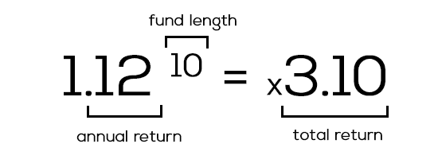
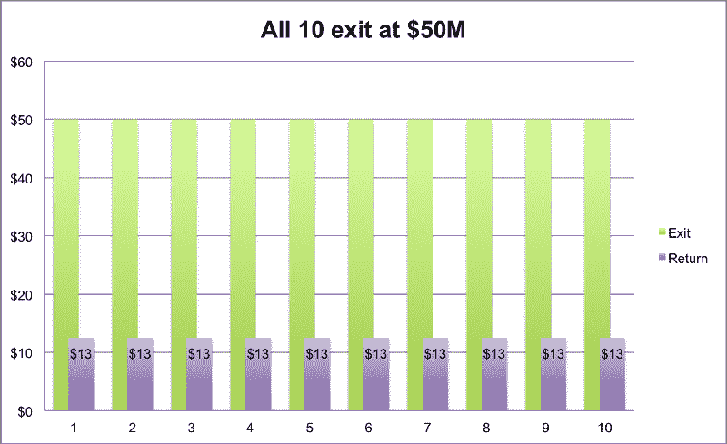
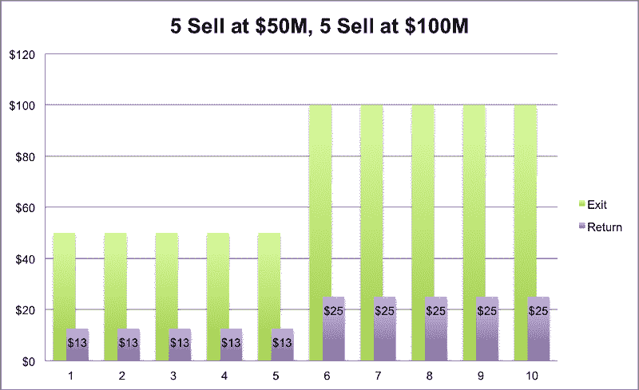
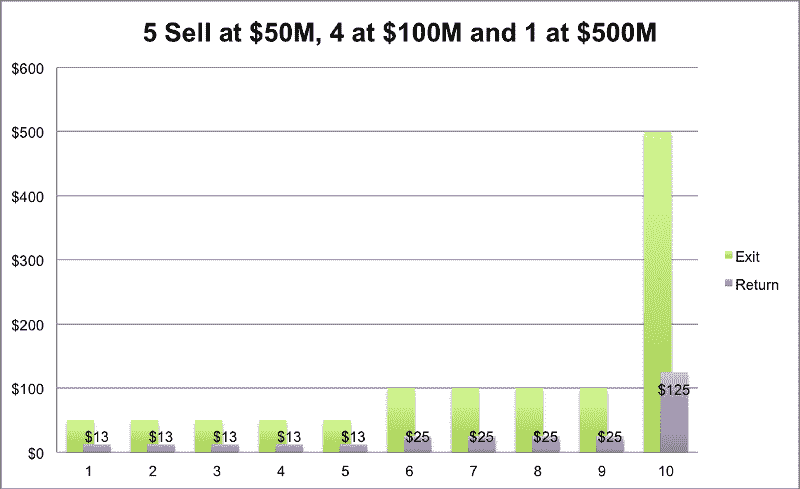
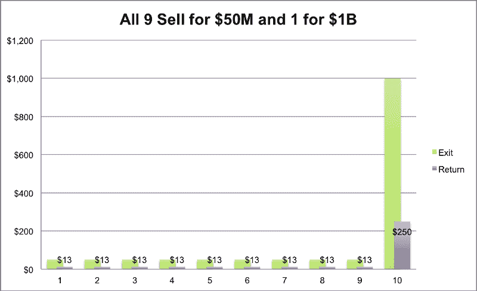
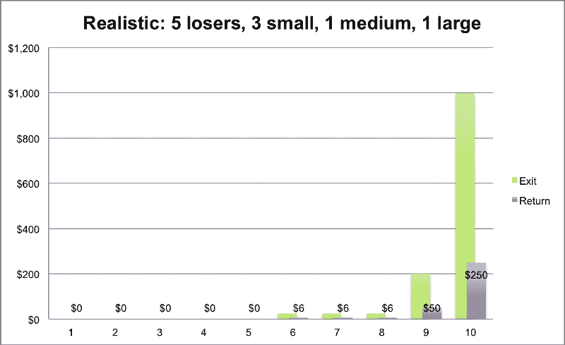

# 让我了解风投真相的会议

> 原文：<https://web.archive.org/web/https://techcrunch.com/2017/06/01/the-meeting-that-showed-me-the-truth-about-vcs/55/>

Tomer Dean 是一位连续的科技企业家，目前居住在特拉维夫。他是的联合创始人兼首席执行官

[Bllush](https://web.archive.org/web/20220110201551/https://www.bllush.com/)

.

我最近会见了一位知名的以色列初创企业投资者。不知何故，话题从我寻找种子的初创公司转到了风险投资的宏观视角，以及它实际上为何没有意义。

“95%的风险投资都不盈利，”他说。 我过了一会儿才明白这到底意味着什么。

我来澄清一下:95%的风投实际上并没有返还足够的资金来补偿他们的投资者(LP)通过投资他们的基金而承担的风险、费用和流动性不足。

## 谁真正成功赚钱了？

风险投资基金需要 3 倍的回报才能达到“风险回报率”，才能被认为是一项好的投资(1 亿美元基金= > 3 倍= > 3 亿美元回报)。下图显示了完成这一任务的风险投资公司的比例。正如我们所见，只有绿色的小薄片将它带回家。其他 95%的人在收支平衡和彻底亏损之间徘徊(记住要考虑通货膨胀)。

一开始我很难理解这个图表。但是一旦你计算了这些数字，一切就都说得通了。我将尝试重新构建导致这种难以理解的认识的论点，这种认识是一个经常从外部被理想化的行业。准备好了吗？让我们找点乐子。

## 假设

开始之前，让我们定义成功和失败的真正含义，并列出我们的假设:

**成功=每年 12%的回报率**

风险资本从有限合伙人那里获得资金，有限合伙人通常是银行、机构、养老基金等传统投资者。在他们看来，与他们的其他选择(如股票市场/房地产)相比，向启动基金投入 5000 万美元是“高风险”的业务，这些选择成本较低，流动性强，每年可以“安全地”获得 7-8%的回报。对他们来说，每年 12%的投资回报率是不错的。还有比这低的吗？不值得他们冒这么高的风险。

这让我们想到了…

**10 年期基金需要 3 倍于基金规模的回报**

我们一致认为风投需要每年赚取 12%的回报，对吗？大多数基金，虽然只积极投资 3-5 年，但肯定会投资 10 年。许多更新的研究表明，12-14 年的基金对今天来说更准确，但让我们坚持 10 年，只是为了给风投一个战斗的机会。每年 12%的增长率迅速增长，显示了复利的力量。让我们看看数学:

**不要忘记帕累托:80%的回报来自 20%的创业公司**

生活的事实是创业是艰难的。收支平衡很难。利润很难。保持利润年同比增长更加困难。10 家公司中，只有两家会真正爆发并 IPO/M&A，把我们亲爱的风投们的一些钱拿回来。其余的，正如我们将会看到的，将会失败和死亡——或者有一个小的清算事件，这是非常相似的。

## 我们开始吧

所以我们有 10 家创业公司和一只需要在 10 年内回报 3 倍的基金。让我们假设这是一个 1 亿美元的基金，在其生命周期内对每家公司投资 1000 万美元，期望回报为 3 亿美元。为了公平起见，我们还假设风险投资公司参与了 A 轮融资，跟进了 B 轮融资，最终拥有 25%的股权，并拥有不参与清算的优先权。

让我们看看 10 年后我们的 10 家创业公司的一些不同结果。

**他们都表现“一般”，以 5000 万美元退出**

绿色标志出口尺寸；紫色表示风险投资人的支出金额和他的 25%。

十家公司都以五千万美元退出。风险投资会从每笔交易中获得 1250 万美元的回报。结果:10 * 1250 万美元= 1.25 亿美元。我们需要 3 亿美元，对吗？不太好。让我们给他们更好的机会。

**一半像以前一样表现一般，一半表现更好**

五幅以 5000 万美元售出，因此每幅有 1250 万美元的回报。其他五家做得更好，完成了 1 亿美元的退出。创始人是一夜之间的百万富翁，他们的照片出现在报纸上。风投呢。没有那么多。回报:(5 * 1250 万美元)+(5 * 2500 万美元)= 1.875 亿美元回报。仍然不到 3 亿美元。不好。

大多数人做“平均；”我们将推出一名优秀选手

让我们以之前的例子为例，让其中一个成为明星。第 10 家公司不是像以前那样卖 1 亿美元，而是现在卖 5 亿美元。因此，我们原来的五个仍然卖 5000 万美元，四个卖 1 亿美元，我们的新的卖 5 亿美元。我们风投的总回报:(5 * 1250 万美元)+(4 * 2500 万美元)+(1 * 1.25 亿美元)= 2.875 亿美元。我们快到了！再多一点。

**我想你知道这是怎么回事…我们需要一个巨大的独角兽出口！**

我们需要一个大的出口才能看到好的利润。类似这样的事情会起作用:9 家初创公司的售价分别为 5000 万美元，一家为 10 亿美元:(9 * 1250 万美元)+(1 * 2.5 亿美元)= 3.625 亿美元。我们终于成功了！大家都很开心。

但最后一种情况真的可行吗？你真的能指望所有 10 家公司都退出吗？的确，100%的成功率听起来好得令人难以置信。更现实的情况是，在这 10 家公司中，5 家将彻底失败，3 家将以中小额出售(我们刚刚看到这几乎没有改变)，但有一两家将成为拥抱退出的大独角兽(10 亿美元以上)

**现实案例**

五家创业公司失败了，赚了 0 美元，三家以 2500 万美元退出，一家以 2 亿美元退出，我们的超级明星赚了 10 亿美元。让我们看看这个的回报:

回报:(5 * 0 美元)+(3 * 600 万美元)+(1 * 5000 万美元)+(1 * 2.5 亿美元)= 3.18 亿美元

我们终于成功了。唷，那太难了。这里我们看到了一些不错的收益，但是认为一般的基金都能找到这张金麒麟票，这实际上现实吗？大概不会。显而易见的事实是，大多数风投并没有我们的“现实案例”做得好只有好的。只有前 5%的人(不是前四分之一！).如果基金规模更大，就像我们看到的正在筹集的 10 亿美元基金，那么数学只会变得更难，3 倍以上回报的可能性甚至会更低。

## 但风投似乎总是成功的，对吧？

是也不是。其余 95%的风投是如何维持收支平衡的？不是他们的投资能力，而是他们的投资者支付的费用。大多数风投公司从他们向投资者收取的承诺资本 2%的年费中获得了丰厚的补偿(1 亿美元基金=>$ 200 万/年费用)。

即使他们没有产生巨大的回报——大多数都没有——他们的个人报酬也能从费用流中得到保证。如果这还不够，请记住这一点:如果他们的一家初创公司确实发生了清算事件，他们将获得 20%的利润作为奖金。他们分享好处，没有任何风险，如果事情变糟。作为一名企业家，我希望我有这种保护！

## 还有希望

我仍然很难接受这样一个事实，即一只基金获得可接受回报的唯一现实方式，是试图只寻找可能成为下一个 Ubers、Facebooks 和 Airbnbs 的公司。在这些规则下，风投们投资任何一个无法到达独角兽阶段的人都是没有意义的。没有一家“普通”公司的市场价值和销售额低于 5 亿美元。至少没有风投。

从这些数字得出的方式来看，对于任何目标不到天上去的初创公司创始人来说，前景都不乐观。更不用说作为一个努力避免负债并获得后续资金的风险投资人了。不要让我开始在有限合伙人，谁是真正的失败者。他们支付费用，承担风险，然后在 10 年期基金(实际上需要 15 年才能清算)结束时实现令人失望的回报。

但是一定要这样吗？我们可以尝试的一个地方是我们的假设选项卡。假设可以而且应该受到质疑:

*   *   **10 年期基金？为什么不是六个？** 将基金期限从 10 年缩短至 6 年，将预期回报率从 3 倍降至更可持续的 2 倍。风险投资者返还 2 亿美元而不是 3 亿美元的压力要小得多。如何能在更短的时间内完成？1-2 年寻找 10 家 A 轮创业公司，4-5 年成长。给创始人施加一些不间断的压力，让他们四处推销。相反的观点是，风投无法控制退出——创始人在退出问题上发挥了主导作用(见优步、Airbnb 等)。)——所以更快获得流动性是不太可能的。
    *   **摆脱传统投资者，转向“云”** 我们应该能够找到不追求 12%回报的更好的资本渠道。难道我们找不到投资者愿意在分散于数百家初创公司的 10 亿美元以上的基金中获得 8%的稳定收益率吗？从 12%到 8%会减少三分之一的回报。更加宽松的投资立法( [【就业法案](https://web.archive.org/web/20220110201551/https://en.wikipedia.org/wiki/Jumpstart_Our_Business_Startups_Act) )正在孕育更多的 P2P 和众筹风险投资。加上 8%的收益率，你会发现更多的非传统投资者加入了这个游戏。这里的反方论点可能是，你可以通过在股市中投入一些现金，然后等着它出来，从而获得类似的回报。不过话说回来，股票并没有创业公司那样的“颠覆兴奋感”。
    *   **投资更多的创业公司/每家公司更少的现金。现在的假设是，假定风投们有现金跟进，他们希望拥有他们投资的任何初创公司 20-25%的股权。理由是，*如果*真的有一个实现事件(退出/IPO)，他们想大捞一笔。与其对每 10 家创业公司投资 1000 万美元，不如尝试一种更种子级的方式，对 50 家创业公司各投资 100 万美元。我们还将对其中的三分之一进行后续的 300 万美元的首轮融资，完成 1 亿美元的融资，并给予投资者平均 10%的股权。如果这些 A 轮中的一半最终以 1 亿美元的价格出售，我们将看到(8 x 1 亿美元 x 0.15 亿美元)的回报。**
    *   **创造公平的竞争环境。**VC 和 LP 没有对齐。当前风投薪酬的行业标准是“2%和 20%”这意味着创投资本家可以获得基金规模 2%的管理费(工资),以及任何可能发生的清算事件额外的 20%。因此，即使创投资本家“未能”获得足够的回报，他们也能获得报酬。只有当风险投资做得非常出色时，有限合伙人才能获得报酬(很少)。最终结果是，两党都有各自的议程，但不一定会重叠。古老的“2%和 20%”应该被取消，代之以支持更高一致性的东西。让风投们为他们的晚餐而战。
    *   只有强者才能生存。对于许多风投来说，这可能很难理解，但你们中的许多人应该被淘汰。表现不佳的基金应该无法进行额外的融资。这个重担落在了有限合伙人的肩上。他们应该冷静地审视一下自己基金的表现。不要只看回报率(IRR)，应该用公开市场当量(PME)来看他们与市场相比的表现。例如，如果一只基金在 2014 年获得了 13%的 IRR 回报，但公开市场实际上达到了 14%，这是高表现的标志吗？没有。有限合伙人需要变聪明，在看到实际回报的情况下，停止再投资。

总而言之，风险投资是一个艰难的行业。有限合伙人很难从风险资本投资中承担的风险、费用和流动性中获得超额回报。企业家努力扩大和发展他们的公司，并为大出口做好准备。对于一个处于第一阶段的创始人来说，知道如何从零增长到十亿是不自然的。旅途中很多事情都会改变。风投们努力创造他们承诺的回报，只有极少数能够兑现。

但是风投们享受着这个行业唯一的负面保护——当他们的投资平平时，他们可以依靠收费来支付自己。漫长的反馈周期意味着风投可以在不太理想的回报赶上他们之前筹集到一些资金，并锁定一些费用流。

有限合伙人和企业家没有这样的安全网。我们靠投资回报生存和死亡。我们才是这个行业真正的风险承担者，而不是风投。

精神食粮。

来源:

感谢[Gil Ben-Artzy](https://web.archive.org/web/20220110201551/http://upwestlabs.com/gil-ben-artzy/)的富有洞察力的会议/反馈，让我开始撰写这篇文章。感谢考夫曼基金会私募股权总监黛安·马尔卡希(Diane Mulcahy)的校对和反馈。感谢 Liat Aaronson 和 Ayal Shenhav 博士在 Zell 创业项目上无数小时的风险投资课程，涵盖了这个世界的所有基础知识。最后，感谢 TechCrunch 的 Jonathan Shieber 帮助撰写本文。