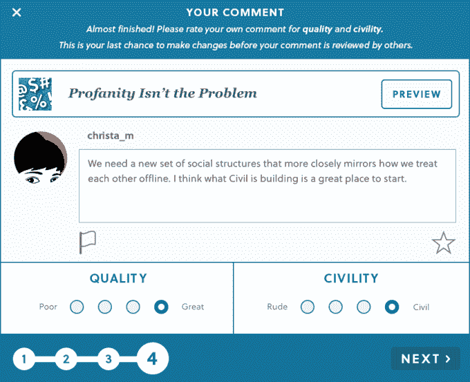

# 民间评论能杀死网络巨魔吗？–第 554 页–

> 原文：<https://web.archive.org/web/https://techcrunch.com/2015/10/31/can-civil-comments-kill-internet-trolls/554/>

套用一句常见的网络奇谈怪论“互联网评论是自希特勒以来最糟糕的事情”。我的意思是:他们糟透了。他们糟透了。不，他们*真的*烂。

我们现在在网络评论上的问题很明显:消极和肮脏正在埋葬或阻碍其他一切。

作为一名在线作家，当你发现你的帖子所记录的评论只是兜售在家工作时赚取$$$的方法和/或发布一个关于在短短两周内将你的销售线索提高 250%的视频链接时，你会如释重负！你知道互联网的标准读者反馈结构有问题，非常非常的问题，而不是随机的尖酸刻薄，卑鄙的愚蠢或暴力的发泄。

可怜可怜科技世界吧，一定有更好的方法！

我并不是说完全关闭评论——尽管越来越多的网站正在这么做，包括一些媒体公司(显然)缺乏资源和/或意志力来有效监管从互联网下半部分无情流出的污水。

但是完全关闭评论是向巨魔的胆汁色旗帜投降。

虽然听到沉默可能比最半心半意的巨魔挽歌更令人愉快，但这也意味着你让真正投入的读者沉默了——他们可能有一些有趣的事情要说，只要他们觉得值得说出来。所以你放弃了发展自己社区的机会。

当然，任何媒体公司都可以将评论转移到社交网络——将评论外包给脸书和推特，在那里你的内容很可能会被再次传播。但是随着[越来越多的网络用户的注意力转向社交技术平台](https://web.archive.org/web/20200107061638/https://beta.techcrunch.com/video/facebook-and-twitter-shut-out-publishers/519169123/)——特别是当这些主导平台制定[越来越多的控制](https://web.archive.org/web/20200107061638/https://beta.techcrunch.com/2015/05/12/facebook-instant-articles/) [媒体/内容分发策略](https://web.archive.org/web/20200107061638/https://beta.techcrunch.com/2015/10/06/project-glacier/#.ahvbbe:Lkpt)——这可以说是非常短视的想法。

在网络出版的流沙中，面对社交网络的商品化和对其广告驱动的商业模式的攻击，媒体公司确实应该有新的动力来保持和维持自己强大的品牌身份。要做到这一点，绝对需要有一个积极参与的社区。你如何让更多的人关注你的作品？你让他们的声音被听到，作为你提议的一部分。

> 许多科技公司……并不认为内容是他们的责任。

因此，进入这个四面楚歌的评论舞台的是 [Civil](https://web.archive.org/web/20200107061638/https://civilcomments.com/we-are-civil/) :一家由前在线评论版主艾捷拉·波格丹诺夫共同创立的初创公司，他厌倦了试图扑灭从不受监管的管道中喷涌而出的源源不断的评论。她的回答？一个评论插件，要求用户参与一个文明和质量的框架，作为能够表达他们观点的具体进入标准。

她认为，目前的数字服务模式使用人工主持人来评估评论内容的可接受性——通常是在事后——是“一种不太有效的方式”。结果呢？嗯，结果很明显…欢迎来到 Trolltown:人口，喊得最响的傻逼。

那么你如何确定文明和质量呢？你让读者来判断。因此你众包评论审核。在 Civil 的情况下，这意味着查看其他三个评论，然后发布你的一个评论。

该系统还要求评论发帖者在提交给其他人审查(以及可能的发布)之前，审查他们自己评论的质量和文明程度——因此有效地提醒他们检查自己的意见。

这些额外的步骤会导致发布的总体评论减少吗？该团队声称，到目前为止，他们只看到了这方面的边际影响——声称测试期间的废弃率为 6%。

用户还会根据他们在评论平台中的行为获得文明程度评级，该评级用于控制他们在某些热点场景中的评论权限(例如，参见下文 Civil 的“筛选模式”功能)。

从技术上来说，这真的是一个非常简单的想法——简单到你不得不奇怪为什么以前没有人做过。但是这个问题引出了一个更有趣的想法:糟糕的网络评论实际上是忽视的副产品。欠考虑的设计和零/最小投资的直接后果。就像杂草在无人照管的土地上生长一样——如果你不为好东西的生长创造条件，你还能指望什么呢？

当我问一个显而易见的问题——即为什么以前没有这样做——时，波格丹诺夫说:“我们经常被问到这个问题。“现在，许多科技公司并没有真正把内容视为自己的责任。他们提供工具让网站所有者发表评论，但人们实际上发表的内容他们说，这取决于你来调节。然后，网站所有者有责任迫使他们在网站上设置昂贵的审核团队。而且显然他们跟不上。”

“我认为，在塑造人们如何在线互动方面，技术可以做很多事情，”她补充道。“对于为什么其他公司没有这么做，我有很多理论——但我不能确定。”

> 我们都应该有一个体面的网络文化。

在 Civil 的例子中，也有一些算法上的特殊酱在后台进行——以确定哪些读者被要求对哪些评论进行评级。所以这并不像表面上看起来那么简单。“我们选择评论；所以这不是一场受欢迎程度的竞赛，”波格丹诺夫是这样解释的。

她不会透露这些算法到底是如何工作的——鉴于任何评论平台都需要防范试图集体利用其机制的风险(例如，像#Gamergate 及其周围的协同评论攻击)。但她会说，这涉及到观察“人的行为”。

“我们花了很多心思来制作它，所以它不是一个受欢迎的比赛。因此，召集一群朋友来改变投票结果并不容易，”她补充道。“随着时间的推移，我们看到了一个人的行为模式，系统能够确定谁在以值得信任的方式行事。”

简而言之，Civil 的论点是，现实世界公共空间中的后果和社会结构有助于让(大多数)人在大部分时间里在公共场合做和说文明的事情。但是网上呢？好吧，那完全是另一个无法无天的故事。

“在网上，我们没有那些社会结构。我们没有这样的系统来不断提醒人们沉溺于自己的本能会导致负面后果……所以，问题不在于人们为什么要做这些事情，而在于“人们缺少了什么来阻止他们做这些事情？”博格丹诺夫认为。

“与其说‘天哪，为什么网上的人这么可怕？’从‘为什么人们在面对面的情况下不经常这么糟糕’的角度来看待这个问题对我们更有帮助。"

为什么要让读者从文明和质量两方面来评判评论？这是为了鼓励人们抛开更多情绪化的个人反应——这可能意味着他们喜欢或不喜欢某个特定的评论——而是推动他们做出更公正的评估，基于一个评论是诚实的还是有意的，或者是可接受的还是辱骂的。

“我们真正需要做的是，我们需要进入那里，我们需要改变人们提交内容和评论的方式。我们需要确保我们给了他们表现良好的好理由。她补充道:“我们还需要确保自己有能力知道评论的内容是什么。

Civil Comments 要求用户注册才能发表评论，但并不强制实行实名制，这与脸书评论不同。该团队认为，允许用户使用假名发表评论是对参与公共辩论的人们的重要保护。

Civil 的另一位联合创始人兼设计师克里斯塔·姆根(Christa Mrgan)表示:“实名制政策……通常对善意行事的人造成的伤害比对防止不良行为/不良行为者的伤害更大。”。“一个真实的名字真的可以用来对付你。我认为仅仅为了参与就要求人们把自己放在那里是一件可怕的事情..我认为这是一个非常高的价格。”

那么在这个众包评论审核管道的商业端，网站用户看到了什么？除了质量/礼貌之外的所有评论？还是只有最低质量/礼貌标准的评论？

这是它仍在调整的东西。“现在，默认的是每条评论三个等级，有 2/3 的批准系统，但我们实际上正在试验不同的变化，针对低流量的网站。我们还可以根据出版商的需求进行配置，”Mrgan 说。

该团队于今年 1 月开始从事这项业务，迄今已筹集了约 34 万美元的天使投资。他们的第一个产品( [Civil Comments](https://web.archive.org/web/20200107061638/https://civilcomments.com/) )仍然在他们自己创建的模拟网站上进行公开测试。他们还没有安装在任何第三方网站上——“希望很快…我们正在讨论中”，他们在客户面前说。

最初的商业模式是 SaaS——他们销售 b2b，但计划开放一个免费增值产品供个人博主在未来使用。除了民间评论，他们还有其他产品的其他想法，尽管他们在这个阶段没有公开讨论这些计划。

“当你开始以这种方式设计平台时，一旦这个平台建立起来，我们希望能够解决许多其他问题，”Mrgan 说。

这里可能也有许可证交易吗？给我的印象是，这里有一些想法可以应用到社交平台上，比如 Twitter，它一直存在协调一致的滥用攻击的问题(尽管 T2 在幕后做了更多的工作，试图阻止滥用推特的传播)。

当我提出这个建议时，他们只会笑着说“也许吧”。

尽管网站关闭评论的举措，以及由于努力与骚扰的比例，网络用户对整个评论过程普遍感到疲劳，但他们对他们的时机持乐观态度。

波格丹诺夫说:“我认为，在某种程度上，许多网站都明白，这些是他们最活跃的用户——这是他们最有价值的资产之一，是他们的社区，对，围绕他们的内容形成的社区。”。

“对于这些公司中的许多公司来说，目前存在的平台无法计算出这些数字，因为在大量评论中进行调节需要花费大量资金。有了像 Civil Comments 这样的东西，真正有助于重置平衡，并把更多的控制权交给他们最好的社区成员，我认为我们会看到更多的网站愿意重新投入进来。因为这对他们真的有好处。”

“这就像在你的网站上有一个迷你社交网络，”Mrgan 补充道。

我认为，一家以修复在线评论为使命的初创公司由两位女性创始人领导，这或许不是偶然的——因为女性经常不得不忍受在线评论中的仇恨。

这两个人在这一点上很圆滑。“这肯定是个问题。这对每个人来说都是个问题。他们说，“我们都应该拥有一个体面的网络文化”。

他们有多大信心，他们所构建的东西能够经受住像 Gamergate 引发的那种有组织的辱骂性评论攻击？

“我不知道我们是否希望公开表明我们有信心不会被欺骗……我认为我们在应对协同攻击方面有很大的进步。我认为没有什么是完美的——我们再次使用现实世界作为我们的基准，在现实世界中，没有什么是 100%安全的，不会受到协同攻击，对吗？但是我们已经建立了我们认为会有所作为的系统，”Bogdanoff 说。

其中一个系统是一个名为“围攻模式”的功能，一篇文章可以被部分评论锁定。“它仍然能够接受评论——如果你的文明程度足够高，如果你的信任度足够高，你仍然可以对这篇文章发表评论，”Mrgan 解释道。

“如果你没有这个礼貌等级，如果你是一个全新的评论者。它会根据可疑活动自动进入这种模式。或者出版商自己可以将文章置于围攻模式。因此，如果你作为一个新的评论者去那里，或者你的文明程度不够高，你会收到一条小消息，说:‘很抱歉，这篇文章收到了大量可疑活动。评论区仅限于文明程度达到 80%或以上的人。但是你可以通过在网站的其他地方发表文明评论来提高你的文明程度。"

“提高你的文明程度需要付出努力，”她补充道。

一个旨在让巨魔流汗的评论平台？现在你在说…