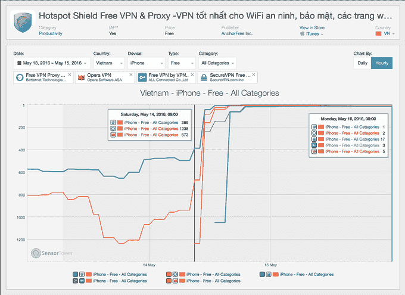

# 由于越南公民抗议，脸书在周末封锁了越南——第 559 页

> 原文：<https://web.archive.org/web/https://techcrunch.com/2016/05/17/facebook-blocked-in-vietnam-over-the-weekend-due-to-citizen-protests/559/>

作为越南政府对社交媒体镇压的一部分，脸书 似乎已经在越南被屏蔽，公众抗议[台塑建造的](https://web.archive.org/web/20190709184633/http://uk.reuters.com/article/vietnam-formosa-plastics-environment-idUKL3N17U2KH)钢铁厂有毒物质排放造成的环境灾难。持不同政见者指责钢铁厂的废水导致了水产养殖场和中国中部省份水域的大量鱼类死亡。市民一直在利用脸书组织集会，这可能是政府关闭的原因。

据报道，Instagram 似乎也受到了影响。

除了帮助抗议者组织起来，社交媒体还被用来分享集会中人们的照片，举着手写的标语，上面写着“我选择鱼”

市民对钢铁公司和政府的不作为感到愤怒。福尔摩沙否认在此事件中有不当行为，环境与自然资源部副部长称鱼类死亡是由有毒藻类大量繁殖或工业废物造成的。他也否认台湾是罪魁祸首。

警方在胡志明市的巴黎广场逮捕了多达 300 名抗议者，在此过程中有多人受伤。

联合国人权事务高级专员最近在一份新闻稿中提到了这些抗议活动，他说:“我们对针对越南抗议者的暴力升级感到担忧，这些抗议者表达了他们对该国中部海岸鱼类神秘大量死亡的愤怒。”

路透社报道，抗议者试图在周日举行第三次集会，但是河内和胡志明市的安全措施阻止了大型集会的举行。

鱼类捕杀始于 4 月，政府调查仍在进行中。

据以色列代理服务公司 Hola 称，该公司的软件将被用来绕过类似的互联网审查(并通过新闻稿利用这种情况)，脸书和照片分享应用 Instagram 在周日被屏蔽。

该公司表示，在脸书封锁之后，下载量出现了大幅增长。

该公司在其博客中写道[“虽然安全部队一直在阻止抗议者在河内和胡志明市聚集，但许多市民一直在使用脸书交流信息和组织集会，因此政府被认为已经关闭了网站。”。](https://web.archive.org/web/20190709184633/http://hola.org/blog/vietnam-facebook-hola-2016/)

我们已经通过应用商店优化公司 [Sensor Tower](https://web.archive.org/web/20190709184633/https://sensortower.com/) 证实，该国的移动 VPN 应用程序也出现了巨大的增长，因为那里的用户正在试图绕过封锁。(见上图)。这种模式类似于 WhatsApp 在巴西被屏蔽的情况，很好地表明脸书的屏蔽确实有效。

作为另一个消息来源，Opera & Asia 的公关负责人[在 Twitter 上发布](https://web.archive.org/web/20190709184633/https://twitter.com/peko0413)称，他们公司看到来自越南的 VPN 用户激增，并怀疑是脸书的一个屏蔽造成的。

还有[的](https://web.archive.org/web/20190709184633/https://twitter.com/papayatshirt/status/731918473442394112)和[的](https://web.archive.org/web/20190709184633/https://twitter.com/VietNamTweeter/status/731451447108239361)[号](https://web.archive.org/web/20190709184633/https://twitter.com/lotusr00t/status/732361201703755777)推特和[报告](https://web.archive.org/web/20190709184633/https://twitter.com/chriswotton/status/731884347054247936)也出现了堵塞。

https://twitter.com/lotusr00t/status/732361201703755777

多年来，越南政府一直断断续续地屏蔽社交媒体，尽管最近越南领导人似乎开始拥抱脸书。十月，[彭博报道](https://web.archive.org/web/20190709184633/http://www.bloomberg.com/news/articles/2015-10-22/vietnam-communists-turn-to-once-blocked-facebook-to-hone-message)越南共产党政府甚至在网络上建立了自己的网页，名为“政府信息”，试图覆盖使用该服务的 3000 万公民。

脸书尚未回应置评请求。

目前还不清楚这项旨在镇压周日抗议活动的禁令是否仍然有效。然而，根据跟踪断电的网站，比如[断电，报告](https://web.archive.org/web/20190709184633/http://outage.report/facebook)和[下降探测器](https://web.archive.org/web/20190709184633/http://downdetector.com/status/facebook/map/)，它似乎已经被解除。

也不清楚它是否延伸到了河内和西贡以外，示威活动计划在那里举行。