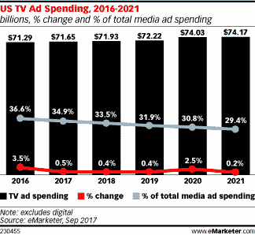

# 5660 万美国消费者今年将没有付费电视，因为削减开支加速了 

> 原文：<https://web.archive.org/web/https://techcrunch.com/2017/09/13/56-6-million-u-s-consumers-to-go-without-pay-tv-this-year-as-cord-cutting-accelerates/>

对传统付费电视来说，坏消息是:削减开支的速度比先前估计的要快。根据 eMarketer 的一份新行业[报告，今年将有 2220 万 18 岁及以上的脐带切割者——这一数字比 2016 年增长了 33.2%。该公司表示，随着削减开支的步伐加快，它不得不修改预测。此前，该公司认为美国只有 1540 万台脐带钳。](https://web.archive.org/web/20221025222913/https://www.emarketer.com/Article/eMarketer-Lowers-US-TV-Ad-Spend-Estimate-Cord-Cutting-Accelerates/1016463)

此外，所谓的“有线电视用户”(cord-never)也在增长，这意味着那些从一开始就没有选择订阅传统有线电视或卫星电视的消费者。虽然这一增长速度较慢——今年为更温和的 5.8%——但脐带 nevers 的总数却更高。eMarketer 表示，2017 年美国将有 3440 万成年脐带神经者。

当你把脐带钳和脐带管结合起来，今年美国将有 5660 万非付费电视观众。

eMarketer 表示，到 2021 年，脐带剪断者的数量将接近脐带缠绕者的数量，前者为 4010 万，后者为 4100 万。

该公司将其修订后的预测部分归因于目前可用的直播和超顶级平台的不断增长。

除了像 Sling TV 和 PlayStation Vue 这样的现有玩家之外，在不到一年的时间里，我们已经看到了直播电视流媒体领域的新参与者，如去年年底进入的[AT&T ' s DirecTV Now](https://web.archive.org/web/20221025222913/https://beta.techcrunch.com/2016/11/28/att-unveils-its-tv-streaming-service-directv-now-which-will-launch-on-nov-30/)； [YouTube TV](https://web.archive.org/web/20221025222913/https://beta.techcrunch.com/2017/04/05/youtubes-35-live-tv-streaming-app-is-now-available-in-five-us-cities/) ，4 月上线；还有 [Hulu Live TV，](https://web.archive.org/web/20221025222913/https://beta.techcrunch.com/2017/05/03/hulu-with-live-tv/)5 月份到的。还有越来越多的体育流媒体服务，包括 [fuboTV](https://web.archive.org/web/20221025222913/https://beta.techcrunch.com/2017/06/19/fubotv-55-million/) 和 [Stadium](https://web.archive.org/web/20221025222913/https://watchstadium.com/) 。与此同时，一些大公司也宣布了类似的进入直播领域的计划，包括 [CBS 体育](https://web.archive.org/web/20221025222913/https://beta.techcrunch.com/2017/08/08/what-we-know-about-cbss-upcoming-streaming-service-for-sports/)和 [ESPN](https://web.archive.org/web/20221025222913/http://www.marketwatch.com/story/what-the-espn-streaming-service-will-look-like-2017-08-08) 。

这还只是直播电视。

包括网飞、亚马逊、Hulu、HBO 等在内的点播市场也在增长。甚至迪士尼也在为自己的网飞竞争对手做准备。

eMarketer 的高级预测分析师克里斯·本特森(Chris Bendtsen)指出:“年轻观众继续转向专门观看(过度)视频，或者结合免费电视节目观看这些视频。

“去年，即使是奥运会和总统选举也无法阻止年轻观众放弃付费电视，”本特森补充道。

付费电视收视率下降的另一个因素与我们现在观看视频内容的方式有关。eMarketer 说，美国成年人只是不像过去那样看电视了。eMarketer 指出，除数字电视外，看电视的平均时间将下降 3.1%，至 3 小时 58 分钟，这是首次低于每天 4 小时。

与此同时，数字视频观看量在 2016 年增长了 9.3%，达到 1 小时 17 分钟。

报告称，由于观众的这种转变，付费电视广告市场现在也开始感受到削减开支的痛苦。今年美国电视广告支出将仅增长 0.5%，至 716.5 亿美元，低于 eMarketer 今年早些时候预测的 727.2 亿美元。

因此，电视在美国媒体广告支出预算总额中的份额今年将降至 34.9%，预计到 2021 年将低于 30%。

当然，电视广告市场并不是唯一一个因削减开支而遭受损失的市场。付费电视提供商，包括 Dish、Comcast、Charter 和美国电话电报公司，也感受到了对其股票价格的影响，因为他们失去了付费电视用户。

尽管削减开支的步伐在加快，付费电视仍然拥有广泛的观众。

今年，超过 1.963 亿美国成年人将观看付费电视(意味着有线、卫星或电信)——这一数字比 2016 年下降了 2.4%。但到 2021 年，这一数字将比五年前下降近 10%，达到 1.817 亿。

付费电视市场的唯一增长预计将来自 55 岁及以上的人群。eMarketer 表示，这是唯一一个人数会上升的人群，而所有其他年龄组的人数都在下降。