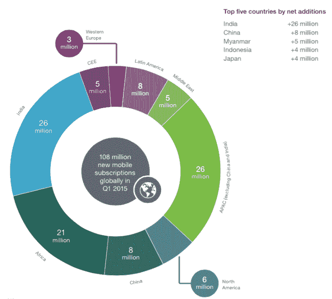
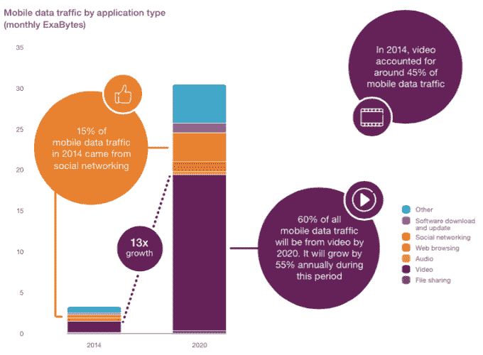
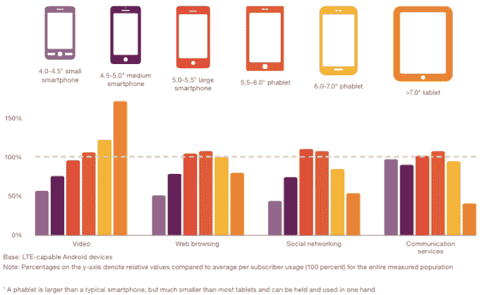
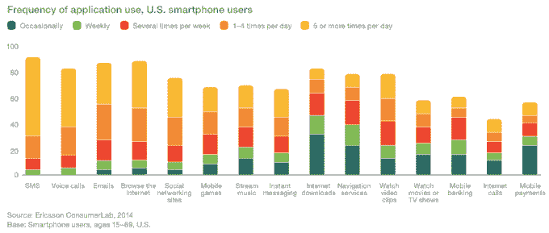

# 到 2020 年，全球智能手机用户将达到 61 亿，超过基本固定电话用户 

> 原文：<https://web.archive.org/web/https://techcrunch.com/2015/06/02/6-1b-smartphone-users-globally-by-2020-overtaking-basic-fixed-phone-subscriptions/>

今天，全球有 26 亿智能手机用户，尽管美国和欧洲等发达市场的增长已经趋于平稳，但远没有完全停滞。到 2020 年，全球将有 610 万智能手机用户，这将得益于不太成熟市场的巨大增长。随着 61 亿部智能手机在流通，我们将看到一个转折点:智能手机最终将在 2020 年超过全球活跃的固定电话用户数量。

这些数字来自[爱立信](https://web.archive.org/web/20221130214844/http://www.ericsson.com/)的最新年度[移动报告](https://web.archive.org/web/20221130214844/http://www.ericsson.com/ericsson-mobility-report)，该报告于今天发布。利用从全球约 100 家运营商收集的数据，爱立信利用这些数据描绘了目前的状况以及未来的预期，不仅涵盖了有多少人在使用移动网络，还涵盖了他们如何使用移动设备。

这 61 亿智能手机用户相当于五年内全球约 70%的人口使用智能手机，这表明这些设备对于我们如何相互交流和做更多事情变得多么重要。

事实上，到 2020 年，“移动”用户总数将达到 92 亿。当你考虑到物联网和 M2M 服务、移动宽带甚至一些基本的剩余功能手机时，五年后将有 260 亿台联网设备。(正如[一些人指出的](https://web.archive.org/web/20221130214844/http://www.mobileworldlive.com/ericsson-backtracks-2020-vision-connected-devices)，然而，这实际上是对爱立信之前预测的 500 亿联网设备的向下修正。)

然而，尽管这些新的基于移动的服务正在兴起，平板电脑等其他类别也在增长，但引领移动充电的是智能手机。到 2020 年，它们将占所有移动数据流量的 80%。

这种增长在多个方面产生了巨大影响。首先，它指出了我们作为消费者的行为是如何演变的。

但在更实际的层面上，这也表明运营商需要投资网络来承载所有的数据流量(或者——正如脸书和谷歌可能希望的那样——寻找其他替代方案来提供连接)；它强调了初创公司和大型企业创造应用程序和其他服务来满足我们的移动需求的机会。

报告中有大量的数据:以下是一些更有趣的统计数据、图表和预测:

— **新兴市场是所有增长都集中的地方。爱立信预测，像亚太、中东和非洲这样的地区将在未来五年内占所有新用户的 80 %,继续其已经跟踪的趋势。在 2015 年的 Q1，净增加的前五个国家是印度、中国、缅甸(这确实远远落后；它现在才开始整理其服务的某些方面，如国际漫游)，在此期间，全球 1.08 亿新用户中，印度尼西亚和日本的净增用户最多。**

— **到 2020 年底，80%的移动数据流量将来自智能手机**。虽然我们听到很多关于人们现在如何使用智能手机作为他们的主要计算设备的说法，但事实是我们正处于移动数据使用的真正爆炸之中。爱立信表示，未来五年将增长十倍，仅亚太地区就占其中的 45%。

虽然增长发生在一个地方，但使用将发生在其他地方。正如今天的情况一样，美国/北美和欧洲将继续成为每部智能手机的最大数据使用量，因为人们继续在他们的设备上消费更多带宽密集型服务，如视频。

— **视频已经占据了应用程序流量的 45 %,将上升到 60%**。这里的故事是关于像 YouTube 和网飞这样的 OTT 提供商，它们是最受欢迎的两家，因此也是最大的带宽掠夺者。爱立信称，这是一个不会消失的事实:手机上的视频消费目前正以每年 55%的速度增长。它进一步指出，仅 YouTube 一家就占了今天所有视频流量的 40-60%。有趣的是，音乐流媒体稳坐第二把交椅，尽管它“越来越受欢迎”，但在任何时候都不太可能超过视频。部分原因是因为很多音乐消费是线下的。社交网络只占 15%。

与我们在应用中看到的流量相比，移动网页浏览流量将继续下降。今天，它只占交通流量的 10 %,到 2020 年将下降到 5%。

— **大型活动带动了巨大的使用量**。爱立信指出，2014 年足球世界锦标赛是“2014 年最大的社交媒体事件之一”，这种繁荣也在移动设备上表现出来，人们使用智能手机在社交网络上发短信、聊天和发帖。世界杯总共产生了 26.7 万亿字节的流量，“这些数据相当于 4850 万张数码照片加上 450 万次语音通话。”

— **尺寸至关重要**。众所周知，屏幕的大小会影响一个人消费什么以及消费多少。具体来说，视频仍然是吸引平板电脑用户的服务——鉴于更大的屏幕和更好的整体体验，这并不奇怪。有趣的是，这并没有渗透到其他更具交互性的功能中。

— **在我们今天可以用手机做的许多事情中，短信仍然是美国最常用的应用程序**，老式的语音通话仍然位居第二。

尽管如此，当你考虑所有其他服务时，总体来说，我们在北美看到了数据使用的一个主要高峰。爱立信表示，到 2020 年，北美每部智能手机每月平均数据使用量将从现在的 2.4 GB 增加到 14 GB。

这在很大程度上取决于超级用户。“大量数据用户占总用户的 10%，但却产生了总数据流量的 55%，”爱立信指出。“视频在重度用户中占主导地位，他们通常每天观看约一小时的视频，比普通用户多 20 倍。”

