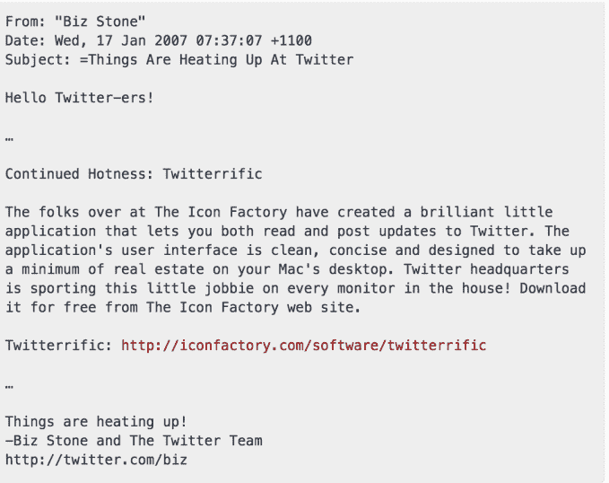
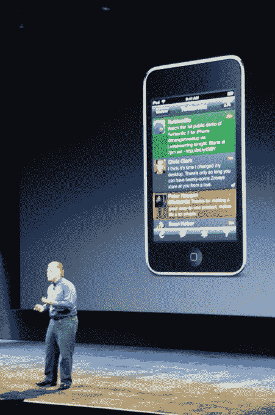

# 600 万用户安装了第三方 Twitter 客户端 

> 原文：<https://web.archive.org/web/https://techcrunch.com/2018/08/17/6-million-users-had-installed-third-party-twitter-clients/>

Twitter 试图淡化停用其遗留 API 对其社区和许多高级用户首选的第三方 Twitter 客户端的影响，称“不到 1%”的 Twitter 开发者正在使用这些旧 API。Twitter 对开发者群体规模的描述是正确的，但它在这个过程中忽略了数百万第三方应用用户。根据 Sensor Tower 的数据，2014 年 1 月至 2018 年 7 月期间，600 万 App Store 和 Google Play 用户安装了前五大第三方 Twitter 客户端。

在过去的一年里，这些顶级第三方应用程序被下载了 50 万次。

该公司还表示，这些数据基本上没有重新安装。

在过去的三年半中，用户安装的第三方 Twitter 应用包括:Twitterrific、Echofon、TweetCaster、Tweetbot 和 Ubersocial。

当然，这些用户中的一部分可能已经转向了 iOS 或 Android 的 Twitter 原生应用，或者他们可能同时运行第三方应用和 Twitter 自己的应用。

即使这 600 万用户中只剩下一部分，他们也代表了一个小的、有发言权的、在某些情况下是突出的用户群。这也是一个非常令人不安的问题。对于一家刚刚宣布[在最近一次盈利中损失了一百万用户的公司来说，Twitter 没有找到一种方法来容纳这些用户，甚至没有让他们加入其新的 API 平台来从他们身上赚钱，这看起来很奇怪。](https://web.archive.org/web/20230124072727/https://techcrunch.com/2018/07/27/twitter-posts-record-100m-profit-but-loses-1m-users/)

显然，Twitter 在做出这个决定时，是在权衡数据和事实，而不是用户情绪和公众看法。但是有些东西比电子表格上的数字更有价值。它们是公司历史和文化的一部分。当然，Twitter 完全有权利毁掉这一切，继续前进，但这并不意味着它是正确的决定。

平心而论，Twitter 说这是一个小团体并没有撒谎。与 Twitter 的原生应用用户群相比，第三方用户群微不足道。在 600 万人下载第三方应用的同时，官方 Twitter 应用在 iOS 和 Android 上的安装次数高达 5.6 亿次。这使得第三方应用程序的安装份额约为 1.1%。

这些年来，这个用户群可能也一直在萎缩。在过去的一年里，虽然排名靠前的第三方应用程序被安装了 50 万次，但 Twitter 的应用程序被安装了 1.17 亿次。这使得第三方应用程序的下载份额仅为 0.4%，而官方应用程序的市场份额为 99%。

但是第三方应用开发者和应用用户是超级用户。甚至是狂热者。福音传道者。

Twitter 本身称赞他们具有开创性的“我们都知道和喜欢的产品功能”，如静音选项、拉至刷新等。这意味着应用程序的持续存在给 Twitter 服务带来的价值比数字本身更大。

*图片来源:[iMore](https://web.archive.org/web/20230124072727/https://www.imore.com/evolution-social-media-icon)*

它们是 Twitter 历史的一部分。你甚至可以把 Twitter 的标志归功于其中一个应用程序！最初，Twitter 只有一个排版版本的名字。然后 Twitterrific 出现了，并引入了一只鸟作为其标志。Twitter 很快跟进。

Twitterrific 也是第一个使用“tweet”这个词的人。(该公司使用了“推特”你能想象吗？)

这些第三方应用程序还在留住用户方面发挥了作用，这些用户正在努力适应 Twitter 采用的新用户体验——其算法时间线。相反，正如一些人继续喜欢的那样，这些应用程序提供了按时间顺序排列的推文视图。

Twitter 削弱这些开发者应用的决定是可耻的。

这显示出对 Twitter 的历史、它的超级用户群、它的创新文化以及它作为一个平台而非目的地的本质缺乏尊重。

附言:

twit 太棒了