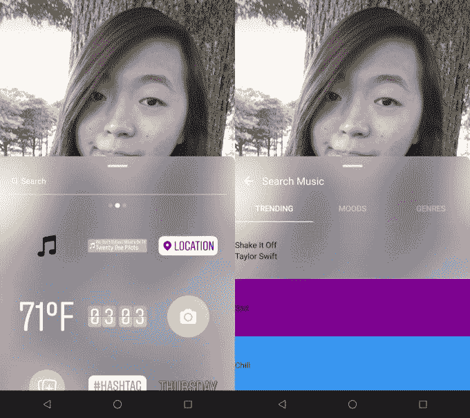
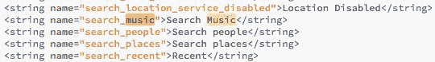
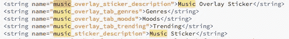

# Instagram 代码揭示即将推出的音乐功能 

> 原文：<https://web.archive.org/web/https://techcrunch.com/2018/05/07/instagram-music/?eml=2018May8/4316986/6011159&etsubid=175623481>

Instagram 正准备让你将音乐添加到你的故事中，从它的 Android 应用程序中找到的代码来判断。“音乐贴纸”可以让你搜索歌曲并添加到你的帖子中，这要感谢脸书最近与主要唱片公司达成的许可协议。Instagram 也在测试一种方法，可以自动检测你正在听的歌曲，并将艺术家和歌曲名称显示为一个视觉标签。

Listenable 音乐贴纸会让 Instagram 上的故事看起来更有趣。当你加上正确的分数时，业余视频片段突然看起来像 DIY MTV。该功能还可能在音乐上抢走青少年唇同步应用 sensation 的风头，并挫败竞争对手 Snapchat 计划但放弃了对音乐的大规模进军。除了 [Instagram Stories 的新平台直接分享来自第三方应用](https://web.archive.org/web/20221002164155/https://techcrunch.com/2018/05/01/stories-platform/)的帖子，包括 Spotify 和 SoundCloud，这些贴纸可以使 Instagram 成为音乐发现的强大驱动力。

TechCrunch 首先从读者 [Ishan Agarwal](https://web.archive.org/web/20221002164155/https://twitter.com/IshanAgarwal24) 那里得到了隐藏音乐图标和代码的提示。Instagram 拒绝置评。但 Instagram 后来证实了最初由 TechCrunch 报道并由 Agarwal 发现的另外三个主要功能，它最初拒绝讨论:[拍摄肖像的](https://web.archive.org/web/20221002164155/https://techcrunch.com/2018/04/10/instagram-focus-portrait-mode/)[聚焦模式](https://web.archive.org/web/20221002164155/https://techcrunch.com/2018/03/05/instagram-portrait-mode/)、 [QR 可扫描姓名标签](https://web.archive.org/web/20221002164155/https://techcrunch.com/2018/04/09/instagram-nametags/)用于[关注人物](https://web.archive.org/web/20221002164155/https://techcrunch.com/2018/04/09/instagram-nametags/)和[视频通话](https://web.archive.org/web/20221002164155/https://techcrunch.com/2018/03/01/instagram-audio-video-calling/)，后者在 F8 正式亮相[。](https://web.archive.org/web/20221002164155/https://techcrunch.com/2018/05/01/instagram-launches-video-chat/)

[更新:[简·满春·王](https://web.archive.org/web/20221002164155/https://twitter.com/wongmjane)告诉 TechCrunch，她曾短暂地测试过这个功能，如上面的截图所示。原型设计看起来有点滑稽，当她试图使用音乐贴纸发布任何内容时，Instagram 崩溃了。除了右边看到的音乐贴纸搜索界面，Wong 告诉我们 Instagram 自动检测到她目前正在手机上播放的一首歌曲，并为它创建了一个贴纸(不像 Shazam 那样使用音频识别)。]

脸书和 Instagram 的视频编辑功能长期以来一直处于可悲的状态。我在 2013 年写了关于[的大机会，并在 2016 年呼吁脸书和 Instagram 给](https://web.archive.org/web/20221002164155/https://beta.techcrunch.com/2013/12/06/video-is-facebooks-next-big-opportunity/?_ga=2.5276211.1209749627.1525707632-1361550980.1392837599)[添加更多的编辑功能，包括配乐](https://web.archive.org/web/20221002164155/https://techcrunch.com/2016/03/29/instacut-pro/)。最后，在 2017 年底，脸书开始了[测试声音收集](https://web.archive.org/web/20221002164155/https://techcrunch.com/2017/12/08/facebook-sound-collection/)，这让你可以向你的视频添加声音效果和非常有限的非流行艺术家的歌曲。但是从那以后，脸书已经获得了索尼、华纳、环球和欧洲唱片公司的许可。

 

多年来，人们一直认为脸书正在与唱片公司进行的谈判将会壮大 Spotify 的竞争对手。但流媒体是一个拥挤的市场，已经有了强有力的解决方案。对脸书来说，更大的问题是，如果用户使用编辑软件自己添加配乐，或者背景中播放的歌曲被录音捕捉到，这些视频可能会因唱片公司的版权投诉而被删除。脸书的意图正好相反——让你更容易将流行音乐添加到帖子中，这样使用起来会更有趣。

Instagram 的音乐贴纸可能是所有这些交易的高潮。

## Instagram 音乐贴纸的工作原理

代码显示，Instagram 的应用程序在其位置旁边内置了一个未发布的“搜索音乐”功能，以及 Instagram Stories 内的朋友提及贴纸搜索选项。可以使用“流派”、“情绪”和“趋势”标签来搜索这些“音乐叠加标签”Instagram 当然可以在发布前改变这一功能，或者完全取消它。但音乐贴纸的明显价值，以及 Instagram 承认 Focus、姓名标签和视频通话功能都在我们报告它们出现在代码中的三个月内的事实，增加了即将推出的产品的重量。

不完全清楚，但似乎一旦你选择了一首歌，并将其作为音乐标签添加到你的故事中，人们观看时就会播放这首歌的片段。有可能贴纸的初始版本只会显示艺术家和歌曲的标题，类似于脸书的活动状态更新，而不是实际上将其添加为可收听的配乐。

这些贴纸几乎肯定可以添加到视频中，但也许 Instagram 也可以让你把它们放在照片上。如果观众可以通过贴纸收听歌曲或在他们喜欢的流媒体服务上查看歌曲，那就太好了。这可能会让 Instagram 成为新的 Myspace，让你通过朋友爱上新音乐；代码中没有这方面的指示。

也许 Instagram 将与某个特定的合作伙伴合作开发这个功能，就像它与 Giphy 合作开发 GIF 贴纸一样。Spotify 的免费层和与脸书的长期整合可以追溯到 2011 年的 Open Graph ticker，显然会是一个选择。但脸书可能会更加中立，以另一种方式为该功能提供动力，或者与一系列提供商合作，可能包括苹果、YouTube、SoundCloud 和亚马逊。

像 Sounds 和 Soundtracking 这样的几个应用程序都试图成为“音乐的 Instagram”。但都没有获得大规模的关注，因为很难判断你是否很快喜欢上了一首歌，以至于暂停滚动，盯着专辑封面并不好玩，用户不想要一个完整的独立应用程序来实现这一点，脸书和 Instagram 的算法可以隐藏这些内容的交叉帖子。但是故事——带有容易跳过的原始视觉效果，在默认的社交应用程序中自然创建和消费——可能会成功。

让更多用户在使用 Instagram 时戴上耳机或打开声音，可能会给该应用的业务带来好处，因为广告商都希望被听到，也被看到。这些贴纸还可以让年轻的 Instagrammers 像 6000 万音乐用户一样跟着他们最喜欢的歌曲一起唱。从这个意义上来说，音乐可以给人们的生活增添情趣，否则他们可能不会通过故事表现出魅力。

音乐贴纸可以让 Instagram 抢先 Snapchat 一步。2014 年索尼黑客事件泄露的电子邮件显示，Snap 首席执行官埃文·斯皮格尔打算推出音乐视频流媒体功能，甚至创建 Snapchat 自己的唱片公司。但围绕收入分成谈判的复杂性，以及转移团队和产品对 Snapchat 核心用例的注意力的可能性，使该项目流产。相反，Snap 与探索频道的唱片公司和增强现实镜头合作，以[推广新歌。](https://web.archive.org/web/20221002164155/http://www.thedrum.com/news/2017/12/27/snapchat-courts-ed-sheeran-fans-with-lens-promote-new-lens)但 Snapchat 仍然没有声卡或配乐功能，使一些内容保持沉默或淹没在随机噪音中。

有了合适的弦乐，每一天都变得如诗如画。随着完美的嘻哈节拍，一个标准的场景获得了霸气。随着最热门的新舞蹈钩，任何地方都可以是一个党。Instagram 在过去的几年里建立了所有可以想象的视觉风格来修饰你的照片和视频。但是音频可能是故事的下一个维度。

*关于故事的未来，请阅读我们的专题文章:*