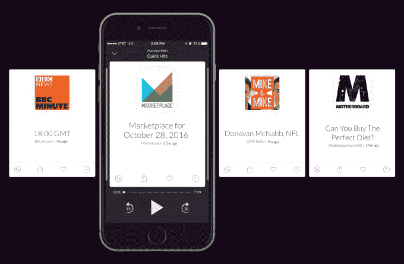

# 60dB 为 iPhone 带来了个性化的简短音频故事，Echo TechCrunch 也即将推出

> 原文：<https://web.archive.org/web/https://techcrunch.com/2016/10/27/60db-brings-personalized-short-form-audio-stories-to-iphone-and-soon-echo/>

今天发布的一款名为 [60dB](https://web.archive.org/web/20221209125253/http://60db.co/) 的新移动应用希望提供更好、更个性化的广播服务，专注于短格式音频内容。该应用程序包括新闻、体育、商业、娱乐、喜剧故事等，来自各种出版商，您使用该服务的次数越多，这些内容就会根据您的兴趣进行定制。当你有更多的时间来听的时候，也可以有一个单独的章节来讲述更长的故事。

总的来说，60dB 的目标是将人们最喜欢听的广播内容与数字产品的个性化功能结合起来。

这家初创公司由前《NPR》记者史蒂夫·亨恩(Steve Henn)和两位长期在网飞工作的高管共同创立，史蒂夫·麦克伦登(Steve McLendon)也曾在 Vessel 工作，约翰·钱库提(John Ciancutti)是一名早期的网飞工程师，曾负责该公司在 T2 的首个个性化软件 T3，后来成为产品工程主管。

正如 Henn 在[今年早些时候的一篇博客文章](https://web.archive.org/web/20221209125253/https://medium.com/@HennsEggs/tell-the-stories-you-want-to-tell-4527a57f50b8#.hdd4r4hll)中所说，他想创造一种更好地为听众服务的广播服务。

“我的旧收音机——伴随我长大的那台——仍然不了解我。它不知道是什么让我关掉它，或者拨动拨号盘，”他解释道。

“很长一段时间以来，我一直有一种挥之不去的感觉，那就是我的旧收音机覆盖的世界不够。我们的文化中有很大一部分——美国经验和全球经验的很大一部分——被我的收音机忽略了。“那不是在敲打电台节目，或者电台的人；这是媒体本身的局限。”

他的初创公司 Tiny Garage Labs 的产品 60dB 的目标是为听众提供你关心的各种故事，但更侧重于简短的内容。Henn 说，播客常常长达一个小时甚至更长，这使得它们很难融入你的日常生活。

也就是说，60dB 将包括一个名为“深入”的更长形式内容的部分在这里，你可以找到更长的故事、节目和播客。但该应用真正的重点是“快速点击”部分，这是一个个性化的故事提要，当你没有太多空闲时间时可以听听。

内容来自一系列出版商，包括 Marketplace、BBC、ESPN、塞斯·梅耶斯深夜秀、史蒂芬·科拜尔深夜秀、彭博和华尔街日报。《大西洋月刊》、Fusion、Mic、Vox、Motherboard Recode 和《纽约时报》也提供了独家音频短片。在发布时，有超过 200 万个故事可用。

当你听的时候，应用程序的 feed 会刷新，所以当一个程序结束时，你不必花时间寻找新的东西来听。你也可以跳过你不喜欢的故事，喜欢你喜欢的故事，和朋友分享。当您与服务互动时，60dB 将了解您的兴趣，以便更好地为您定制订阅源。

个性化是当今许多音乐服务的竞争优势。

Pandora 通过拇指向上和拇指向下的交互方式推广了其流媒体广播应用的趋势，现在 Apple Music 和 Spotify 等新的点播流媒体服务通过定制的播放列表和推荐来满足用户的兴趣，例如 Spotify 广受欢迎的 Discover Weekly 播放列表。

然而，在寻找口语或播客内容时，同样的个性化努力实际上并不存在。

60dB 还出现在消费者对听音频内容越来越感兴趣的时候，包括播客以及简短形式的音频节目，如[苹果的口语版](https://web.archive.org/web/20221209125253/https://beta.techcrunch.com/2016/10/03/spoken-editions-go-live-on-itunes-so-you-can-listen-to-your-favorite-websites/)或[新的亚马逊 Prime perk，Audible Channels](https://web.archive.org/web/20221209125253/https://beta.techcrunch.com/2016/09/13/amazon-adds-another-prime-benefit-audible-channels-and-free-audiobooks/) 。

在某种程度上，这与家庭中新语音计算平台的快速采用有关，例如通过 Echo 扬声器的亚马逊 Alexa，或者现在的谷歌 home。由于这些连接的扬声器，人们可以积极地寻找更多的音频内容，以便在做其他任务时使用，如在厨房做饭、做家务或只是在客厅与家人一起放松。

这就是为什么 60dB 不打算把自己限制在移动领域。虽然它今天只在 iOS 上运行，但计划是不仅将该应用程序引入 Android，而且在不久的将来引入 Amazon Echo。

这家初创公司得到了天使和机构投资者的小轮种子资金支持，包括科斯拉风险投资公司、铆钉风险投资公司和彭博贝塔公司。