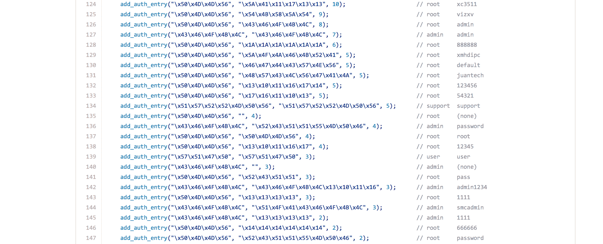

# 黑客发布了一个名为 Mirai 未来组合的强大 DDoS 应用程序的源代码——第 61 页

> 原文：<https://web.archive.org/web/https://techcrunch.com/2016/10/10/hackers-release-source-code-for-a-powerful-ddos-app-called-mirai/61/>

# 黑客发布了一款名为 Mirai 未来组合的强大 DDoS 应用的源代码

在对 [KrebsOnSecurity](https://web.archive.org/web/20191216010308/https://krebsonsecurity.com/2016/10/source-code-for-iot-botnet-mirai-released/) 和其他网络服务器造成严重破坏后，Mirai 未来组合僵尸网络(一种旨在利用不安全的物联网设备进行大规模拒绝服务攻击的程序)的创建者显然已经在 [Github](https://web.archive.org/web/20191216010308/https://github.com/jgamblin/Mirai-Source-Code) 上发布了源代码。

紧凑的 C 代码旨在运行在 IP 摄像机和其他互联网连接设备上。它尝试各种硬编码的根密码，感染设备，然后向预设目标发送流量。你可以在这个名为 scanner.c.

的文件中看到包含硬编码密码的代码。黑客利用僵尸网络向 Brian Krebs 的热门安全博客 KrebsOnSecurity 发送了 620 Gbps 的 DDoS。该系统虽然功能强大，但很容易因重启违规的物联网设备而受阻，而且更新似乎正在慢慢减少潜在目标的数量。在黑客论坛上发布代码的黑客 Anna-senpai 写道:“对于 Mirai 未来组合，我通常只从 telnet 中调用最多 38 万个机器人。”。“然而，在 Kreb(原文如此)DDO 事件后，互联网服务提供商开始慢慢关闭并清理他们的业务。如今，最大拉力约为 30 万个机器人，而且还在下降。”

克雷布斯并不认为这次发布是利他的，特别是考虑到他喜欢让黑客被捕。

他写道，“安娜-森派为何发布 Mirai 未来组合的源代码，这是一个悬而未决的问题，但这不太可能是一种利他主义的姿态:当执法调查人员和安全公司开始在离家太近的地方打探时，开发恶意软件的恶棍往往会公开他们的源代码。”“将代码发布到网上供所有人查看和下载，可以确保当当局带着搜查令来敲门时，代码的原作者不是唯一被发现拥有它的人。”

代码现在在 Github 上，看起来是合法的。我没有编译它，但文件本身有足够多有趣的信息，它可以成为研究人员的教育项目，可悲的是，它还是一个更邪恶用途的紧凑工具。