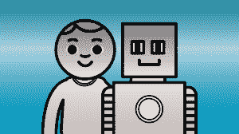
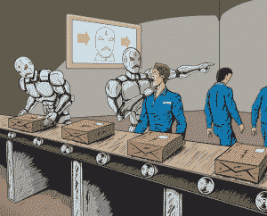

# “机器人税”真的是“创新惩罚”吗？–第 621 页–

> 原文：<https://web.archive.org/web/https://techcrunch.com/2017/04/22/save-the-robots-from-taxes/621/>

史蒂夫·考辛斯撰稿人

史蒂夫·考辛斯是

[Savioke](https://web.archive.org/web/20190901170940/http://www.savioke.com/)

，该公司开发和部署在人类环境中工作的自主机器人，以改善人们的生活。史蒂夫之前是机器人孵化器 Willow Garage 的总裁兼首席执行官。

More posts by this contributor

当[比尔·盖茨](https://web.archive.org/web/20190901170940/https://crunchbase.com/person/bill-gates) 最近建议机器人[应该像其他员工一样缴纳所得税](https://web.archive.org/web/20190901170940/http://www.businessinsider.com/bill-gates-robot-tax-brighter-future-2017-3)时，我并没有立即表示反对。我赞赏盖茨帮助解决社会即将面临的最大挑战之一的大胆想法:以一种“提升所有船只”的方式拥抱自动化，而不是将社会的大部分抛在后面。

机器人税将有助于抵消流入国库的收入减少，因为机器夺走了一些以前由人类占据的工作。

然而，在我们开始对部署机器人技术的公司征税之前，让我们先就机器人到底是什么达成一致。

当我们想到机器人时，我们通常会联想到在装配线上制造汽车的巨大手臂，或者在仓库周围运送货物的自动运输车辆。但机器人的经典定义相当简单:一组技术的组合，它们一起感知、评估和执行规定的任务。

这一定义的问题在于它太宽泛了，几乎所有技术——包括大多数现代家用电器、电脑和智能手机——都被归为机器人。那么，我们的底线在哪里？事实上，为什么单单对机器人征税，而不对其他提高自动化、生产率或质量的技术征税呢？

将外科医生的手部动作转化为更精确的微小器械动作的技术是否被视为机器人？自动提款机、自动食品杂货店收银台或者告诉你什么时候需要牛奶的冰箱怎么样？

我们可以缩小机器人的定义，只包括那些完成曾经由人类完成的任务的机器，但我们必须包括微软的大量硬件和软件产品，因为计算机可以做文字处理、转录、计算数学公式和分析数据等事情——所有这些过去都是人类的任务。

当你想到所有曾经由人类完成的任务现在都由机器完成时，很快就会明白将某些自动化技术划分到“机器人”类别中是多么困难。如果征收机器人税，为什么一家公司不会简单地把他们的新自动化技术归类为“计算机”、“电器”或“设备”？

当然，由于定义什么是机器人和什么不是机器人的挑战，实施机器人税不会很难。也几乎不可能证明自动化技术的实施和净失业之间的直接关联。在一些罕见的情况下，公司可能会部署一个自动化设备，然后同时解雇一个人。但是大部分公司都不是这么操作的。

他们不断部署新技术来提高生产率，解雇一些工人，同时雇用其他人。事实上，如果一个机器人导致一个人失业，可能会雇佣三个新员工——一个管理机器人，另外两个因为机器人提高了整体生产率，从而允许扩大招聘。

在现实中，机器人像大多数自动化一样，帮助人们提高效率和生产力，而不是取代他们。几个世纪以来都是如此。一项对英格兰和威尔士自 1871 年以来的人口普查数据的研究发现，在这 140 年间，科技创造的就业机会远远多于它摧毁的就业机会。“机器将承担更多重复性和费力的任务，但似乎没有比过去 150 年中的任何时候更接近消除对人类劳动力的需求，”德勤报告称。

当盖茨谈到机器人税时，本质上，他是在谈论对部署最新自动化技术的公司进行财政惩罚——一种“创新税”——对我来说，这是一种逆向税。

难道我们的政府不应该支持那些拥抱创新以努力提高生产率和增加收入的公司吗？这将使美国经济在全球范围内变得强大和有竞争力。

也许确保自动化改善所有公民生活的更好方法——而不是成为贫富差距越来越大的楔子——是确保企业为其利润纳税。

一个公司由于自动化和生产率的提高而变得越有利可图，它就应该向集体系统缴纳越多的所得税。当然，堵住让美国企业得以逃税的漏洞将是困难的，但这对全球经济的长期健康至关重要。

让企业支付公平份额的税收无法解决自动化最终将取代低技能工人这一更大的社会挑战，机器人税收也无法解决这一问题。相反，政府应该专注于利用公司税收创造免费或低成本的教育项目，让人们做好与自动化并肩工作的准备。

对于那些在未来技术驱动的社会中找不到工作的人，政府可以为最弱势群体提供普遍基本收入或其他安全网。

对于日益扩大的贫富差距，没有简单的答案。在自动化时代，这种差距只会加剧，让非熟练工人处于明显的劣势。但是机器人税不是这个问题的答案。