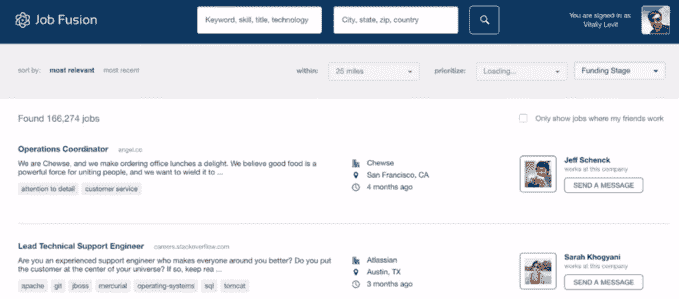
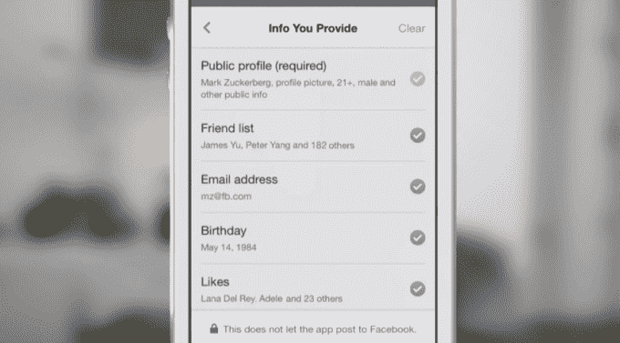

# 脸书关闭了向应用程序提供朋友数据的 API

> 原文：<https://web.archive.org/web/https://techcrunch.com/2015/04/28/facebook-api-shut-down/66/>

脸书让你自愿向第三方应用提供你朋友的状态更新、签到、位置、兴趣等等，这总是有点可疑。虽然这让开发者可以构建强大的个性化产品，但隐私问题导致脸书在 2014 年 F8 上宣布将在一年内关闭好友数据 API。现在这一时刻已经到来，随着强制迁移到 Graph API v2.0 导致好友数据 [API 关闭](https://web.archive.org/web/20211223170412/https://developers.facebook.com/docs/apps/changelog#v2_0_login)，以及其他一些变化在 4 月 30 日发生。

今天，脸书召集了三藩市的记者，讨论这一变化背后的修辞。自 2014 年 4 月 20 日以来创建的所有应用程序都已经有了新系统，所以你可能已经在野外见过它们了。但是所有新的开发者必须遵守更新的 API，否则他们与脸书的连接将停止工作。

工作融合将不得不关闭其推荐引擎

一些用户会认为这是一个积极的举措，将个人数据的控制权归还给了合法的所有者。仅仅因为你是某人的朋友，并不意味着你一定要相信他们对开发人员可以安全打交道的判断。现在，每个用户都将控制自己的数据命运。

除了年度通知，脸书还审查了 5000 个顶级应用，并向他们发送了关于他们的应用在改变后将如何表现的反馈。它的目标是尽量减少对用户的影响。

脸书的西蒙·克罗斯告诉记者，马克·扎克伯格说脸书的新口号之一是“以人为本”，因为“如果人们对使用脸书、登录脸书和在应用程序中使用脸书感到不舒服，我们就没有平台，我们就没有开发者。”

为了给新政策提供信息，脸书进行了广泛的面对面调查，询问用户在应用程序中使用脸书时，他们对自己的隐私有何感受。它认为，为了确保生态系统的长期健康，它必须让用户对如何处理他们的应用程序隐私充满信心。克罗斯说，当人们自信时，“他们会感到更快乐，会更多地使用我们的产品，这就是我们努力实现的目标”。

另一方面，一些开发者将不得不显著改变他们的应用程序的工作方式，或者完全关闭它们。例如，Job Fusion 依赖于获取用户朋友工作地点的能力，向他们显示这些公司的职位空缺。现在 [Job Fusion 正在关闭](https://web.archive.org/web/20211223170412/http://jobfusion.co/blog/no-more-referrals-fb-friends-api-shutting-down-april-30)它的推荐引擎，尽管它将继续以不同的方式运行。其他由于这一变化而变暗或已经变暗的包括 CareerSonar、Jobs With Friends 和 adzuna Connect。

随着 friends data API 的变化，脸书现在要求所有应用程序使用其新的登录系统，这使得用户可以更精确地控制他们给开发者的数据。以前，用户在两个大屏幕上提供他们所有的数据和权限。一个是所有个人信息，一个是一个应用程序代表你发布到脸书的能力。

现在，在登录屏幕上，开发者必须包括一个“编辑你提供的信息”链接，这将打开一个他们要求的所有数据和权限的清单，包括朋友列表、喜欢、电子邮件地址和发布到新闻订阅的能力。用户可以点击复选标记来拒绝某些权限。

最后，脸书现在已经建立了登录审查，由员工团队审查任何需要超出某人公共档案、朋友列表和电子邮件地址等基本数据的应用程序。登录审查团队现在已经检查了超过 40，000 个应用程序，并根据经验创建了新的、更具体的权限，因此开发人员不必要求超过他们所需的权限。脸书透露，现在应用程序要求的权限比以前平均少了 50%。

那么 4 月 30 日对于用户来说意味着什么呢？在某些情况下，什么都没有。那些不需要额外权限的应用程序，以及那些在缺少某些权限(比如你的电子邮件地址)的情况下仍能运行的应用程序，将会自动获得新的登录系统，并正常工作，用户也不必重新登录。如果开发人员对应用程序进行了重大更改或需要更多权限，用户可能需要重新登录，否则应用程序可能会表现怪异或显示路障错误消息。一些应用程序可能会不复存在。

应用程序不需要删除已经下载的数据。如果有人把你的数据给了一个应用程序，它可以继续使用它。然而，如果你要求开发商删除你的数据，它必须这样做。然而，您可以通过表格、电子邮件或其他因应用程序而异的方式提交这些请求。你也可以随时转到你的[应用隐私设置](https://web.archive.org/web/20211223170412/https://www.facebook.com/settings?tab=applications)并移除某个应用的权限，以便将来获取更多关于你的数据。

总体而言，这些变化可能会提振人们对脸书平台和社交网络本身的信心，后者过去一直因隐私不佳而饱受诟病。克罗斯说，用脸书登录的人的转化率增加了 11%，他认为这意味着“更多的人对用脸书登录感到放心。”

脸书从不羞于将用户置于开发者和广告商之上。它一再降低应用程序的病毒传播性，以保护用户的饲料免受垃圾邮件的影响，并拒绝广告商要求更多华而不实的网站收购式广告的请求。脸书知道，如果它现在烧伤用户，使用将枯萎，所有的开发者都将受到伤害。

虽然开发人员可能不喜欢这些变化，但脸书试图给他们尽可能多的警告。