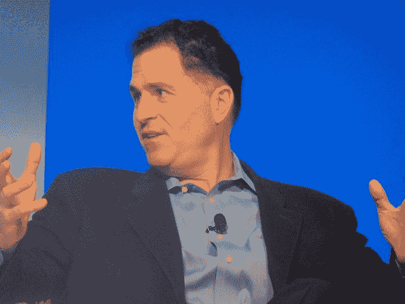

# 670 亿美元的戴尔-EMC 交易今天达成 

> 原文：<https://web.archive.org/web/https://techcrunch.com/2016/09/07/67-billion-dell-emc-deal-becomes-official-today/>

去年秋天，[谣言开始流传，称戴尔有意收购 EMC](https://web.archive.org/web/20230123202547/https://techcrunch.com/2015/10/08/emc-dell-rumors-could-be-about-storage-giant-exiting-on-its-own-terms/) 。10 月 12 日，当戴尔公司宣布[将以创纪录的 670 亿美元](https://web.archive.org/web/20230123202547/https://techcrunch.com/2015/10/12/dell-buys-emc-for-67b-in-largest-deal-in-tech-history/)收购 EMC 时，谣言被证实是真的。差不多一年后，不管是好是坏(富裕还是贫穷)，[那笔交易今天正式达成](https://web.archive.org/web/20230123202547/http://www.businesswire.com/news/home/20160830006294/en/Historic-Dell-EMC-Transaction-Set-Close-September)。

虽然各方[可能喜欢将这一交易描述为一场没有多少戏剧性的交易](https://web.archive.org/web/20230123202547/http://searchstorage.techtarget.com/blog/Storage-Soup/Dell-EMC-deal-closes-Sept-7)，但事实是，戴尔在此过程中面临着几个重大的法律和监管障碍，以及 EMC 和 VMware 股东的怀疑，但上周[当中国当局批准](https://web.archive.org/web/20230123202547/http://www.wsj.com/articles/china-grants-clearance-for-dell-emc-merger-1472587852)时，[交易最终成为全系统交易](https://web.archive.org/web/20230123202547/http://www.businesswire.com/news/home/20160830006294/en/Historic-Dell-EMC-Transaction-Set-Close-September)。

现在是整合两家公司的艰难工作。还有待观察的是，这对戴尔来说最终是否是一笔好交易，以及它能否将两个组织塑造成一个有凝聚力的运营。这里当然没有保证。

## EMC 不是普通的公司

当你支付创纪录的价格时，你会吸引注意力，但并不是所有的注意力都是积极的。监管者和投资者都有很多疑问，问题很快就出现了。

部分问题在于 EMC 的组织方式。与大多数内部部门在单一公司结构下运营、股票单一的大公司不同，EMC 是一个由关联公司(有时是独立公司)组成的联盟。其中最主要的是虚拟化巨头 VMware，它作为一家完全独立的公司运营，甚至成为自己的公开交易股票。

VMware 股东并不喜欢这笔交易，至少在最初是这样，股价从宣布出售前一天的 82.09 美元一路下跌到 2 月 9 日的 43.84 美元，这是宣布出售后的最低点。在那之后，该股开始缓慢但稳定地回升，截至周二，股价一路回升至每股 73.39 美元。这一复苏对于戴尔高管及其资金支持者来说肯定是一个巨大的安慰，因为 VMware 是这个难题的重要组成部分。EMC 以及戴尔拥有该公司 80%的股份，这笔更大的交易是以一种不寻常的方式构建的，这使得 VMware 变得格外重要。

[graphiq id = " fvusw 3 zvl " title = " Vmware Inc .(VMW)股价–1 年" width = " 600 " height = " 463 " URL = " https://w . graphiq . com/w/fvusw 3 zvl " link = " http://Stock-screener . findcompany . com/l/8825/VMW " link _ text = " Vmware Inc .(VMW)股价–1 年| findcompany "]

戴尔同意向 EMC 股东支付每股 24.05 美元。此外，它同意支付所谓的跟踪股票，这是一种跟踪 VMware 股价的金额。随着股价下跌，拨备价值下降，股东越来越紧张。随着股价回到接近收购前的水平，这应该不再是一个问题。

另一个关键的独立部分是 Pivotal，这是一家由 EMC、VMware 和 GE 合作推出的公司，它帮助公司更加关注数字技术。[去年春天，它宣布从福特和微软等公司获得了 6 . 5 亿美元的外部资金](https://web.archive.org/web/20230123202547/https://techcrunch.com/2016/05/09/pivotal-confirms-series-c-round-is-actually-over-650-million/)，有传言称[它可能会在某个时候上市](https://web.archive.org/web/20230123202547/https://techcrunch.com/2015/11/03/pivotal-ipo-could-make-dell-emc-deal-even-more-complicated/)。虽然这不一定是一件坏事，但它确实增加了达成交易的难度。

在交易宣布后不久，EMC 和 VMware 宣布他们正在剥离 Virtustream，这是一家 EMC 在 2015 年 5 月以 12 亿美元收购的公司，也是另一家半独立的公司。新公司将帮助客户管理他们的云运营，无论是公共云、私有云还是混合云——毫无疑问，这对戴尔来说是一个有吸引力的部分——但这笔交易很快遇到了麻烦，因为已经焦虑不安的 VMware 股东开始犹豫，他们对新公司的财务状况将作为 VMware 收益的一部分进行报告感到不满。两个月后，V [Mware 从他们的那部分股权](https://web.archive.org/web/20230123202547/https://techcrunch.com/2015/12/14/plot-thickens-in-dell-emc-deal-as-vmware-announces-its-walking-away-from-virtustream-deal-with-emc/)中抽走。EMC 决定单干，但当时确实引起了关注。

## 财务问题得到解决

还有关于[将如何对该交易征税](https://web.archive.org/web/20230123202547/http://recode.net/2015/11/10/dells-emc-deal-could-unhinge-on-tax-rule/)，以及两家公司中较小的戴尔[将如何支付如此巨大的债务负担](https://web.archive.org/web/20230123202547/https://techcrunch.com/2015/12/03/dell-could-be-shopping-some-assets-to-help-relieve-emc-deal-debt-load/)的问题，据报道债务在 400 亿美元左右(这就是为什么它对 VMware 股价的回升感觉非常好)。

今年 1 月， [VMware](https://web.archive.org/web/20230123202547/https://techcrunch.com/2016/01/26/vmware-confirms-layoffs-in-earnings-statement-as-it-prepares-for-dell-acquisition/) 和 [EMC](https://web.archive.org/web/20230123202547/https://techcrunch.com/2016/01/08/emc-confirms-layoffs-as-cost-cutting-measures-begin-ahead-of-dell-sale/) 分别在交易完成前宣布裁员。随着这两个组织的合并和消除多余的职位，肯定会有更多的机会。好消息是，两家公司的产品线非常互补，没有太多重叠。

尽管存在这些问题，这笔交易还是稳步向前发展，今天终于完成了。行业观察家对两家公司的合并大多持积极态度，因为凭借强大的企业存储组件，EMC 可以为戴尔提供进入宝贵的混合云计算市场的途径。许多传统技术供应商，如 HPE、戴尔、思科和 VMware 警惕[AWS](https://web.archive.org/web/20230123202547/https://www.srgresearch.com/articles/amazon-leads-microsoft-ibm-google-chase-others-trail)(在某种程度上还有微软和谷歌)在公共云中不断增长的力量，试图采取不同的方法，为公司提供私有云——也就是说，像公共云一样运行的能力，包括自我供应和基于使用的计费，但在私有数据中心的舒适和安全(至少理论上)中。

除此之外，人们还意识到，企业如今已经在云中运行，而且在未来十年(或更长时间)内，很可能会在公共云和私有数据中心运行一些工作负载组合，也就是所谓的混合云。

戴尔认为，通过与 EMC 合作，它可以在这个利润丰厚的市场中占据相当大的一块，即使其服务器业务开始与市场其他部分一起下滑。 [Gartner 在其 6 月份的报告中对戴尔等服务器供应商带来了喜忧参半的消息，出货量增长了 1.7%，但收入下降了 2.3%。IDC 6 月份的报告更糟糕，调查显示收入下降了 3.6%。](https://web.archive.org/web/20230123202547/http://www.gartner.com/newsroom/id/3335717)

## 大部分是积极的氛围

虽然需要一些时间来真正理清这笔交易中的赢家和输家，但共识是戴尔收购 EMC 做得很好，即使价格过高。

甲骨文董事长拉里·埃里森是一个热情的支持者，他说他流了不少眼泪，因为他不能提出一个竞争性的报价，因为甲骨文一直忙于自己向云计算的过渡。他认为这个价格很划算，当一切都结束后，戴尔及其投资者可以赚一大笔钱。

戴尔董事长迈克尔·戴尔。

Digital Clarity Group 的分析师艾伦·佩尔茨-夏普(Alan Pelz-Sharpe)不像埃里森那样看好这笔交易，但他仍然喜欢他所看到的情况，特别是就两家公司的长期稳定性而言。“硬件领域的利润率很低，而且很可能会一直如此，但这仍然是一笔大生意。将 EMC 从公开交易的世界带入戴尔的私人世界，为整合并最终实现某种长期增长提供了一个相对稳定的环境，”他说。

Forrester 的分析师格伦·安东内尔认为，EMC 联盟中的独立部分(VMware、Pivotal 和 Virtustream)才是戴尔的真正价值所在。他还喜欢这笔交易对戴尔现金流的影响。“EMC 为戴尔这样的私营公司创造了高达 55 亿美元的自由现金流和美妙的音乐。”

虽然人们普遍认为最终会解决所有问题，但合并两家像戴尔和 EMC 这样规模的公司需要很长时间。政治可能会令人震惊，让两家公司合二为一将是一个巨大的组织挑战。

与此同时，在他们努力应对这一重大转变的同时，他们的竞争将会继续。戴尔和 EMC 一起变得更大，并提供更广泛的企业产品，但他们能否在达成这样一笔交易的同时继续创新，并[出售一些产品来帮助支付成本](https://web.archive.org/web/20230123202547/https://techcrunch.com/2015/10/14/dell-needs-to-decide-what-to-keep-and-what-to-sell-after-emc-deal/)？这是一项艰巨的任务，需要时间来判断戴尔为收购 EMC 所做的大量投资是否值得。

无论如何，这将取决于这两家公司来找出如何使这一切工作，不管准备好了没有，未来从现在开始。

***注**:根据戴尔公关，根据现金对价的价值和 DVMT 的开盘价(45.07 美元)，实际交易价值为 581 亿美元。交易宣布时的原始价值是 670 亿美元。*