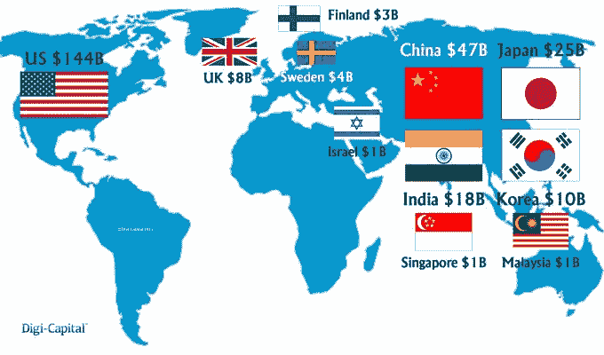

# 移动独角兽成倍增长，达到 2.5 万亿美元

> 原文：<https://web.archive.org/web/https://techcrunch.com/2015/02/13/68-mobile-unicorns-added-28b-last-quarter-hitting-261b-value/>

More posts by this contributor

**编者按:** *蒂姆·梅雷尔(Tim Merel)是* *[Digi-Capital](https://web.archive.org/web/20230316042549/http://www.digi-capital.com/) 的董事总经理，该公司* *为美国、中国、日韩和欧洲的移动互联网、游戏和数字公司提供咨询服务。*

当恐龙在地球上漫游时(2013 年末)，有 38 只科技独角兽价值超过 1300 亿美元。在过去的 12 个月里，移动互联网改变了一切。很多。68 家移动独角兽公司在 2014 年第四季度增加了 280 亿美元的股东价值，价值达到 2610 亿美元。也就是 2 . 5 万亿美元。这还不包括脸书(64%的移动收入，59%的纯移动用户，84%的总移动用户)，这超过 2000 亿美元扭曲了分析。

## 独角兽的统称是什么？

虽然独角兽是罕见的神兽，但令人惊讶的是，它们有一个集合名词:“独角兽的祝福”由于移动独角兽住在马厩里看起来不太合适，我们将它们放入了我们的估值金字塔之一。

这个金字塔有许多惊人之处，包括它有 68 家公司的规模，而且还在增加，它占了全球科技独角兽的大部分，以及公司本身。有些是家喻户晓的名字，如[优步](https://web.archive.org/web/20230316042549/https://techcrunch.com/2014/12/04/uber-confirms-new-1-2b-funding-round-looks-to-asia-for-expansion/)和[推特](https://web.archive.org/web/20230316042549/https://twitter.com/)，但其他的，如[爱奇艺](https://web.archive.org/web/20230316042549/https://techcrunch.com/2014/11/18/xiaomi-makes-300m-strategic-investment-in-iqiyi-one-of-chinas-largest-online-video-platforms/)或[蘑菇姐](https://web.archive.org/web/20230316042549/http://www.avcj.com/avcj/news/2349642/china-online-social-shopping-platform-mogujie-raises-usd200m)，你可能不太了解。

## 30 蒂姆一天做饭

要正确看待上个季度 280 亿美元的增加值，那就是 3 亿美元——或者说超过 30 位蒂姆·库克(去年薪酬超过 900 万美元)每天的收入。

优步、[、Snapchat](https://web.archive.org/web/20230316042549/https://techcrunch.com/2014/12/31/snapchat-485m/) 、 [Flipkart](https://web.archive.org/web/20230316042549/https://techcrunch.com/2014/12/20/flipkart-700-million/) 和[美团](https://web.archive.org/web/20230316042549/https://techcrunch.com/2015/01/19/meituan-700m/)增加了最多的单位公司价值，15 家新的移动互联网独角兽加入了俱乐部。但这并非一帆风顺，因为 14 家价值十亿美元的公司损失了价值(有些情况下损失了数十亿美元)。

入会也不能保证终身会员资格，去年第四季度，两家前独角兽公司的市值跌破 10 亿美元，共有五家公司退出。

## 帕累托规则

[帕累托的 80/20 法则](https://web.archive.org/web/20230316042549/http://en.wikipedia.org/wiki/Pareto_principle)一语中的:20 家公司创造了移动互联网亿万富翁排行榜中 70%的价值。前五名(从优步到[线](https://web.archive.org/web/20230316042549/https://techcrunch.com/2014/10/29/chat-app-lines-revenue-doubles-year-on-year-to-reach-192-million-in-q3-2014/))价值超过 40%，前十名(从 [Snapchat](https://web.archive.org/web/20230316042549/https://techcrunch.com/2014/12/31/snapchat-485m/) 加到 [Square](https://web.archive.org/web/20230316042549/https://techcrunch.com/2014/09/12/payments-startup-square-raises-100-million-more/) )超过一半，前二十名(从 [Pinterest](https://web.archive.org/web/20230316042549/https://techcrunch.com/2014/05/15/svangel-leads-pinterests-5-billion-round/) 加到 Gungho)超过 70%，前三十名(从[万达电商](https://web.archive.org/web/20230316042549/https://techcrunch.com/2015/01/04/wanda-ecommerce-funding/)加到[陌陌](https://web.archive.org/web/20230316042549/https://techcrunch.com/2014/11/09/momo-a-flirting-app-with-180m-users-is-latest-chinese-tech-firm-to-file-for-a-u-s-ipo/))超过 80%。并非所有的独角兽生来平等。

## 下一个独角兽可能来自任何移动互联网领域

移动互联网十亿美元名单中的 2610 亿美元价值分布在各个行业，六个行业占 89%，价值 2290 亿美元。

六大行业分别是出行/交通(包括优步、[滴滴打车](https://web.archive.org/web/20230316042549/https://techcrunch.com/2014/12/09/didi-dache-700-million/)和[用车](https://web.archive.org/web/20230316042549/http://technode.com/2014/09/16/china-yongche-gets-series-c-funding/))、移动商务(由亚洲公司主导，如 [Flipkart](https://web.archive.org/web/20230316042549/https://techcrunch.com/2014/12/20/flipkart-700-million/) 、 [Snapdeal](https://web.archive.org/web/20230316042549/https://techcrunch.com/2014/10/27/snapdeal-india-softbank/) 和 [One97](https://web.archive.org/web/20230316042549/http://blogs.wsj.com/briefly/2015/01/12/what-alibaba-is-getting-with-its-575-million-investment-in-paytm-at-a-glance/) )、社交网络(包括 Twitter 和 Snapchat，这应该算脸书，但没有算进去，因为它淹没了其他一切)、消息传递(如 [WhatsApp](https://web.archive.org/web/20230316042549/http://www.latimes.com/business/technology/la-fi-tn-facebook-whatsapp-20141006-story.html) 和 [Daumkakao](https://web.archive.org/web/20230316042549/https://techcrunch.com/2014/11/12/korean-internet-giant-daum-kakao-launches-its-own-mobile-payment-platform/)

然而，名单上有 16 个移动互联网行业，因此下一个独角兽可能来自任何行业。

## 美国在价值上占优势，亚洲在数量上占优势

美国是移动互联网价值创造之王，24 家公司创造了 1440 亿美元的股东价值，超过榜单总价值的一半。这部分是因为一些美国公司的估值过高(包括优步、WhatsApp、Twitter 和 Snapchat 超过 100 亿美元)，美国公司的平均价值为 60 亿美元。

亚洲以 38 家公司，价值 1020 亿美元的数量占据主导地位，但其 27 亿美元的平均估值还不到美国的一半。然而，与西方相比，亚洲正在加速发展，15 个新加入者中有 12 个来自中国、印度、韩国、新加坡和马来西亚。

中国保持着万达电子商务价值 32 亿美元的速度纪录，仅在它由杰出的母公司万达、腾讯和百度创立四个月后。

或许这份榜单最令人兴奋的地方在于它与基本面增长的联系。随着 2017 年移动互联网收入预计超过 7000 亿美元，移动互联网十亿美元名单到今年年底可能超过 3000 亿美元。

完整的名单是[这里](https://web.archive.org/web/20230316042549/http://i.imgur.com/rSP0mMK.png)。请注意，所有上市公司的大部分业务都来自移动互联网，但不包括移动基础设施，如高通，设备，如苹果，或大量但占少数的移动互联网业务，如腾讯和微信。这些估值来自于股票市场、收购和融资的组合。