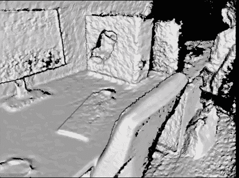
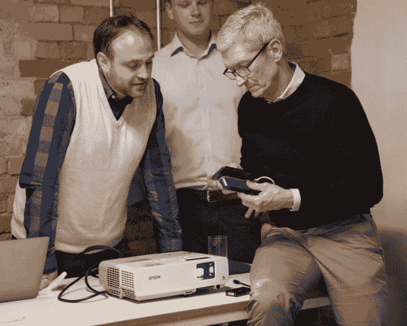

# 6D.ai 正在建立一种 AR 技术，它众包了一个世界的 3D 网格

> 原文：<https://web.archive.org/web/https://techcrunch.com/2018/02/20/6d-ai-is-building-ar-tech-that-crowdsources-a-3d-mesh-of-the-world/>

增强现实初创公司旨在解决的问题往往看起来微不足道。

正如 HBO 节目《硅谷》戳穿了这个行业对[将数字胡须精确地放在人们脸上的痴迷](https://web.archive.org/web/20230316161016/https://www.youtube.com/watch?v=pAEAbqrE5Zw)，让多部手机知道你的咖啡桌确切位置的问题看起来可能非常可笑。但是有了增强现实，事情会变得很快变得复杂和重要。

[6D.ai](https://web.archive.org/web/20230316161016/http://6d.ai/) 是一家来自牛津大学主动视觉实验室的年轻初创公司，旨在使用智能手机摄像头构建一个基于云的众包三维世界地图，这将让应用程序开发人员扩展他们的视野，并让用户从基于手机的 AR 中收集一些实际的效用，这些 AR 基于苹果的 ARKit 和谷歌的 ARCore 平台。

更有趣的是，所有这些都可以在后台完成，因此当用户在玩一个带有被动摄像头的 AR 游戏时——类似于 pokémon GO——他们也可以收集他们正在导航的环境的丰富 3D 数据。

首席执行官 Matt Miesnieks 在接受 TechCrunch 采访时表示:“阻碍增强现实的一个重要因素是让内容感觉自己实际上是世界的一部分。”。“要真正实现这种效果，你至少需要一个你房间的 3D 模型，如果不是整个世界的话。”

在带有外部深度传感器的 iPhone 上运行的 6D.ai 实时绘图技术的早期演示

Miesnieks 作为旧金山 SuperVentures 的合伙人，一直在投资 AR 初创公司，此前他曾在三星领导一个 AR R&D 团队，并共同创立了 AR 初创公司 [Dekko](https://web.archive.org/web/20230316161016/https://techcrunch.com/2012/09/07/dekko/) 。去年夏天，Miesnieks 在牛津大学偶然发现了 6D.ai 联合创始人 Victor Prisacariu 的工作，并决定成立一家公司。7 名员工的团队现在包括 Altspace VR 的联合创始人布鲁斯·伍德(Bruce Wooden)，他刚刚成为该公司的开发者关系主管。

6D.ai 所建立的功能最终有点像 AR 的 Waze，使用智能手机摄像头来建立基于云的世界三维数据地图，这将增强增强现实内容，使其对人们有用。

你的手机内存将能够存储步行距离约 100 米的三维几何图形，而设备上的存储可以保存城市街区的信息。这意味着，随着越来越多运行 6D.ai 引擎的设备走上街头，手机网络将开始构建世界地面三维数据的云图。当其他用户偶然发现之前已经绘制的区域时，6D.ai 将下载这些信息，并允许新用户进一步完善 3D 模型的精度，同时将 3D 交互推向他们的设备无法感知的距离。

当你在谈论一项可以访问你家内部 3D 地图的服务时，有很多理由担心隐私需求。这还不完全是黑暗骑士的水平，但随着越来越多的开发人员利用这个 API，6D.ai 将建立一个非常强大的三维世界视角。

“我们非常清楚滥用的可能性，”Miesnieks 说。“所以一个直接的规则是，除非你亲自到了那个地方，否则你将无法访问关于那个地方的数据，所以我无法下载你的主页，除非你亲自邀请我去你家，而我已经在那里了。”

6D.ai 联合创始人 Victor Prisacariu 最近向苹果 CEO 蒂姆·库克展示了一个演示

这种技术的使用案例远远超出了基于手机的 ar。Miesnieks 表示，该公司也一直在与无人机制造商和机器人公司进行谈判。

有了设备上所有这些额外的 3D 数据，AR 面临的其他技术问题变得容易处理得多。让多人 AR 游戏如此困难的是，两台手机通常需要从相同的有利位置观看世界才能同步，这意味着你真的需要把一台手机放在另一个用户的旁边，才能在开始加入游戏或应用程序之前同步你的地图。

Miesnieks 表示，在发布时，他的初创公司的技术将允许用户在聚焦于空间中的同一点时(几米内)，在彼此 70 度范围内同步。几个月后，他声称用户将完全不必处理这种重新定位，并将能够在任何距离从任何角度完成这一过程。

6D.ai 不是唯一一家应对这些后端 AR 挑战的公司。在谷歌最近的 I/O 大会上，他们详细介绍了一种名为 [VPS](https://web.archive.org/web/20230316161016/https://techcrunch.com/2017/05/17/google-has-an-indoor-positioning-tech-in-the-works-called-vps/) 的技术，该技术使用 AR 技术来帮助用户的智能手机定向。Pokémon GO 的创造者 Niantic Labs 也刚刚收购了 Escher Reality，这是一家致力于解决一些关于持久性和多人游戏的后端问题的初创公司。

然而，6D.ai 有自己独特的优势，因为它特别关注建立更丰富的 3D 网格数据。Miesnieks 说:“事实上，我们是一家能够获得牛津正在进行的知识产权的初创公司，这意味着我们可以继续挑战极限。”

Miesnieks 已经着眼于未来的发展方向，表示在这家初创公司于 3 月份推出第一套 API 集(专注于获取几何图形和建立多人游戏)后，他们将更多地致力于分割数据，以便其系统可以识别哪些 3D 数据属于哪个现实世界的物体，以及该物体是桌子、椅子还是墙壁。

“我们希望成为一个平台，让 AR 应用程序开发人员了解真实世界以外的真实世界——真实世界的结构，真实世界中发生的事情，真实世界中还有谁——并让他们在此基础上构建智能应用程序。”