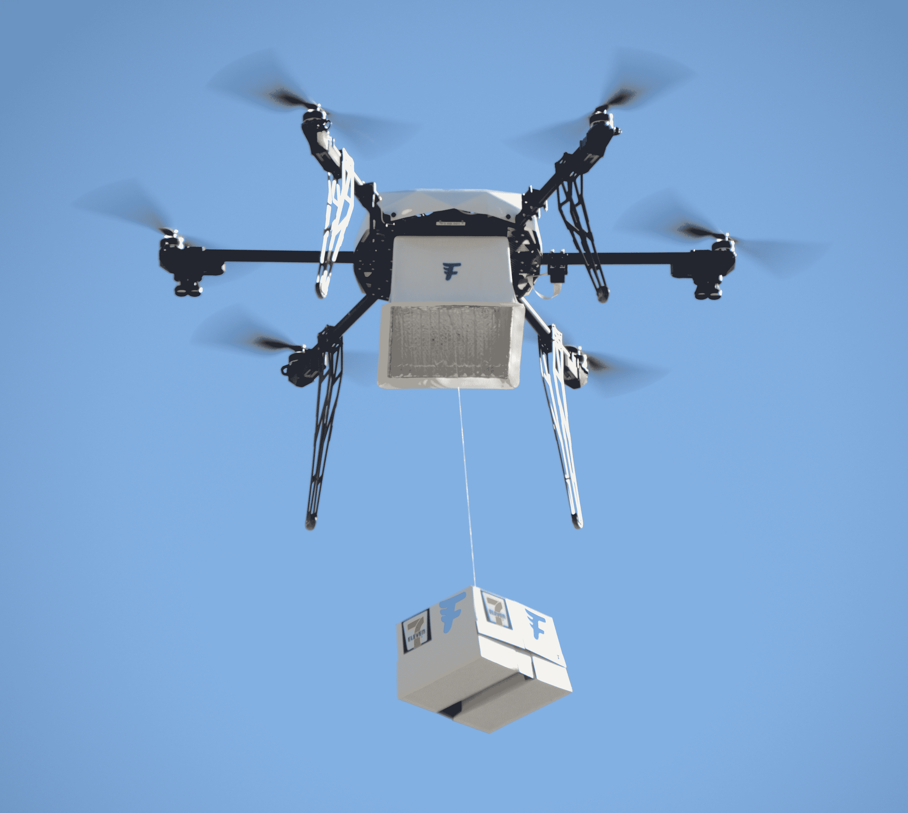

# 7-Eleven 在例行服务的第一个月通过无人机递送 77 个包裹 

> 原文：<https://web.archive.org/web/https://techcrunch.com/2016/12/20/7-eleven-delivers-77-packages-via-drone-in-first-month-of-routine-service/>

# 7-Eleven 在例行服务的第一个月通过无人机交付了 77 个包裹

便利连锁店 7-Eleven 在内华达州里诺开展商业服务的第一个月就完成了 77 次无人机送货，这是有史以来最具品牌协同效应的成就。是的，那是美国另一个大赌城的 Triple 7s。无人机服务由商业无人机服务提供商 Flirtey 运营，该公司于 7 月份开始与 7-Eleven 合作进行商业发射。

11 月是 Flirtey + 7-Eleven 组合提供常规商业服务的第一个月，该组合在周末向 12 名特殊客户发送包裹，这些客户通过一个专门创建的定制应用程序使用无人机点播服务。该应用程序允许用户从他们的库存中挑选，然后在送货过程中提供通知，从装载货物开始，到货物到达他们家门口结束。

根据[新闻稿](https://web.archive.org/web/20221208010601/http://www.prnewswire.com/news-releases/flirtey-and-7-eleven-complete-first-month-of-routine-commercial-drone-deliveries-deliver-77-packages-to-customer-homes-in-united-states-300381798.html)，可用的物品包括冷热食物和非处方药，它们被装在一个 Flirtey 制造的无人机装载的货物集装箱中运输。当无人机到达客户目的地时，它们会在悬停时将这些产品降至地面，大多数交付从接到订单到将产品送到客户手中只需不到 10 分钟。

说实话，我现在可以去吃一个 taquito 或一些白天的感冒药，外面很冷，所以我肯定会看到这项服务如何在早期客户中赢得一些粉丝。Flirtey 和便利连锁店表示，他们将在 2017 年扩大服务区域，所以也许明年这个时候我就能如愿以偿了。