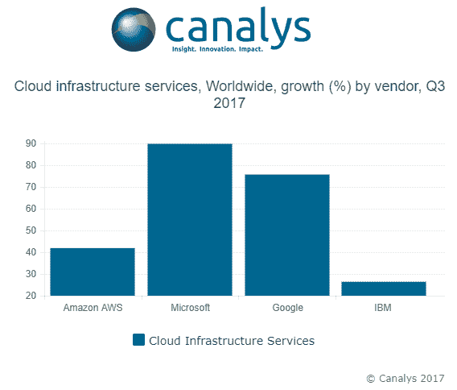

# AWS 继续统治云基础设施市场–第 718 页–

> 原文：<https://web.archive.org/web/https://techcrunch.com/2017/10/30/aws-continues-to-rule-the-cloud-infrastructure-market/718/>

AWS 在基础设施即服务市场的主导地位在本季度依然如故。是的，微软、谷歌、阿里巴巴和其他公司继续以比 AWS 更快的速度增长，但这并没有对 AWS 在 IaaS 市场的统治地位产生重大影响。

首先， [AWS 第一季度收入高达 45.7 亿美元。这高于分析师预期的 45.1 亿美元，并使亚马逊的云计算部门达到 180 亿美元的运营成本，因为其稳步增长的轨迹仍在继续。](https://web.archive.org/web/20190810170515/https://beta.techcrunch.com/2017/10/26/amazons-financials-impress-with-a-better-than-expected-quarter/)

但我听到你说，“微软[不是公布了 200 亿美元的运行率](https://web.archive.org/web/20190810170515/https://beta.techcrunch.com/2017/10/26/microsoft-easily-beats-the-street-as-its-cloud-run-rate-passes-20b-a-year-early/)？”是的，确实如此，但当涉及到这个数字时，你必须进行合理的比较，微软从其 SaaS 业务 Office 365 中赚得了这笔巨额资金的大部分，而不是从其基础设施即服务平台 Azure 中赚得的(要了解云计算术语，[请查看本文](https://web.archive.org/web/20190810170515/https://beta.techcrunch.com/2017/02/19/wtf-is-cloud-computing/))。)

Synergy Research 是一家跟踪不同类型云市场份额的分析公司，该公司的 John Dinsdale 表示，在衡量市场份额时，你必须小心地将 SaaS 业务分离出来。他的公司发现，AWS 继续控制着 35%的市场,在基础设施方面，其挑战者继续远远落后，他们定义基础设施包括基础设施、平台和托管的私有云服务。

“这一系列研究的重点是云基础设施服务(或云计算)，因此涵盖了 IaaS、PaaS 和托管私有云服务。它不包括 SaaS(我们用一组不同的数字来计算)。微软的云数据中包含的大部分是软件/SaaS。微软在 SaaS 市场遥遥领先，”丁斯代尔告诉 TechCrunch，但在基础设施方面却明显落后。

Synergy 的最新数据与其之前的报告一致，即 AWS“自成一家”。虽然微软有一个不错的小基础设施业务，但它仍然离 AWS 很远。这些数字与[科纳仕公司一致，后者显示了略低的数字](https://web.archive.org/web/20190810170515/https://www.canalys.com/newsroom/media-alert-leading-cloud-service-providers-accelerate-q3-2017-fueling-43-growth)AWS 31%的市场份额，但仍然足够接近进行有意义的比较。

另一件让人困惑的事情是这些竞争公司令人瞠目结舌的增长率。虽然这些公司正在以巨大的速度增长，科纳仕公司报告称 AWS 的增长率约为 40%，微软为 90%，谷歌为 75%左右。与往常一样，值得指出的是，从一个较小的市场份额数字开始增长要比你变得更大容易得多，这使得 AWS 数字更加令人印象深刻。

毫无疑问，随着未来十年蛋糕的扩大，以及更多的工作负载被推到云上，市场上还有足够的空间让每个人成长。但作为第一家营销 AWS 的公司，它有着明显的优势，即使微软在后面推波助澜。

“AWS 将继续受益于其先发优势、最广泛的云服务组合以及开发者的强烈认知。但微软的大幅增长，受其庞大的企业安装基础、与其 Office 产品组合的兼容性以及增强的混合云解决方案的推动，意味着它仍将是 AWS 最接近的竞争对手，”刘在一份声明中表示。

虽然 AWS 清楚地认识到这种领先优势，但首席执行官 Andy Jassy 在今年早些时候的一次采访中表示，他认为竞争将很快到来。

> “成功的玩家不会只有一个。不会有 30 家，因为规模在成本结构和服务广度方面确实很重要，但将会有多个成功的参与者，我认为这些参与者是谁还没有写出来。但我预计一些老的后卫球员在这里有业务，因为他们有大型企业客户群和庞大的销售队伍之类的东西，”他说。

无论如何，当你看到云市场份额数字时，一定要理解你在看什么，并理解增长率和收入并不总是比较这些公司的最准确方式。AWS 统治着市场，目前还没有人能与之匹敌。