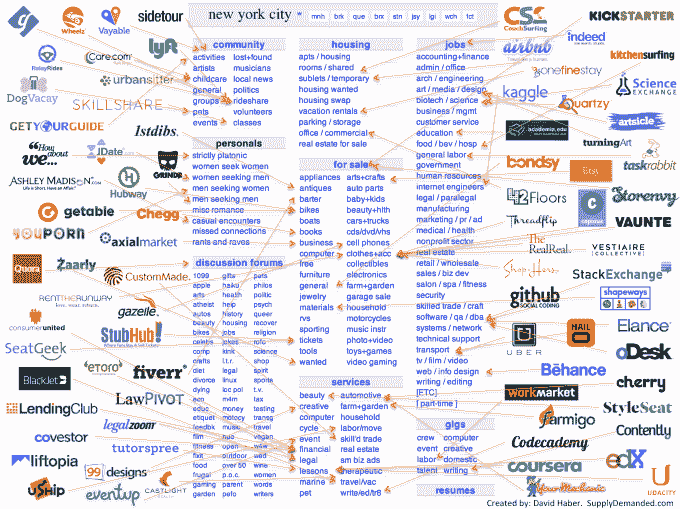
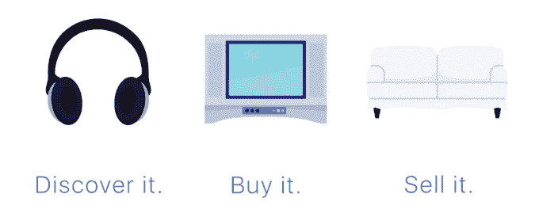

# 脸书推出 Marketplace，一个更友好的 Craigslist——737 页

> 原文：<https://web.archive.org/web/https://techcrunch.com/2016/10/03/facebook-marketplace-2/737/>

每月已经有 4 . 5 亿人访问脸书上的“买卖”群，现在该公司在其应用程序中推出了一个专门用于点对点购物的标签。

[Facebook Marketplace](https://web.archive.org/web/20190907030703/http://newsroom.fb.com/news/2016/10/introducing-marketplace-buy-and-sell-with-your-local-community/) 可以让你浏览从附近的人那里购买的相关分类商品，并快速列出你自己的待售商品。与 Facebook Messenger 的集成让你可以讨价还价或安排会面，由于脸书的个人资料，你比在 Craigslist 等匿名网站上更了解你在和谁打交道。

Marketplace 今天在美国、英国、澳大利亚和新西兰推出手机版，但如果受欢迎的话，也可能在全球和网络上推出。不幸的是，缺乏一个有助于阻止诈骗和不良行为的双向评级系统。除了通过 Messenger 进行特别支付之外，交易也没有原生的结账选项，这很烦人，但促进了面对面的交流，而不是充满欺诈的运输。

“我认为 Craigslist 的流行显示了对本地商务产品的巨大需求，”Marketplace 产品经理 Bowen Pan 说。

虽然现在 Marketplace 上没有允许的页面，但如果脸书让企业或人们为他们出售的东西购买新闻源广告或赞助位置，有一天它会产生广告收入。潘告诉 TechCrunch，“在我们确信已经为人们提供了出色的产品体验之后，如果有必要，我们会考虑引入业务，然后我们会考虑如何将 surface 货币化。”

脸书在 Marketplace 上下了很大的赌注，考虑接管导航标签栏的主要位置，取代脸书 iOS 的 Messenger 快捷方式。这个黄金地段可以让 Marketplace 成为在收银台冲动购物的数字版。

## 社交销售

脸书继续其无止境的追求，要吃掉互联网(T2)，为网络上的每一个流行活动创造自己的版本，以吸引他们的参与和潜在利润。它拥有的商业经验越多，通过广告间接获得的收入就越多。它还致力于从传统零售商那里购买的购物标签。

 [https://web.archive.org/web/20190907030703if_/https://www.youtube.com/embed/rrWrHKfJu4k?version=3&rel=1&fs=1&autohide=2&showsearch=0&showinfo=1&iv_load_policy=1&wmode=transparent](https://web.archive.org/web/20190907030703if_/https://www.youtube.com/embed/rrWrHKfJu4k?version=3&rel=1&fs=1&autohide=2&showsearch=0&showinfo=1&iv_load_policy=1&wmode=transparent)

视频

近十年来，脸书一直试图赢得当地商业。2007 年，它首次尝试了一个“市场”,用于出售物品、住房、工作等等的分类列表。但 Marketplace 从未获得巨大的吸引力，2009 年，脸书将控制权转移给了支持它的商业平台 Oodle。2014 年被关闭。

去年，脸书采取了另一项措施，为群组建立了一个特殊的“[待售”帖子选项，其 17.1 亿用户中的近四分之一现在每月都会访问该群组。2015 年 10 月，脸书开始测试一个](https://web.archive.org/web/20190907030703/https://beta.techcrunch.com/2015/02/10/facebook-adds-a-new-way-to-sell-items-in-groups/)[【本地市场】](https://web.archive.org/web/20190907030703/https://beta.techcrunch.com/2015/10/29/facebook-tests-local-market-a-dedicated-buying-and-selling-community-powered-by-facebook-groups/)功能，该功能将演变为今天推出的市场。

**Facebook market place 有三个主要特点:

1.  多亏了人们添加到他们的列表中的标签和脸书的文本分析人工智能结合你喜欢的页面和你在市场上浏览的东西，你看到的列表是基于相关性进行排名的。预先准备好的信息，如“这件商品还有吗？”这个东西是什么状况？“让谈判更简单。
2.  **出售你的物品**——你可以轻松地为你的物品拍照、添加描述、设定要价并发布你的物品，而不必建立新的个人资料。
3.  **搜索周围环境**–除了浏览家居或电子产品等特定类别，您还可以搜索特定的东西，并根据位置、类别和价格或通过地图过滤您看到的内容。如果你找到你想要的东西，你会看到卖家的大概位置，而不是他们的确切地址，除非他们告诉你。

“我们向您展示与您最相关的商品，即使您不知道自己想要什么，”潘说

Craigslist 在美国蓬勃发展，因为它是最低的普通商业标准。它非常简单、灵活，而且比许多竞争对手早推出。它有着令人难以置信的惯性，买家和卖家都被它吸引，因为它聚集了最多的供应和需求，尽管它缺乏特性。

但是最近，我们看到专业网站成功地解除了 Craigslist 的某些功能。例如，评论、日历和内置支付帮助 Airbnb 从 Craigslist 抢走了短期租赁市场。座位表和过滤选项让 StubHub 窃取门票转售。

 还没有人能够把 P2P 卖家从 Craigslist 手中抢走，但脸书可能有最好的机会，原因有三。

## 信任

在 Craigslist 上，除了他们在列表上说的话和你的直接交流，你对你要见的买家或卖家一无所知。但是脸书的资料告诉你很多。

对于拥有虚假账户的骗子来说，很难建立大量的朋友，所以如果有人有很多填写完整的个人资料，你就可以非常确定他们是谁。这些信息或缺乏这些信息可能会暗示你是否想亲自见他们，这可能是有风险的。此外，如果人们认为你可以向警方提供他们的名字，在工作中追踪他们，或者在社交媒体上羞辱他们，他们就会更加负责任，表现也会更好。

Marketplace 最缺乏的功能是让买家和卖家互相评价，并注明物品状况比列出的更差，卖家试图在最后一刻抬高价格，或者买家迟到或筋疲力尽。

## 便利

人们通常只在想要特定的东西时才会去 Craigslist。然而，我们每天已经在脸书、Messenger 和 Instagram 上花了大约 50 分钟。在脸书，Marketplace 只需点击一下，而不是像许多功能一样被埋没在更多标签页中。

把市场建在我们已经花费时间的地方，就像在镇中心建立一个农贸市场。用户浏览 Marketplace 可能只是因为他们感到无聊。由于 Messenger 的流行，买家和卖家可以不用电话号码轻松聊天。一个竞争对手的商务平台可能仍然不得不依赖脸书进行沟通。脸书也不收费，所以你可以想怎么交易就怎么交易，不用额外付费。

## 震颤

Craigslist 和许多其他 p2p 商务平台过于专注于将大量文本列表塞进一个页面。有些是在每个人手边都有相机之前为网络设计的，所以浏览起来并不有趣。而且没有行为和兴趣数据，他们不知道你喜欢什么。Marketplace 是在照片之上建立的，首先是移动的，并且是相关性排序的，以使浏览高效和令人满意。

这些特点鼓励人们随意浏览。你可能会无意中发现大幅度的折扣，因为卖家只是想摆脱某些东西，而你从传统零售商那里永远得不到这些东西。这使得使用 Marketplace 有点像在跳蚤市场或庭院销售中寻宝，在那里你可以对你可能发现的东西感到兴奋。在测试中，服装、汽车和打折的家具被证明是最受欢迎的类别。

market 将不得不与 OfferUp、LetGo、Wallapop、Close5 以及其他觊觎 Craig 地盘的初创公司展开竞争。尽管如此，这对脸书来说还是一个鸡还是蛋的问题，因为它必须同时增加供应和需求。幸运的是，人们不需要下载一个新的应用程序就能参与进来，脸书把 market dab 放在其应用程序的中心，所以它肯定会被看到。

现在的问题是，脸书是否会给市场带来蓬勃发展的促销激情，以及它是否能保证体验的安全。“在，人们实际上代表了他们的真实自我，”潘谈到在每个买家和卖家背后都有一个经过同行验证的个人资料的好处时说。

## 自发购物

潘说，如果发现人们在虐待他们的同行，它将采取行动，从删除一个商品清单到禁止某人加入该功能。例如，不允许出售枪支、成人服务或其他非法物品。

也就是说，脸书对交易中的欺诈或其他问题不承担责任。这也是为什么它不允许你像在易贝这样的电子商务网站或平台上直接付款的部分原因。如果有人在你去他们家买沙发时抢劫了你，或者你给别人寄去了一台相机的付款，而这个相机从未被运送给你，你必须向警方报案。“我们认为我们的角色只是连接买方和卖方，”潘解释道。

脸书有机会像对待视频消费一样对待购物:让购物变得自发。你去脸书不会像在 YouTube 上那样有目的地看视频，但最终还是会看，因为 feed 会智能地插入它们。现在，这种休闲模式可以进入商业领域。

“我们发现绝大多数人只是喜欢浏览。他们心里没有一个具体的项目。他们只是……浏览提要，看看是否有他们感兴趣的内容。“它模仿了去周日市场或购物中心的一些线下购物行为。你可能不知道自己想要什么，但你愿意看到它们。”