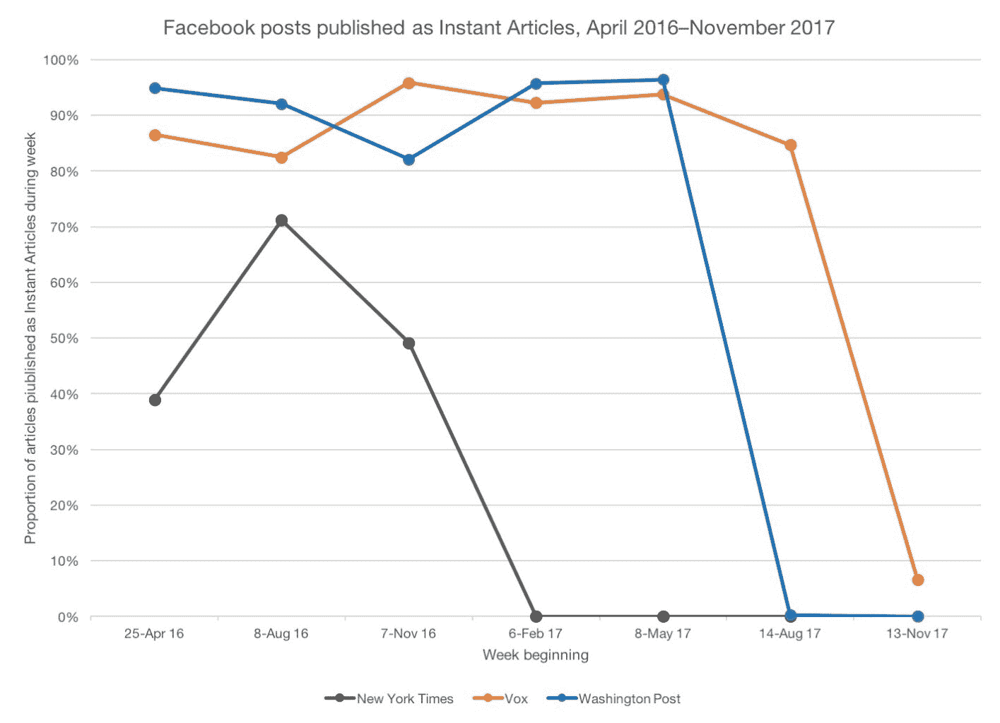
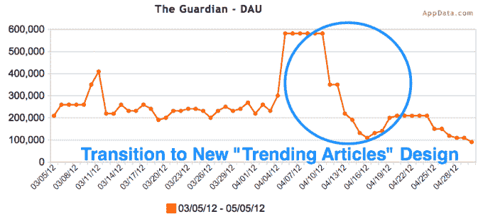
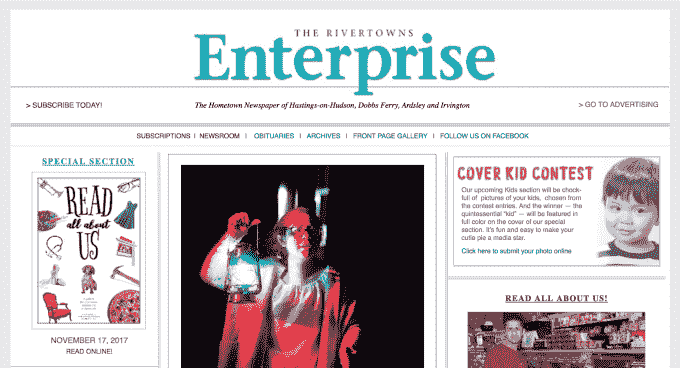

# 脸书如何窃取新闻业务

> 原文：<https://web.archive.org/web/https://techcrunch.com/2018/02/03/facebooks-siren-call/75/>

大新闻媒体愚蠢地将他们的灵魂卖给了脸书。绝望于推荐流量[【脸书】](https://web.archive.org/web/20201116013239/https://crunchbase.com/organization/facebook) 的诱惑，他们花了几年时间跳过它的圈圈，结果却被排除在方程式之外。他们没有开发主页访问者和时事通讯订阅者的自有受众，而是让脸书给读者洗脑，让他们认为这是他们的信息来源。

现在脸书正在推进本地新闻，但是出版商应该警惕同样不正当的交易。今天，它可能会为较小的媒体提供更多的曝光率和流量，但它可能会告诉用户，他们只需要在未来访问脸书获取当地新闻。以下是脸书在过去 12 年里如何重新训练我们从新闻中榨干钱的。

## 用户第一是脸书第一后来

明确地说，脸书的意图，我认为是认真的，是促进其用户和他们的社区之间更强的联系，以提高福祉。但这并不意味着连锁反应是积极的。审视脸书所有战略的关键视角是，从短期来看，它把用户放在第一位，自己放在第二位，其他人远远排在第三位。这包括开发商、广告商，当然还有新闻出版商。

然而，从长远来看，这种策略实际上是自私的，因为脸书只会继续占据主导地位，因为它的用户不会离开。早在 2010 年，脸书摧毁了 Zynga 等游戏开发商的病毒式传播，Zynga 赚了很多钱，因为他们的垃圾新闻可能会把人们从社交网络上赶走。这种对底线的短期冲击为深度参与铺平了道路，这种参与推动了脸书今天赚取 40 亿美元的季度。

脸书的“今日报道”本地新闻专题节目正在几个城市进行测试

这解释了为什么首席执行官马克·扎克伯格最近宣布，脸书将做出改变以提高福祉，即使它减少了花在网站上的时间或其广告收入。这些后果在短期内可能是真实的。但当你缩小时，这是一个精明的策略。如果不加以控制，“花好时间”运动可能会演变成“是时候离开脸书”运动。现在，最好每天为每个用户节省几分钟时间，以便在未来几年留住这些用户。

## 重新培训新闻读者

当脸书开始时，没有饲料。你浏览了一个又一个的个人资料来查看你的朋友。新闻订阅在 2006 年的推出重新训练了用户，让他们只需去脸书的主页，在那里一切都会来到你面前。品牌紧随其后，投资通过脸书翻腾的内容流来建立受众。

随着脸书的用户从 PC 和 MAC 转向 Androids 和 iPhones，该公司发现了一种持久的移动格式。台式电脑的屏幕足够大，可以容纳多个窗口，在浏览器标签之间切换很快，让用户可以很容易地在不同的网站之间切换。但在屏幕小、应用质量低、连接差、网站下载速度慢的手机上，人们使用的是脸书的单一应用，这个应用汇集了来自世界各地的内容。脸书开始训练我们保持滚动，而不是挣扎着弹来弹去。

2011 年，当脸书第一次注意到 Twitter 时，它推出了公众人物订阅功能，新闻链接在 feed 中获得了更多的关注。到 2014 年，“脸书这个大新闻机器”正如火如荼地进行着，各种趋势、标签和新闻媒体都投入了大量资源来增加它们的页面。在新闻供稿中强调“新闻”会让用户等待改变世界的头条新闻出现，而不是在各种出版商的主页上走来走去。许多人甚至不点击进入，仅仅从标题和预览广告中获取新闻的要点。广告商追随眼球，将他们的支出从出版商网站转移到脸书。

 形象:[罗素·沃格斯](https://web.archive.org/web/20201116013239/http://www.russellwerges.com/)

2015 年，脸书意识到用户讨厌等待缓慢的移动网站加载，所以它推出了即时文章，在自己的应用程序中托管出版商的内容。即时文章训练用户在点击链接时甚至不访问新闻网站，而是耐心等待一个快速加载的原生页面，剥夺发布者的身份和许多再循环和赚钱的机会。广告商紧随其后，因为出版商允许脸书为他们出售即时文章上的广告，从而在放弃读者关系的同时也放弃了广告商关系。

脸书就是这样把出版商变成代笔人的，这个问题我在 2015 年揭发过。出版商相互竞争，为脸书的“智能管道”制作可互换的“哑内容”

出版商明智地开始反击，要求更多的布局和货币化灵活性，许多人放弃了该平台，转而支持谷歌更少规定性的快速加载移动页面的 AMP 平台。事实上，根据[哥伦比亚新闻评论](https://web.archive.org/web/20201116013239/https://www.cjr.org/tow_center/are-facebook-instant-articles-worth-it.php)的一项研究，包括《纽约时报》和《华盛顿邮报》在内的 72 家即时文章发起伙伴出版物中的 38 家已经放弃了脸书控制的格式。

尽管如此，除了脸书和谷歌搜索，出版商几乎没有主要的流量来源。随着谷歌阅读器的死亡和 Twitter 转向算法订阅，仍然没有大规模、未经过滤的地方来分享或关注新闻。如果人们确实想与新闻有更直接的关系，他们应该上 Feedly 或其他 RSS 阅读器，或者在浏览器的书签栏中添加一些喜欢的网站。

与此同时，脸书的唯一目标仍然是为用户提供价值，就内容而言，只要是高质量的，它并不在乎是哪家出版商提供的。

## 将资源抽到中心

一次又一次，脸书将注意力集中到了网络上。几年前，我写了一篇关于“脸书吃互联网的 20 种新方式”的文章，它的胃口越来越大。它正试图在手表(YouTube)、市场(Craigslist 和易贝)和许多其他功能上做同样的事情。这是一个聪明的计划，最终可以说改善了个人用户的体验——或者至少提供了新的选择，同时使脸书变得更重要、更丰富。

问题在于，对整个社会而言，这将导致一些新闻出版商、内容创作者和公用事业提供商的非货币化并最终失去融资，同时使他们严重依赖脸书。这让脸书有权决定什么类型的内容、什么主题和什么来源是重要的。即使脸书认为自己是一个中立的技术平台，它也含蓄地扮演着媒体公司的角色，因为它的价值观定义了 feed。让一个编辑的易错算法决定网络世界的新闻消费是一种不稳定的情况。

商业方面也同样令人担忧。正如 Stratechery 的 Ben Thompson 所描述的，广告客户正在放弃新闻网站，聚集到脸书，在那里他们可以更有效地锁定他们每天去的确切客户。当企业可以直接获得关注时，为什么要在一个中介新闻网站上做广告呢？没有庞大的规模和广告技术，个体出版商无法争夺美元。

但是，如果他们拒绝与脸书合作，并在那里提供他们的内容，另一家出版商会很乐意将同样的故事带到社交网络上，以换取短期的流量提升。总有人愿意向智能管道提供愚蠢的内容。

## 受到战略变化的影响

真正的问题只有在脸书改变方向时才会显现。得出的结论是，用户希望看到更多的视频，所以这种格式在新闻提要中更容易看到。很快，出版商争相转向视频，雇佣团队并购买昂贵的设备，这样他们就可以在脸书上发布内容，而不是考虑他们忠诚的网站访问者。但后来，脸书认为过多的被动视频对你有害或者没有意思，所以它的新闻供稿可见性被削弱了，出版商浪费了他们的资源和时间去追逐一只白兔……或者，在这种情况下，一只蓝色的兔子。

这种情况发生在页面标签应用上，比如音乐家个人资料提供商 BandPage，在脸书禁止默认登陆标签之前，band Page 是脸书第二大应用。初创公司[在浪费数年时间追逐脸书的变化后，失去了 90%的流量](https://web.archive.org/web/20201116013239/https://beta.techcrunch.com/2012/07/24/bandpage-everywhere/)，最终在筹集了 2700 万美元后以 800 万美元的价格出售。 [Open Graph news reader 应用程序遭遇了同样的命运](https://web.archive.org/web/20201116013239/https://beta.techcrunch.com/2012/05/07/decline-of-facebook-news-readers/)，由出版商建立，以满足脸书短命股票和“乔希在华盛顿邮报社交阅读器上阅读[click bait]文章”故事的机会。

出版商目前正陷入另一场[大规模的脸书战略变革](https://web.archive.org/web/20201116013239/https://beta.techcrunch.com/2018/01/11/facebook-time-well-spent/)。它现在正在努力抵消俄罗斯的选举干扰，为盈利而制造的假新闻，政治偏见的指控，两极分化的社会，病毒视频的爆炸，朋友的缺席，以及对过多滚动伤害我们福祉的担忧。这导致脸书宣布将从新闻提要中删除 20%的新闻，因为它不仅优先考虑有意义的内容，而且刺激用户之间有意义的互动。

在本周的 2017 年第四季度收益电话会议上，扎克伯格表示，脸书已经调整了其算法，以显示更少的病毒视频并优化福祉。结果是每天减少了 5000 万小时的脸书使用时间[，这相当于每个用户每天花费 2.14 分钟，或花费在脸书上的总时间的 5%。该公司愿意做出改变，导致其有史以来最慢的用户增长率，以及其全球用户总数的首次下降，因为美国加拿大地区实际上失去了 70 万 Facebookers 用户。](https://web.archive.org/web/20201116013239/https://beta.techcrunch.com/2018/01/31/facebook-time-spent/)

然而，视频制作者和新闻出版商将为这一目的的转变买单。脸书的收入仍然达到了创纪录的 129.7 亿美元，投资者仍然推高了其股价。事实上，脸书实际上可以从“花得值的时间”的改变中赚到钱或者至少不亏不赚。

通过减少花费的总时间，但提高人们看到的内容的质量，脸书最终获得了更少的总广告印象，但更高的参与度，因为人们被重新训练跳过更少的内容。仍然渴望触及其庞大受众的广告客户将在脸书的广告拍卖中竞争，支付更高的价格。脸书有现金储备和动力来度过短期的货币化下降，以换取更健康的长期未来。内容创作者只能努力维持生计。

[2018 年 2 月 4 日更新:[扎克伯格讨论了](https://web.archive.org/web/20201116013239/https://www.facebook.com/story.php?story_fbid=10104521556636051&id=4&notif_id=1517761110420737&notif_t=notify_me&ref=notif)脸书坚持不懈的能力，尽管他在关于公司 14 岁生日的帖子中犯了错误。“这些年来，我犯了几乎所有你能想象到的错误。。。错过了重要的趋势，对别人反应迟钝。我推出了一个又一个失败的产品。我们社区今天存在的原因不是因为我们避免了错误。这是因为我们相信我们正在做的事情足够重要，值得我们继续努力。问题是，其他不太安全和成功的业务，如新闻编辑室，没有资源进行大规模的试错，以跟上脸书的变化。]

## 坚持到底

而现在地方新闻网站正面临这一危险循环的开始。脸书表示，它将在新闻提要中显示更多的本地新闻。它正在几个城市的《本地新闻文摘》中测试一个[【今日】。它优先考虑人们讨论的内容，而不是被动地消费。脸书正在推动其新的使命，重建社区，使世界更加紧密地联系在一起，与当地新闻保持一致。](https://web.archive.org/web/20201116013239/https://beta.techcrunch.com/2018/01/10/facebook-today-in/)

听起来很棒，对吧？毫无疑问，本地新闻媒体在这里有一个机会。但是让他们的船漂浮的关键不是完全改变航向去跟随脸书的警笛声。无论你是否认为该公司是有目的地试图摧毁它入侵的行业，或者只是为了让用户受益而对它们进行现代化改造，出版商必须带着怀疑的态度面对脸书。

脸书的下一个再培训似乎是，它是获取当地新闻的最佳地方，而不是你当地的报纸或博客。它可能会愉快地显示所有的标题，几乎不鼓励读者点击，就像今天这样。它可能会让图片和视频比在本地网站上加载得更快。他们可能会将当地新闻与脸书事件捆绑在一起，并使用当地网站无法比拟的个性化功能对附近地方进行评论。

这可能对读者有利，因此从长远来看对脸书有利，但对出版商来说是危险的。脸书甚至不需要有目的地从本地网站挖走广告客户，当它成为本地新闻目的地时，他们会自然而然地流向它。

他们仍然应该把重点放在把偶尔的读者变成主页的回头客，他们会把网站收藏起来，并经常回来。他们应该跟踪那些忠实读者想要什么样的故事的分析，而不是那些可能偶尔推动路过读者流量高峰的故事。他们应该投资开发自己的广告技术，或者与更中立的第三方提供商合作。他们应该继续推送电子邮件简讯、活动和订阅。

这是因为没有人知道脸书关于用户想要什么或者如何给他们的策略什么时候会改变。同样，脸书希望用户得到通知和娱乐，但它不一定在乎如何或由谁来做。我们不要忘记，脸书正在其应用程序的另一部分悄悄建立其市场点对点销售功能，以最终取代分类广告，分类广告曾是当地新闻网站的支柱。

不幸的是，资金雄厚、拥有真正技术人才的大型出版商未能优雅地驾驭脸书设定的不断变化的竞争环境。那么，没有技术或战略实力的小商店希望有什么希望呢？

在扎克伯格的家乡纽约多布斯费里，有一份受人喜爱的报纸，名为《河镇企业》。对于那些寻找本地新闻的人来说，它是一个目的地，它的网站和每周印刷版都有忠实的追随者，许多在那里长大的人都会将这些报纸送到他们在全国各地的家中。访问它的网站，你会偶然发现各种关于城市政治、高中体育和主要街道商业的故事，这些故事也在那里做广告。

但是，随着脸书将目光转向地方新闻，将其作为解决福祉、虚假信息和两极化社区等更大问题的答案，它也对 Rivertowns 企业和类似机构构成了威胁。占主导地位的社交网络只是加速了不可避免的技术进步。但是现在，如果想要生存，这些出版商最好的选择是向脸书学习:把你自己的读者和你的长期生存能力放在第一位，而不是赌上短暂的利益。