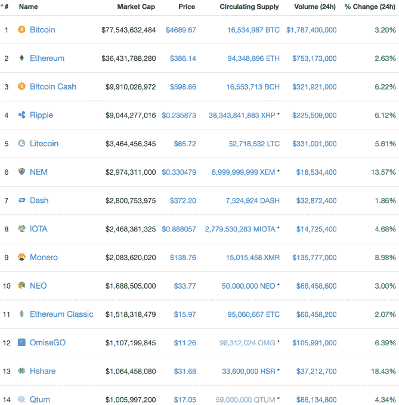

# 第一批 ICO 独角兽出现了

> 原文：<https://web.archive.org/web/https://techcrunch.com/2017/08/31/the-first-ico-unicorns-are-here/780/>

这总是有可能发生的，但第一批价值超过 10 亿美元的 ico 的到来速度令人惊讶。

据追踪加密令牌价值的网站 coinmarketcap.com 称，今天 OmiseGO 和 Qtum 的市值都超过了 10 亿美元。通过这样做，他们成为第一批 ERC20 代币——建立在以太坊网络上并通过 ICO 出售给投资者的子代币——根据已分发硬币的总价值通过独角兽标志。

最令人难以置信的是，两者都在短短几个月内超越了这一里程碑。

OMG 代币销售[在 7 月进行，筹集了 2500 万美元](https://web.archive.org/web/20211027223636/https://beta.techcrunch.com/2017/07/05/omise-go-ico-25-million-omg/)，最初一个 OMG 代币价值约 0.27 美元。今天，它的价值超过了 11 美元，给那些在 ICO 阶段买入的人带来了超过 40 倍的回报。

[今年 3 月，Qtum 筹集了价值 1560 万美元的加密资金。它的 QTUM token 最初价值 0.30 美元，但今天的价格超过了 17 美元——对那些投机者来说，这是又一次可观的回报。](https://web.archive.org/web/20211027223636/http://www.the-blockchain.com/2017/03/24/qtum-shatters-ico-records-raising-15-6-million/)

另一个令人吃惊的事实是，两家公司目前都没有真正的产品上市。尽管这在 ico 中很常见，因为投资者会购买将通过代币销售筹集的资金开发的产品路线图。

> OMG 和 Qtum 是第一批市值超过 10 亿美元的 ERC20 硬币

Omise 持有 ICO 是为了筹集资金，开发基于区块链技术的分散支付系统。这家总部位于泰国的公司计划在今年年底前推出其第一个迭代，但它很可能是随后推出的最初有限版本。

与此同时，总部位于新加坡的 Qtum 正在建设基础设施，让企业能够轻松构建和部署使用以太坊和比特币区块链的应用和服务。例如，这可能包括智能合约。

10 亿美元的铸币总额实际上意味着什么？

风险投资支持的初创公司的独角兽地位主要是为了展示，但创始人表示，这可能是一种优势，有助于招聘和媒体的普遍关注。对于一家加密硬币公司来说，这种好处甚至更加模糊不清。

从根本上说，这意味着许多人对这些项目感到兴奋，他们现在投资是希望这些公司能够在未来生产出突破性的技术。但是专家们很谨慎。

“最近许多 ico 的巨大市场资本表明，人们相信其潜在的商业模式。然而，随着一些 ico 向投资者提供数倍于其初始投资的回报，许多背后可能存在大量投机，”上海金融科技研究公司 [Kapronasia](https://web.archive.org/web/20211027223636/https://www.kapronasia.com/) 的创始人兼董事 Zennon Kapron 告诉 TechCrunch。

Omise 的联合创始人兼首席执行官长谷川润告诉 TechCrunch，估值飙升对他的业务没有短期影响。然而，随着硬币成为活生生的产品后，他计划将其作为 OmiseGO 支付网络的一部分，他相信代币的价值只会增加。

“OmiseGO 计划长期持有 OMG。举办 OMG 的动机是参与网络验证过程。随着越来越多的交易在 OMG 网络上发生，我们也看到 OMG 网络价值的长期增长，”Hasegawa 说。

“OMG 价格的上涨不会影响我们的开发预算，”他补充道。

这是我们期待在下个月的 TechCrunch Disrupt SF 活动的[ICO 小组会议上讨论的众多话题之一。](https://web.archive.org/web/20211027223636/https://beta.techcrunch.com/2017/08/24/techcrunch-disrupt-sf-ico-panel-september-2017/)

*注:文章已更新，修正了 OMG 和 QTUM 的初始价格*