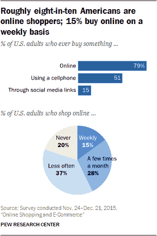
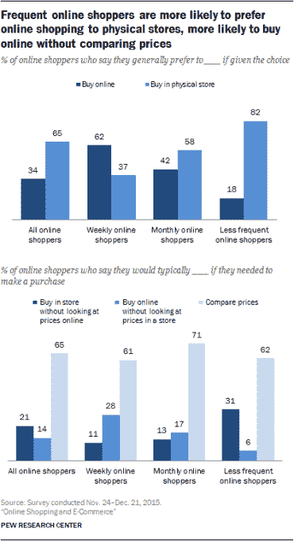
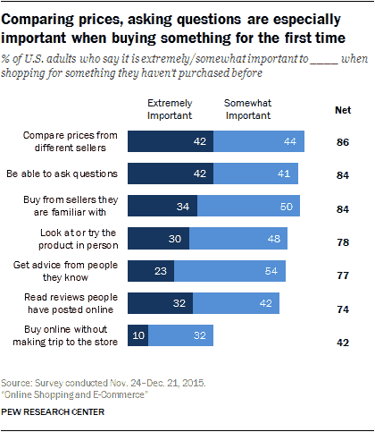
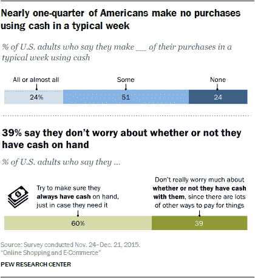

# 79%的美国人现在在网上购物，但动摇他们的不仅仅是便利，还有成本

> 原文：<https://web.archive.org/web/https://techcrunch.com/2016/12/19/79-percent-of-americans-now-shop-online-but-its-cost-more-than-convenience-that-sways-them/>

根据皮尤研究中心今天早上发布的一项新研究，80%的美国人现在在网上购物。这相当于 79%的美国消费者通过网络或手机购物，而 2000 年这一比例仅为 22%。研究发现，超过一半(51%)的人还通过手机购物，15%的人是通过点击社交媒体上的链接购买的。

虽然这项研究的主要重点是详细说明有多少人在网上购物，在哪里购物，多久一次，以及使用哪些平台，但更有趣的是它如何找出原因的答案。

令人惊讶的是，消费者认为最有吸引力的不一定是点击几个按钮就能把产品送货上门的便利性:而是成本，以及在购买前更有效地在网上研究这些成本和其他问题的能力。

这是一个有趣的关于消费者行为的观点，此时许多初创企业正试图解决不得不实际出门购物带来的痛点。公司正在推出各种服务，从[当天送达](https://web.archive.org/web/20230402233001/https://postmates.com/)到日常用品的订购盒，如[卫生棉条](https://web.archive.org/web/20230402233001/https://www.mylola.com/)或[牙刷](https://web.archive.org/web/20230402233001/https://www.getquip.com/)或那些让你省去去杂货店麻烦的服务。

事实上，这是对硅谷对待新网络经济方式的批评之一。

正如通用催化剂投资助理凯瑟琳·博伊尔最近在 TechCrunch 专栏中指出的:“在硅谷，人们努力节约时间。在美国其他地方，人们会存钱。”

根据皮尤的发现，这是真的。在皮尤的研究中，65%的网上购物者表示，在同等条件下，他们更喜欢去实体店购物。

皮尤指出，当然，这种渴望是他们更抽象地表达的东西。根据他们上网购物的频率，那些说他们会去 T2 而不是 T3 当地实体店购物的人的比例大大下降。

例如，62%每周在网上购物的人说他们宁愿去网上实体店购物。但是 82%的人甚至一个月都不在网上购物，他们说他们更喜欢在实体店购物。

但是当涉及到人们最终选择在哪里购物时，往往是价格的问题。

65%的网上购物者表示，如果他们需要购买，他们会将现实世界的价格与网上的价格进行比较，然后在可以买到最划算的地方购买。只有 21%的人说他们不会为了比较而查看网上价格，只有 14%的人说他们会在网上购买而不会查看零售价格。

同样有趣的是，当消费者在购买他们从未买过的东西时，他们如何回答关于他们考虑的因素的问题。与许多其他因素相比，不用去商店就能购物的便利性是人们认为最重要的因素之一。

例如，只有 42%的人认为这“有点”或“非常”重要。与此同时，他们认为更重要的事情包括比较价格(86%的人认为有点或非常重要)，提问(84%)，从他们熟悉的卖家那里购买(84%)，亲自查看产品(78%)，从他们认识的人那里获得建议(77%)，阅读在线评论(74%)。

皮尤还发现，在线评论对美国人的购买决定变得非常重要。82%的人说他们第一次购买时会咨询在线评级，近一半(46%)的人说评论可以帮助他们对自己的购买更有信心。

然而，购物者已经开始对在线评论的可信度失去信心。48%的人表示，通常很难判断这些评论是否真实和公正。这个问题在很大程度上可能因付费评论的情况而加剧。例如，[亚马逊最近打击了](https://web.archive.org/web/20230402233001/https://techcrunch.com/2016/11/23/amazon-made-good-on-its-promise-to-delete-incentivized-reviews/)的激励性评论(评论者获得免费产品或折扣的评论)，以努力使其评论更真实。

这份更大的报告还深入探讨了“展厅”等主题(在实体店购物时查看网上价格——45%的人这样做过)；社交媒体在购买中的作用；和付款。

在最后一个方面，现金的使用似乎在减少。24%的人说他们在平常的一周中不会用现金购物。另有 24%的人说他们几乎所有的购物都用现金。另一半说是混合。

虽然该报告没有深入挖掘较新的支付技术，但它确实指出，12%的美国人通过在收银台刷手机或扫描手机来支付购物费用。在另一个与普通用户无关的技术例子中，39%的人说他们听说过比特币，但只有 1%的人实际使用过。

皮尤网站上有完整的报告。