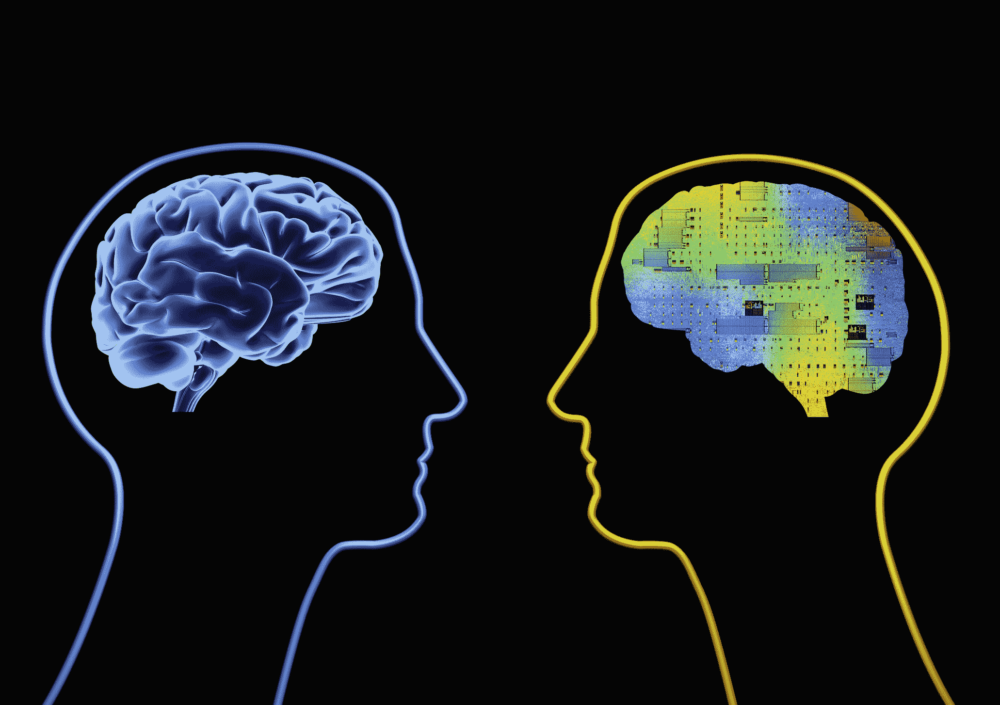
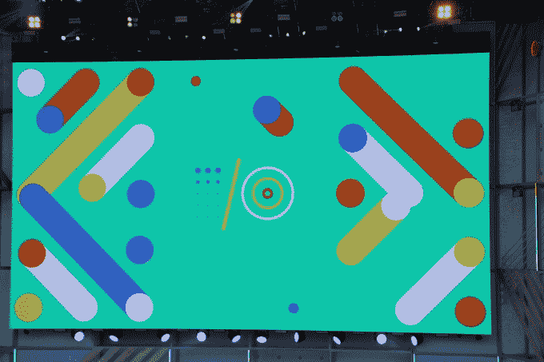
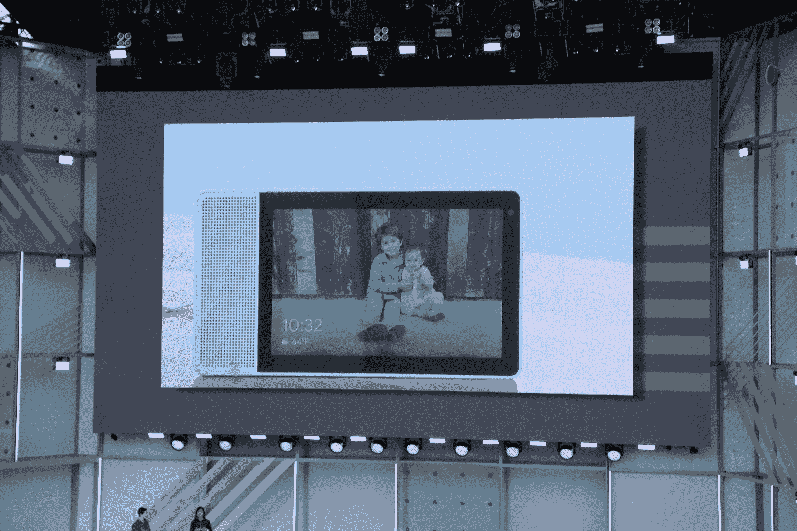
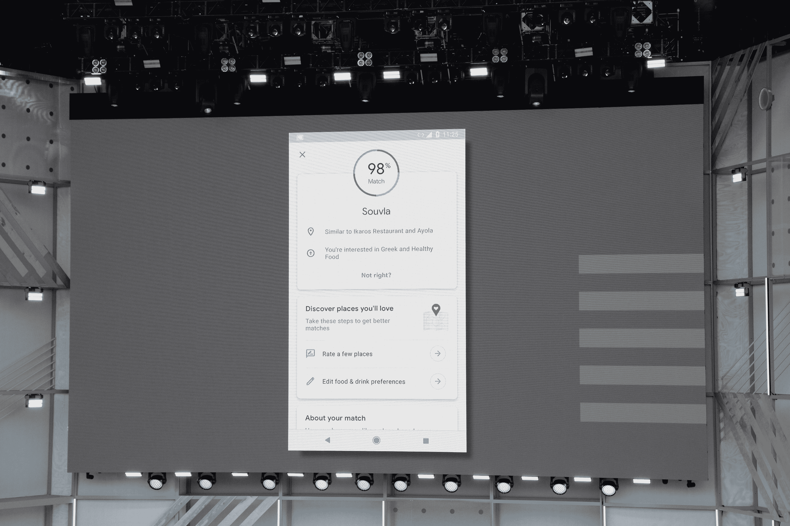
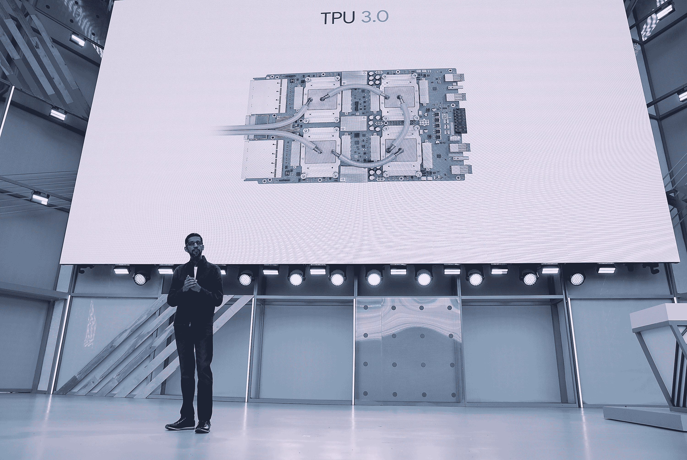
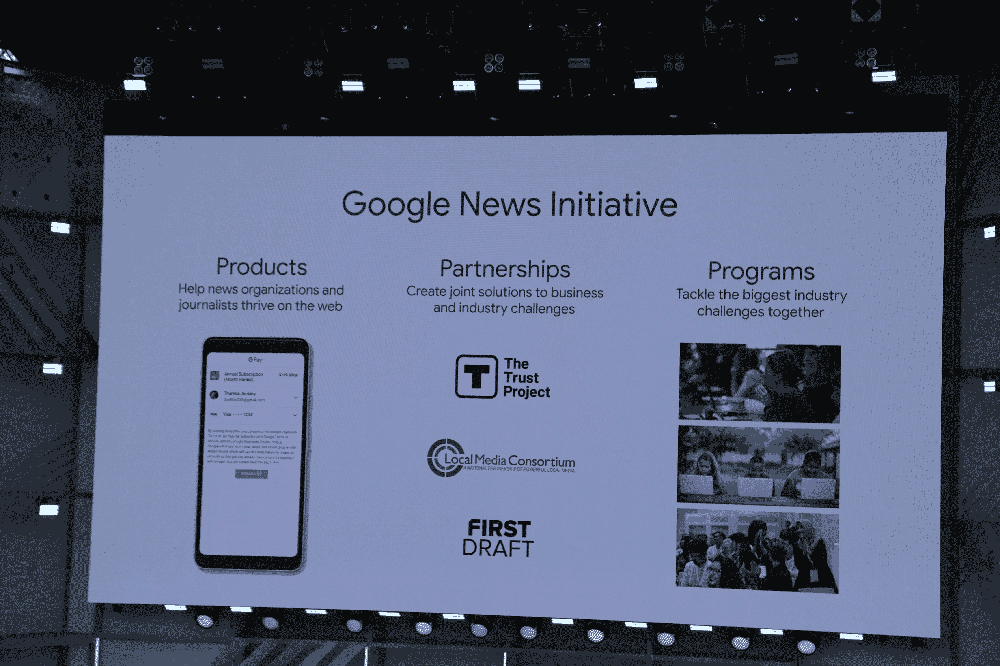
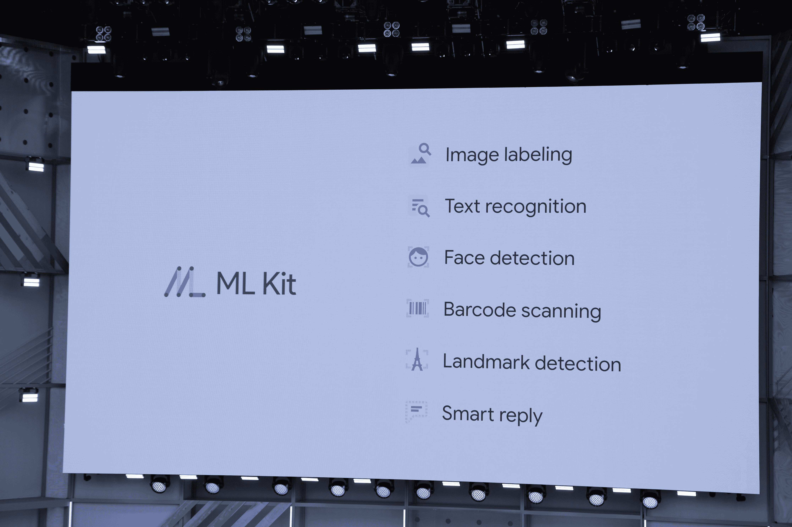

# Google I/O 2018  的 8 大公告

> 原文：<https://web.archive.org/web/https://techcrunch.com/2018/05/08/8-big-announcements-from-google-i-o-2018/>

谷歌在加州山景城的海岸线圆形剧场召开了年度 I/O 开发者大会。以下是第一天主题演讲中的一些重要公告。接下来几天还会有更多，所以请关注 TechCrunch 上的所有谷歌 I/O。

[**谷歌全力投入人工智能，将其研究部门更名为谷歌人工智能**](https://web.archive.org/web/20230407182141/https://techcrunch.com/2018/05/08/google-goes-all-in-on-artificial-intelligence-renames-research-division-google-ai/)

就在主题演讲之前，谷歌宣布将其谷歌研究部门更名为谷歌人工智能。此举标志着谷歌如何越来越多地将 R&D 的注意力放在计算机视觉、自然语言处理和神经网络上。

[**谷歌用“继续对话”让与助手的对话更自然**](https://web.archive.org/web/20230407182141/https://techcrunch.com/2018/05/08/google-makes-talking-to-the-assistant-feel-more-natural/)

**谷歌宣布:**谷歌宣布了对谷歌助手的“持续对话”更新，使与助手交谈感觉更自然。现在，不用每次你想说一个命令的时候都必须说“嘿，谷歌”或者“好的，谷歌”，你只需要在第一次说就可以了。该公司还增加了一项新功能，允许你在同一个请求中提出多个问题。所有这些都将在未来几周推出。

**为什么重要:**当你在进行一次典型的对话时，如果你没有得到想要的答案，你很可能会问一些后续的问题。但是每次都不得不说“嘿，谷歌”可能会不和谐，这会打破整个流程，让整个过程感觉很不自然。如果谷歌想在语音界面方面成为一个重要的参与者，实际的交互必须感觉像一次对话——而不仅仅是一系列的查询。

[**Google 相册获得 AI 提升**](https://web.archive.org/web/20230407182141/https://techcrunch.com/2018/05/08/google-photos-will-add-more-ai-powered-fixes-including-colorization-of-black-and-white-photos/)

**谷歌宣布的内容:**谷歌照片已经通过内置编辑工具和人工智能功能自动创建拼贴画、电影和风格化照片，使您可以轻松修改照片。现在，Photos 得到了更多人工智能支持的修复，如照片着色、亮度校正和建议旋转。新版本的谷歌照片应用程序将建议快速修复和调整，如旋转、亮度校正或添加颜色。

**为什么重要:**谷歌正在努力成为你所有照片的中心，它能够通过提供强大的工具来编辑、分类和修改这些照片，从而吸引潜在用户。谷歌获得的每一张额外的照片都为其提供了更多的数据，并帮助他们在图像识别方面越来越好，最终不仅改善了谷歌的用户体验，也使其自己的服务工具变得更好。谷歌本质上是一家搜索公司，它需要大量数据来进行正确的视觉搜索。

[**谷歌助手和 YouTube 即将智能显示**](https://web.archive.org/web/20230407182141/https://techcrunch.com/2018/05/08/googles-first-smart-displays-will-launch-in-july/)

谷歌宣布的消息:智能显示屏是谷歌今年 CES 的热门话题，但从那以后，我们就没怎么听说过谷歌的 Echo Show 竞争对手。在 I/O 大会上，我们对该公司的智能显示工作有了更多的了解。谷歌的第一批智能显示器将于 7 月推出，当然将由谷歌助手和 YouTube 提供支持。很明显，该公司投入了一些资源来构建视觉优先版本的 Assistant，证明了在体验中添加屏幕的合理性。

**为什么重要:**用户越来越习惯于在他们的客厅里放一些智能设备来回答他们的问题。但谷歌正在寻求创建一个系统，让用户可以提出问题，然后选择对语音界面无法解决的行为进行某种视觉显示。谷歌助手处理这个等式的语音部分——拥有 YouTube 是一个很好的服务。

**[谷歌助手即将登陆谷歌地图](https://web.archive.org/web/20230407182141/https://techcrunch.com/2018/05/08/google-maps-will-soon-give-you-better-recommendations/)**

**谷歌宣布的内容:**谷歌助手将于今年夏天在 iOS 和 Android 上推出谷歌地图。这一增加是为了给用户提供更好的推荐。谷歌长期以来一直致力于使地图看起来更加个性化，但由于地图现在不仅仅是方向，该公司正在引入新的功能，为你提供更好的当地推荐。

地图集成还结合了摄像头、计算机视觉技术和带有街景的谷歌地图。有了相机/地图组合，看起来真的像是你跳进了街景里。谷歌镜头可以做一些事情，比如识别建筑物，甚至狗的品种，只需将你的相机对准有问题的物体。它还能够识别文本。

**重要性:**地图是谷歌最大、最重要的产品之一。围绕增强现实有很多令人兴奋的事情——你可以指出像 Pokémon Go 这样的现象——公司刚刚开始触及它的最佳用例的表面。计算方向似乎是相机的一个自然用例，虽然这有点像技术壮举，但它给了谷歌的地图用户另一个好处，让他们留在服务中，而不是切换到其他服务。同样，对于谷歌来说，一切都要回到数据上来，如果用户停留在它的应用程序中，它能够捕捉更多的数据。

[**谷歌宣布推出新一代 TPU 机器学习硬件**](https://web.archive.org/web/20230407182141/https://techcrunch.com/2018/05/08/google-announces-a-new-generation-for-its-tpu-machine-learning-hardware/)

**谷歌宣布的消息**:随着创造定制人工智能硬件的战争升温，谷歌表示，它将推出第三代芯片，张量处理器单元 3.0。谷歌首席执行官桑德尔·皮帅表示，新的 TPU pod 比去年强大 8 倍，性能高达 100 petaflops。谷歌加入了几乎所有其他大公司的行列，寻求制造定制芯片，以处理其机器操作。

为什么重要:有一场为开发者创造最好的机器学习工具的竞赛。无论是在使用 TensorFlow 或 PyTorch 等工具的框架层面，还是在实际的硬件层面，能够将开发者锁定在其生态系统中的公司都将比其竞争对手拥有优势。这一点尤其重要，因为谷歌希望将其云平台 GCP 打造成为一项庞大的业务，同时对抗亚马逊的 AWS 和微软的 Azure。给开发者——他们已经在大量采用 TensorFlow 一种加速他们操作的方法可以帮助谷歌继续吸引他们进入谷歌的生态系统。

加州山景城——5 月 8 日:谷歌首席执行官桑德尔·皮帅于 2018 年 5 月 8 日在加州山景城海岸线圆形剧场举行的谷歌 I/O 2018 大会上发表主题演讲。谷歌为期两天的开发者大会将于 5 月 9 日星期三结束。(贾斯汀·沙利文摄影/盖蒂图片社)

[**谷歌新闻获得人工智能驱动的重新设计**](https://web.archive.org/web/20230407182141/https://techcrunch.com/2018/05/08/google-news-gets-an-ai-powered-redesign/)

谷歌宣布了什么:小心了，脸书。谷歌还计划在谷歌新闻的改版中利用人工智能。人工智能驱动的重新设计的新闻目的地应用程序将“允许用户跟上他们关心的新闻，了解完整的故事，并享受和支持他们信任的出版商。”它将利用谷歌数字杂志应用程序、报刊亭和 YouTube 中的元素，并引入“新闻广播”和“全面报道”等新功能，以帮助人们获得新闻报道的摘要或更全面的观点。

**为什么重要:**脸书的主要产品字面意思是“新闻订阅”，它是这个星球上一个重要部分的主要信息来源。但脸书卷入了一场丑闻，多达 8700 万用户的个人数据最终落入了一家政治研究公司的手中，脸书的算法以及它们是否会显示合法信息存在很多问题。这是一个巨大的漏洞，谷歌可以通过提供更好的新闻产品来利用，并再次将用户锁定在其生态系统中。

[**谷歌发布 ML Kit，这是一个 SDK，可以轻松地将人工智能添加到 iOS 和 Android 应用中**](https://web.archive.org/web/20230407182141/https://techcrunch.com/2018/05/08/googles-ml-kit-makes-it-easy-to-add-ai-smart-to-ios-and-android-apps/)

**谷歌宣布的内容:**谷歌发布了 ML Kit，这是一款面向 iOS 和 Android 应用程序开发人员的新软件开发工具包，允许他们将预先构建的、谷歌提供的机器学习模型集成到应用程序中。这些模型支持文本识别、人脸检测、条形码扫描、图像标记和地标识别。

**为什么重要:**机器学习工具催生了新一波用例，其中包括基于图像识别或语音检测的用例。但是，即使像 TensorFlow 这样的框架使得构建利用这些工具的应用程序变得更加容易，仍然需要高水平的专业知识才能让它们起步并运行。开发人员通常会找出新工具和设备的最佳用例，ML Kit 等开发套件有助于降低准入门槛，并为没有大量机器学习专业知识的开发人员提供一个操场，开始为这些应用程序找出有趣的用例。

那么你什么时候才能真正体验所有这些新功能呢？[Android P 测试版今天上市，你可以在这里找到升级。](https://web.archive.org/web/20230407182141/https://techcrunch.com/2018/05/08/android-p-beta-is-available-today/)