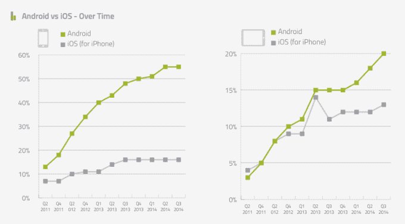
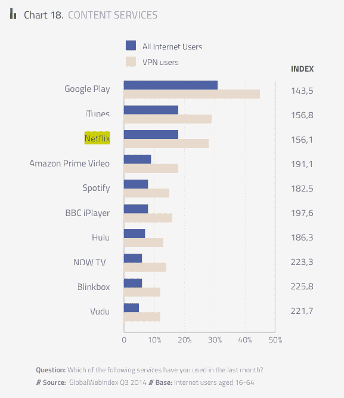

# 80%的在线成年人现在拥有智能手机，不到 10%的人使用可穿戴设备

> 原文：<https://web.archive.org/web/http://techcrunch.com/2015/01/12/80-of-all-online-adults-now-own-a-smartphone-less-than-10-use-wearables/>

如果人们指望苹果及其新的智能手表来激发消费者对可穿戴计算设备的更广泛兴趣，iPhone 的制造商将有很多工作要做。GlobalWebIndex 的最新研究表明，在对 32 个市场的 170，000 名成年互联网用户进行的调查中，只有 9%的人拥有智能手表，7%的人拥有智能腕带。相比之下，在网络成人中，80%的人现在拥有智能手机。

智能手机的拥有比例达到了一个新高，但它还没有超过传统的个人电脑的拥有和使用，目前占所有在线成年人的 91%。

GWI 的研究还强调了其他一些有趣的数据:

——**可穿戴设备**。在可穿戴设备类别中，拥有最多设备的是亚太地区 25-34 岁年龄段的富裕男性。这表明，这些更小、更便携、功能更窄的设备将继续作为利基产品占据市场，尚未找到吸引更广泛消费者的渠道。

— **平台“战争”已经结束，Android 赢得了**。分析不同的移动平台在智能手机和平板电脑领域的表现，不难发现 Android 遥遥领先于 iOS。然而，有趣的是，他们在何时偏离了多远。

我们已经听到各种各样的[市场分析师](https://web.archive.org/web/20220813074202/https://beta.techcrunch.com/2015/01/07/kantar-november-2014/)指出，苹果的 iPhone 销售[在推出 iPhone 6 型号后出现了大幅增长](https://web.archive.org/web/20220813074202/https://beta.techcrunch.com/2014/12/15/gartner-301m-smartphones-sold-in-q3-as-xiaomi-muscles-into-the-top-5-at-samsungs-expense/)，但不清楚 GWI 描绘的所有权情况是否支持这一点。

虽然 Android 季度环比增长，但 Q2 和第三季度之间的差距明显缩小，这可能表明销售放缓，只是 iPhone 的数字似乎持平/增长非常轻微。

换句话说，如果有影响的话，它必须由苹果来维持，以显示所有权的任何有意义的转移。目前，安卓 54%的份额代表着领先 iPhone/iOS 38 个百分点，差距还在扩大。

回到 2011 年，Android 和 iOS 用户的比例刚刚低于 2:1；GWI 指出，2014 年，这一比例已大幅提高至接近 3.5:1。

对于用户(和苹果公司)来说，这种分歧最终是否会在开发者投入时间和精力的领域发生，将是一个真正重要的问题。

——**药片**。在平板电脑方面，对我来说，最有趣的一点是一个历史问题:我们喜欢谈论苹果和 iPad 如何主宰平板电脑，尽管就单一品牌而言这可能是事实，但谈到平台主导地位，苹果自 2011 年第四季度以来就没有处于领先地位，2013 年真正脱离了接近的位置。

— **移动互联网使用**。GWI 称，75%的智能手机用户通过智能手机访问移动互联网服务，这意味着还有 25%的人没有。人们每天花在移动设备上的平均时间为 1.85 小时，比 2012 年增加了约 40 分钟。由于新兴市场消费者经常用手机取代个人电脑，他们使用手机的次数最多，在中东和非洲平均每天超过三个小时。

正如你在图表中看到的，移动设备用于互联网接入的次数远远超过平板电脑、电视和电子阅读器，但就设备拥有量而言，它尚未超过 PC/笔记本电脑的使用率，后者约为 90%。

—**VPN，热门内容**。GWI 还深入研究了在互联网接入方面有哪些内容正在被消费，以及用户是如何获取这些内容的。在一些市场中，限制性防火墙的兴起导致了使用 VPN 访问互联网的增加。这些 VPN 有效地让你出现在互联网上，就好像你在某个地方，而你实际上并不在那里。目前，GWI 表示，4 亿用户中约有 27%的受访者表示他们使用过 VPN 上网，仅中国就有 1.5 亿人。

在这些用户中，不出所料，他们比不使用 VPN 的人更热衷于在线内容消费。在 VPN 和普通互联网用户访问的所有服务中，Google Play 得分最高，他们将转向搜索巨头的商店，而不是应用程序，而是视频、音频和游戏内容。

