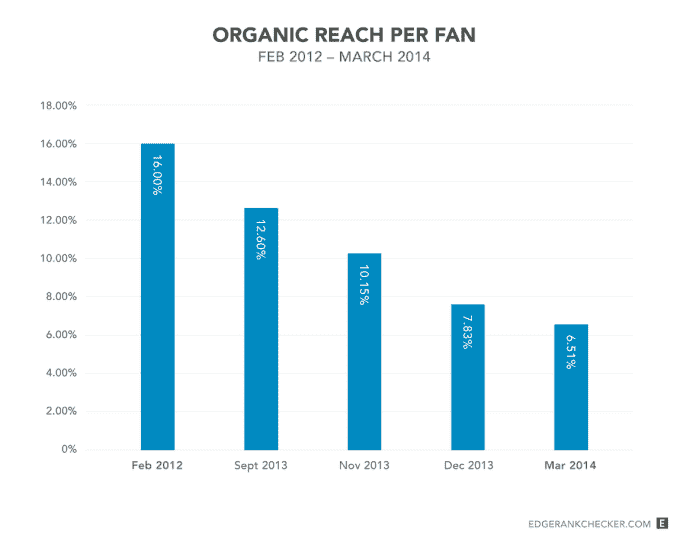
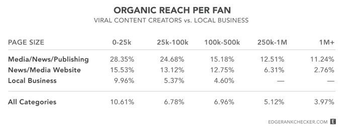

# 为什么脸书·佩奇的影响力在下降？更多的竞争和有限的关注–第 817 页–

> 原文：<https://web.archive.org/web/https://techcrunch.com/2014/04/03/the-filtered-feed-problem/817/>

脸书的每一个页面都想让所有人看到他们发布的所有内容。但是人们每天只阅读有限数量的新闻。根本没有空间容纳所有的东西，对饲料空间的竞争正在加剧。典型的[【脸书】](https://web.archive.org/web/20190626033407/https://crunchbase.com/organization/facebook) 用户喜欢的页面总数去年增长了 50%以上——这一新的统计数据来自对脸书新闻供稿负责人的 45 分钟采访。

内容的过剩和空间的缺乏迫使脸书扮演“坏人”的角色，过滤提要，试图显示最相关的帖子(加上一些广告)。到目前为止，脸书在如何以及为什么过滤新闻方面做得很糟糕。其结果是广泛的批评，如 Eat24 向社交网络发出的分手信，该公司删除了其 7 万个赞的脸书页面，以抗议越来越少的粉丝看到其帖子。

同情 Eat24，演员[雷恩·威尔森](https://web.archive.org/web/20190626033407/https://twitter.com/rainnwilson/status/448522571206893568)，以及品牌的[合唱团](https://web.archive.org/web/20190626033407/https://www.youtube.com/watch?v=oVfHeWTKjag)，当地商人和公众人物[对 reach 下降的愤怒](https://web.archive.org/web/20190626033407/http://dangerousminds.net/comments/facebook_i_want_my_friends_back)是明智的。他们努力吸引人们喜欢他们的网页。他们付钱给脸书做广告，让人们喜欢他们的页面，因为脸书告诉他们这是一项很好的长期投资。他们围绕他们在脸书获得的影响力建立业务，投入资源用吸引注意力的内容填充脸书。他们认为，如果有人明确表示想听他们的页面，他们应该看到页面上的帖子。当这种情况没有发生时，页面会感觉被抢了。

然而，这种观点在真空中观察每个页面的覆盖范围，而事实上它们是页面和人们在零和游戏中争夺注意力的整个生态系统的一部分，这个零和游戏就是新闻提要。它没有意识到，你从一个页面上看到的每一个额外的帖子，就意味着你从一个朋友或你关心的其他页面上看到的少了一个。

## 过滤饲料问题

随着时间的推移，人们会添加更多的朋友，喜欢更多的页面，但他们无法持续增加阅读新闻的时间。脸书说，一个普通用户每天可能有 1500 个帖子出现在他们的 feed 中，但如果有人有很多朋友，喜欢很多页面，这个数字可能会激增到 15000 个。然而，一天的时间是有限的，人们可能只会阅读几十到几百条帖子。

如果每个朋友和页面都被平等对待，那么随着时间的推移，有机接触——他们的朋友或粉丝看到他们的帖子的比例——将会下降，这是很自然的，事实上也是不可避免的。的确如此。来自 [News Feed 优化服务 EdgeRank Checker](https://web.archive.org/web/20190626033407/http://edgerankchecker.com/blog/2014/04/providing-stats-metrics-to-the-eat24-facebook-discussion/) 的一项研究显示，50，000 个帖子乘以 1，000 个页面的粉丝有机接触量(中位数)稳步下降:

*   2012 年 2 月= 16%
*   2013 年 9 月= 12.60%
*   2013 年 11 月= 10.15%
*   2013 年 12 月= 7.83%
*   2014 年 3 月= 6.51%

在过去的一年里，平均每名脸书用户的点赞数增加了 50%,而点击量下降了约 50%。当人们喜欢更多的页面时，每个页面的有机覆盖率就会下降。

但是所有的页面和人并没有被平等对待，因为脸书的目标是向人们展示他们每天能看到的所有帖子中最吸引人的帖子。脸书靠展示广告赚钱和实现其连接世界使命的能力取决于人们是否会回来，因为他们在那里看到有趣的内容，不会感到无聊。

这让脸书处于一个非常艰难的境地，要选择哪些内容可以播放，哪些内容不可以。我称之为过滤饲料问题。

脸书认为，娱乐和通知用户的最好方式不是向他们显示他们所关注的每个人发布的所有内容的倒序列表。经常发表无聊想法和平庸营销信息的人和网页会淹没你关心的最重要的生活变化和最大的朋友和生意的消息。噪音会淹没信号。这就是我所说的[未过滤的 feed 问题，也是 Twitter 不得不应对的](https://web.archive.org/web/20190626033407/https://beta.techcrunch.com/2013/10/05/sorry-my-feed-is-full/)。

## 脸书如何对提要进行分类

相反，脸书选择过滤其饲料。它建立了一个新闻订阅排序算法，非正式地称为 EdgeRank，分析每一个可能的信号，以确定每个帖子与每个人的相关性。大约 [100，000 个不同的重要性指标](https://web.archive.org/web/20190626033407/http://marketingland.com/edgerank-is-dead-facebooks-news-feed-algorithm-now-has-close-to-100k-weight-factors-55908)被考虑在内。我问脸书新闻 feed 产品管理总监 Will Cathcart，一篇文章是否显示在 Feed 中的最重要的决定因素是什么，他告诉我:

*   帖子创建者过去的帖子在每个人那里有多受欢迎(被喜欢、被评论、被分享、被点击)
*   这个帖子在已经看过的人当中有多受欢迎
*   帖子创建者过去的帖子在浏览者中有多受欢迎
*   帖子的类型(状态更新、照片、视频、链接)是否与查看者过去喜欢的类型相匹配
*   这篇文章是最近发表的吗

你可以在这篇文章的顶部看到这是一个简化的等式，尽管还有很多很多高度个性化的因素影响可见性。

卡斯卡特说，对于每个用户，脸书会给他们看到的每个帖子打分。它注入了一些广告，但“在大多数情况下，我们是按照排名顺序排列的”，他说。不管帖子是来自朋友还是页面，脸书只是试图向人们展示他们想要的东西。

这意味着一个帖子越成功，它的创建者在每个人和潜在的浏览者中越受欢迎，浏览者就越有可能看到这个帖子。事实上，有人喜欢一个页面或在几年后的某个时候添加了一个朋友，这并不重要。它是每个人和他们帖子的任何特定潜在浏览者是否继续对这个页面感兴趣。

本质上，每个人都必须在新闻订阅中赢得自己的空间。如果他们发布的帖子足够有趣，能够获得喜欢、评论、分享和点击，他们的影响力就会增加。如果他们的帖子令人厌烦，被任何看到他们的人忽略或滚动过去，他们的影响力就会下降。由于随着竞争的加剧，自然趋势是搜索范围缩小，网页必须越来越努力才能保持可见性。

一些页面实际上受益于脸书[最近的一系列 feed 算法调整](https://web.archive.org/web/20190626033407/https://beta.techcrunch.com/2013/08/23/facebook-feed-changes/)，奖励深度内容，惩罚使用点击诱饵标题和浅层图像宏模因。有趣、迷人、动态的内容适合他们的观众，网页仍然可以从脸书获得大量的免费流量。

新闻媒体和其他向脸书发布真实产品的媒体，如新闻文章，往往比仅仅发布产品营销信息的页面有更大的影响力，正如我在 3 月份委托 EdgeRank Checker 对 1000 个页面的影响力进行的研究所示。你可以喜欢《纽约时报》和奥利奥，但你可以在新闻订阅上阅读《NYT 》,而在那里你不能吃饼干。因此，NYT 拥有更高比例的粉丝是有道理的——它的帖子更有趣。

击败这个系统的唯一方法就是为广告付费。这并不新鲜。脸书从早期开始就允许广告客户为可见性付费，但是广告出现的地点和购买方式已经改变。最初，广告被放在 Facebook.com 的侧边栏，必须通过一个笨重的界面购买。最终，它开始允许广告出现在 feed 中，然后是移动 feed，购买广告变得更加简单。

但是现在，脸书允许页面立即将他们的帖子内容复制到广告中。这仍然是同样的为可见性付费的情况，但它与 reach 的自然下降相结合，跨越了一些心理边界，这让人们感觉脸书为了与自己的粉丝交流而勒索很多页面。

“我曾经接触到更多的粉丝，现在我接触到的越来越少，脸书希望我为以前免费获得的东西付费”是一个令人信服的抱怨，从技术上来说这是真的，但这似乎更像是这个系统的一个不幸的副产品，而不是脸书的恶意选择。

真正不真诚的是，脸书告诉公司将购买赞作为长期投资，而它可能已经看到或至少预测到这些粉丝的接触将会下降，从而使投资贬值。这就像告诉某人在快速通货膨胀时期存钱一样。广告商计算了粉丝的终身价值和通过脸书广告购买粉丝的成本。如果不把覆盖范围的下降考虑在内，他们可能会以无法收回的价格购买粉丝。这是一个诱饵和开关，可能会使广告商厌倦投入资源建立他们在脸书的存在。

## 饲料健康是重中之重

脸书试图保护新闻的质量，因为它的长期成功依赖于此。如果脸书偏离了人们想看的东西，展示更多的页面帖子来稳定下降的覆盖范围，用户就会放弃它，每个人的关注度都会下降。如果它能够改进其算法，以更好地检测和展示人们产生共鸣的相关内容，这个蛋糕就会为每个人而变大。这是脸书对其人工智能研究实验室进行长期巨额投资的核心目的。人工智能可以让它更好地理解你关心什么，并为你匹配这些内容。

但让新闻饲料长期更健康可能是一颗难以下咽的苦药丸，脸书没有提供多少糖来帮助药物消化。

去年，它开始[公布重大的新闻订阅算法变化](https://web.archive.org/web/20190626033407/https://beta.techcrunch.com/2013/08/06/facebook-story-bumping/)，但它需要打开新闻订阅分类的黑匣子，了解它是如何从根本上工作的，以及为什么这样做。它需要以更多的同情来处理这个问题，因为竞争拖累了他们的业务，无辜的页面正在看着他们的业务遭受损失，脸书全球传播/货币化总监 Brandon McCormick 对 Eat24 的[回应不能继续](https://web.archive.org/web/20190626033407/http://www.adweek.com/adfreak/facebook-exec-snarkily-confirms-brands-big-fear-their-content-isnt-important-156662)所展示的“艰难的突破，你没那么有趣，克服它”的态度。它应该为鼓励品牌购买赞而没有警告他们不可避免的接触范围减少而道歉。

当企业和公众人物更好地接触到脸书时，他们放弃了 Myspace。但是今天，十亿用户并不重要，如果达到他们的渠道超载。Twitter、Pinterest、Snapchat 和其他公司将很乐意欢迎前页面经理更多地关注他们不拥挤的平台。因此，尽管脸书不能给营销人员他们想要的东西，但它必须尊重他们。