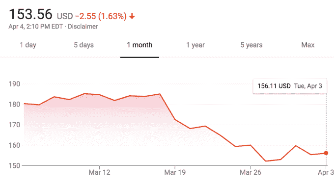

# 脸书承认剑桥分析公司劫持了多达 8700 万用户的数据

> 原文：<https://web.archive.org/web/https://techcrunch.com/2018/04/04/cambridge-analytica-87-million/85/>

# 脸书承认剑桥分析公司劫持了多达 8700 万用户的数据

[脸书](https://web.archive.org/web/20200320171020/https://crunchbase.com/organization/facebook) 将警告 8700 万用户，其中大部分在美国，他们的数据“可能被他们或他们的朋友使用的应用程序不当分享给剑桥分析公司”，[该公司刚刚宣布](https://web.archive.org/web/20200320171020/https://newsroom.fb.com/news/2018/04/restricting-data-access/)。脸书首席技术官迈克·舍普费尔(Mike Schoepfer)告诉 TechCrunch，脸书将在新闻提要上方发布通知，警告这些用户他们的哪些数据可能已经被获取，以及他们现在应该做什么。它还将在提要顶部显示其新的批量应用权限删除工具。

Schroepfer 说，8700 万是受影响用户的最大数量，高于《纽约时报》最初报道的 5000 万人受影响的数量，因为脸书并不确定有多少人的数据被滥用。它可能不想低调行事，后来不得不向上修正这个数字，就像它最初报道俄罗斯选举干涉广告被 1000 万用户观看时那样，后来不得不向国会承认，如果将有机帖子包括在内，实际上是 1.26 亿。马克·扎克伯格计划在下午 1:00 的太平洋电话会议上回答记者关于这些变化的问题。

这些变化是剑桥分析公司丑闻之后一系列公告的一部分，包括对脸书 API 使用的新限制和立即关闭旧 Instagram API 的新限制，旧的 insta gram API 原定于 7 月份发布，但本周开始破坏开发者的应用。脸书目前正在对提取大量数据或看起来可疑的应用程序开发人员进行深入审计，Schroepfer 承诺，如果脸书发现任何类似剑桥分析公司惨败的情况，它将进一步披露。

脸书正试图修复其破碎的数据隐私，此前一位名为亚历山大·科岗博士的开发人员使用该平台管理一款收集参与者及其朋友数据的性格测试应用程序。这些数据随后被传递给剑桥分析公司(Cambridge Analytica)，在那里，这些数据可能被用来优化政治竞选活动，包括 2016 年总统候选人唐纳德·川普 [和英国退出欧盟投票](https://web.archive.org/web/20200320171020/https://www.nytimes.com/2018/03/27/world/europe/whistle-blower-data-mining-cambridge-analytica.html)的竞选活动，该公司自己强烈否认这些指控。不管这些数据是如何被用于政治目的的，这种松散的数据共享足以点燃一场围绕脸书隐私做法的风暴。

剑桥分析公司的丑闻曝光后，该公司的股票急剧下跌，[从之前稳定增长的时期抹去了超过 600 亿美元的市值。在撰写本文时，脸书的交易价格为 153.56 美元。](https://web.archive.org/web/20200320171020/https://techcrunch.com/2018/03/20/facebook-has-lost-60-billion-in-value/)

脸书的核心领导层对负面关注的爆发反应迟缓，尽管扎克伯格和桑德伯格通过一系列媒体露面、采访和[平面广告](https://web.archive.org/web/20200320171020/https://techcrunch.com/2018/03/25/zuck-apologizes-for-cambridge-analytica-scandal-with-full-page-print-ad/)打破了沉默。该公司还再次受到国会的审查，来自众议院和参议院的小组委员会以及两个政党的压力似乎得到了回报。[扎克伯格预计将于 4 月 11 日在众议院能源和商业委员会作证，这只是几个要求他作证的强大委员会之一。](https://web.archive.org/web/20200320171020/https://techcrunch.com/2018/04/04/zuckerberg-will-testify-before-congress-on-april-11/)

虽然大规模错误处理用户数据的确很不幸，但这一事件已经成为压垮脸书骆驼隐私的最后一根稻草——这似乎正在催化变革。Schroepfer 告诉 TechCrunch，脸书现在正在挖掘每一块石头，寻找任何其他可能被用来非法访问或窃取人们信息的漏洞。现在，我们正在进行几年前就应该进行的改变，这可能会使脸书成为一个更安全的网络场所，让那些担心公司如何处理他们的私人数据的用户可以使用。

更多关于脸书最近的丑闻和变化，请阅读我们的其他报道: