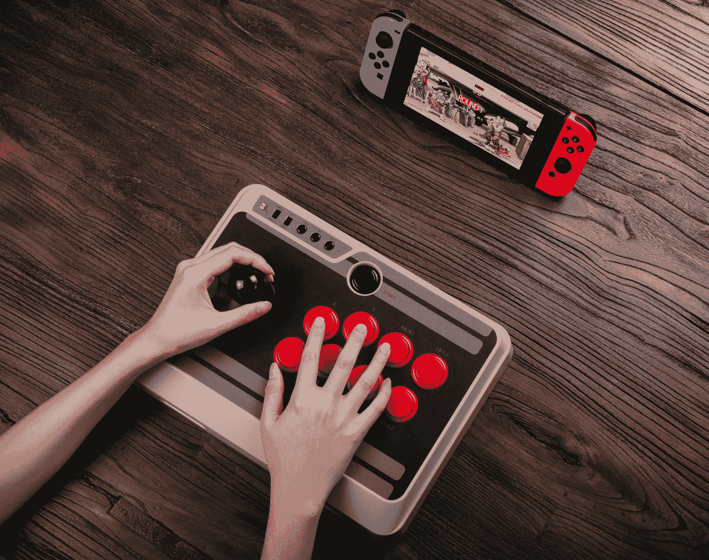
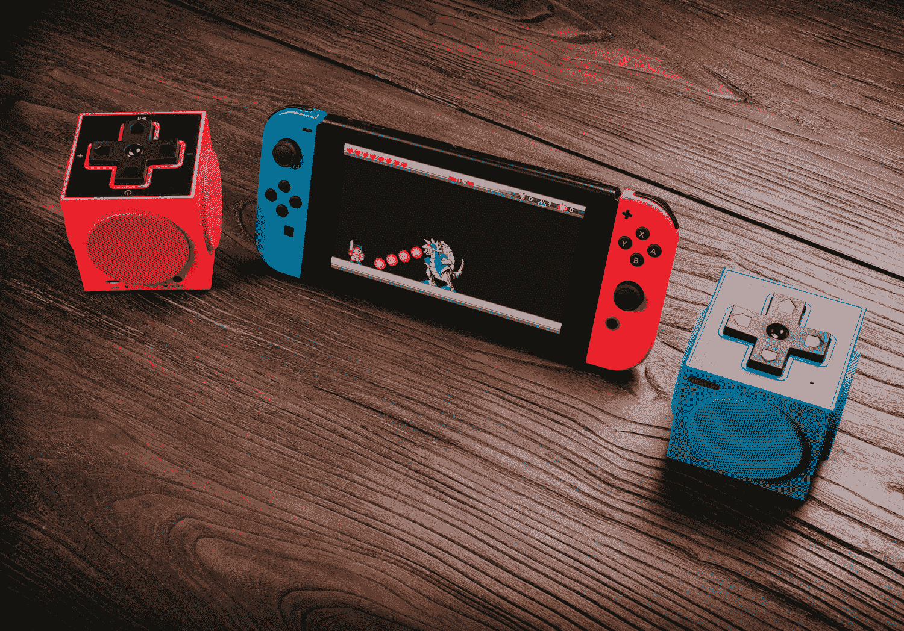

# 8bitdo 新推出的 SNES 风格复古游戏手柄是一款梦幻任天堂 Switch 控制器 

> 原文：<https://web.archive.org/web/https://techcrunch.com/2017/06/15/8bitdos-new-snes-inspired-retro-gamepad-is-a-dream-nintendo-switch-controller/>

自从 [8bitdo](https://web.archive.org/web/20221202005133/http://www.8bitdo.com/) 用任天堂 Switch 支持更新了他们的 NES30 Pro 和其他游戏控制器以来，我一直把它们作为在游戏机上玩游戏的主要方式。现在在 E3，8bitdo 展示了一种新的模型，它可能会成为有史以来最好的开关控制器。

SNES30 Pro(和 SFC30 Pro，因为它的 Super Famicom 彩色变体被称为)拥有任天堂自己的 Pro Switch 控制器的完整控制器映射所需的所有按钮，并且它的包装对 90 年代的孩子和其他任何花了大量时间玩超级任天堂的人来说都非常熟悉。唯一真正不同的是增加了更多的肩部按钮，以及两个模拟操纵杆的存在，看起来它们一直都属于那里。

SNES30 Pro 有两种经典配色，这两种配色的灵感都来自实物，它们提供了与一系列设备的蓝牙兼容性，包括 Android 手机、Windows 和 Mac PCs，当然还有 Switch。它们还通过 USB-C 充电，这是第一个这样做的 8bitdo 控制器，这使它们更适合与任天堂的最新游戏机一起使用。这些还包内置隆隆电机，另一个原始的改进。

[gallery ids="1503974，1503975，1503977，1503978，1503979，1503980"]

这还不是 8bitdo 在今年的大型游戏展上展示的全部:他们还展示了 NES30 街机棒，这应该是格斗游戏粉丝的一个受欢迎的选择。这包括 turbo 模式支持，并且还具有蓝牙连接。

最后，还有来自该公司的新发言人。这些看起来像小立方体，颜色与开关的霓虹红色和蓝色控制器相协调，并具有音量和播放的 D-Pad 控件。它们也可以通过蓝牙或 AUX 连接，对于您的移动开关设置来说，看起来绝对是非常适合旅行的选择。

这些产品不会立即上市——snes 30 Pro 将在即将到来的假期上市，而 NES30 Arcade Stick 和 TwinCube 扬声器将在今年第三季度上市。不过，就我而言，SNES30 Pro 尤其不能很快上市。