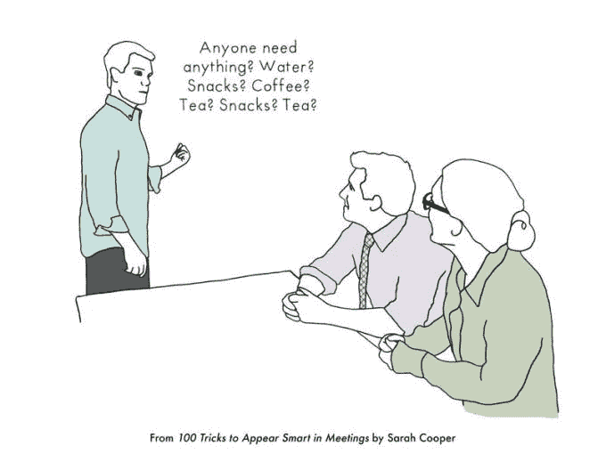
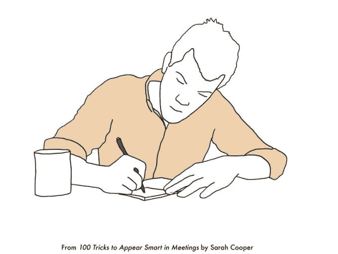
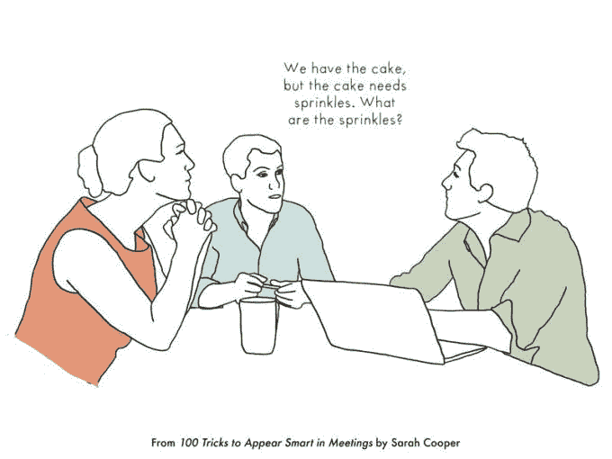
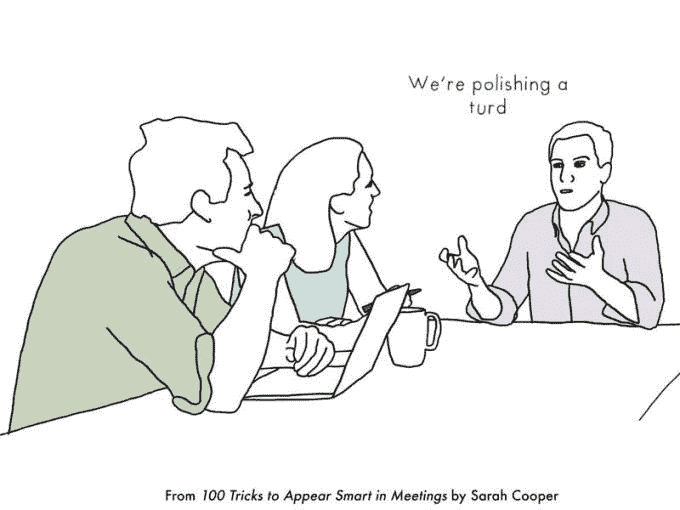

# 在头脑风暴会议上显得聪明的 9 个技巧 

> 原文：<https://web.archive.org/web/https://techcrunch.com/2016/09/30/9-tricks-to-appear-smart-in-brainstorming-meetings/>

莎拉·库珀是一名作家、喜剧演员和讽刺博客的创建者

[TheCooperReview.com](https://web.archive.org/web/20221002234813/http://thecooperreview.com/)

。她之前是谷歌文档的设计主管，现在专注于企业和科技幽默的写作和演讲。你可以在上找到她

[Facebook](https://web.archive.org/web/20221002234813/https://www.facebook.com/TheCooperReviewPage/)

和

[Instagram](https://web.archive.org/web/20221002234813/https://www.instagram.com/thecooperreview/)

.

*以下节选自莎拉·库珀的新书，* [*在会议中显得聪明的 100 招(10 月 4 日，安德鲁斯·麦克米尔)*](https://web.archive.org/web/20221002234813/http://smarturl.it/100Tricks)

在头脑风暴会议中，提出令人难以置信的新想法的压力会让人变得疲惫不堪。幸运的是，大多数公司最不想要的就是新想法。

在这些很大程度上毫无意义的练习中，重点是利用你在场的庄严来做出贡献，让别人的想法看起来像你的想法，并通过质疑整个过程的效率来看起来像一个真正的领导者。

这里有 9 个诀窍，让你看起来像是团队中的创新力量。

1.  **离开去取水，询问是否有人需要什么**

在会议开始前，起身询问是否有人需要 任何东西。人们会认为你很体贴、善良、乐于助人，而且你可以消失 10 分钟而不问任何问题。即使没有人想要任何东西，带瓶水、汽水和零食回来。

你的同事会觉得不得不开始喝酒和吃零食，而你的远见会让他们认为你真的能预测未来。

2.  **抓起一叠便利贴，开始画画**

在介绍话题的时候，抓起一个便利贴 便笺簿，开始画无意义的流程图。你的同事会 带着担忧的兴趣看着你，甚至在你知道这个 会议是为了什么之前，想知道你是如何 提出这么多复杂想法的。

3.  **打个很简单却听起来很深奥的比方**

当每个人都在试图定义这个问题的时候，打个比方 关于烤蛋糕，或者一些完全不相关的事情。你的 同事会点头表示同意，即使他们真的不明白你所说的和他们正在谈论的 有什么关系。完全让他们摸不着头脑的谈话会让你看起来超凡脱俗，极具创造力，尽管事实是你真的就像蛋糕一样。

4.  **询问我们是否问对了问题**

没有什么比通过问这些问题是否正确来质疑这些问题更能让你看起来更聪明了。如果有人 问你你认为正确的问题是什么，就说你只问了一个。

**侧栏:如何战略性地击落小创意**

想知道一个想法是否看起来太小，所以你的同事认为你是一个伟大的思想家和游戏规则的改变者。

使用以下短语之一:

*   但它是如何颠覆性的呢？
*   这是 10x 吗？
*   这是未来吗？
*   我以为那已经死了。
*   有什么大胜算？
*   但是苹果不就是这么做的吗？

5.  **使用习语**

用习语质疑一个想法是 质疑它的一种微妙、聪明的方式。这里有一些成语可供选择:

*   这不是画蛇添足吗？
*   那不是给猪涂口红吗？
*   似乎我们在擦拭一坨屎。

6.  **培养一个古怪的、创造性的习惯，让你的血液流动起来**

养成一个古怪的习惯,“帮助你思考”并“让你的创意 源源不断”这可以是任何事情，从穿着你的 睡衣出现，在地板上沉思，当场慢跑，对着墙壁扔一个 球，用你最喜欢的鼓槌击鼓， 或者同时做所有这些事情。即使你实际上没有提出任何想法，你的同事也会被你无法控制的创造力吓倒。

**侧栏:如何战略性地否决大创意**

想知道一个想法是否看起来太大，这样你的上司就会知道你有多在乎公司的资源。

使用以下短语之一:

*   是不是太颠覆了？
*   这与路线图有什么关系？
*   这似乎是一个支点。
*   那不是没戏了吗？
*   那不是超出范围了吗？
*   但是你如何测试呢？
*   这在国际上行得通吗？

7.  **说出你认为首席执行官会如何回应**

通过提出你认为她会如何回应 想法，让你的同事认为你和首席执行官有着非常亲密的关系 。直呼首席执行官的名字。说你可能会在你的下一次巫术中通过 她运行这个。祝贺每个人都提出了她喜欢的东西。通过将你自己与首席执行官 联系得如此紧密，人们会开始认为你是某种培训中的首席执行官。

8.  **询问我们是否正在创建正确的框架、平台或模型**

通过提出前进的框架，或 思维的模型，或我们如何将它变成一个平台，你将总是显得你比其他任何人 思维更强。这是一种非常元的方式 让每个人都瞠目结舌，并且掩盖了一个事实，那就是你对每个人都在谈论的事情一无所知。

9.  **当每个人似乎都喜欢一个想法时，大喊一声“扔掉它！”**

总有一天，每个人都会对一个想法或方向感到兴奋。此时，你应该试着成为第一个 喊出“出货！”当然，说出来会让人 发笑是一件有趣的事情，但这样做也会传达你的一些权威 来结束会议并做出最终决定，即使你 也没有权力这样做。

[*在会议中显得聪明的 100 招*](https://web.archive.org/web/20221002234813/http://smarturl.it/100Tricks) *将于 10 月 4 日发布。* [*此处预先订购*](https://web.archive.org/web/20221002234813/http://smarturl.it/100Tricks) *并在*[*100Tricks.com*](https://web.archive.org/web/20221002234813/http://100tricks.com/)*处阅读更多。*