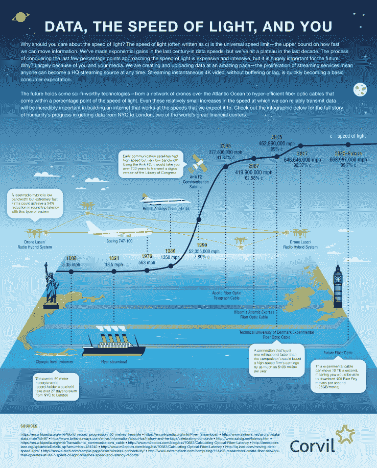

# 数据、光速和你——955 页

> 原文：<https://web.archive.org/web/https://techcrunch.com/2015/11/08/data-the-speed-of-light-and-you/955/>

费戈尔·图米撰稿人

费戈尔·图米是

[Corvil](https://web.archive.org/web/20190528144222/http://www.corvil.com/)

.

我们人类去年创造了 4.4 兆字节的数据。预计到 2020 年，这一数字将升至 44 千兆字节。不，“零字节”这个词不是我造的就规模而言，据估计 42 兆字节可以存储所有人类说过的话。一个 zettabyte 大约是 2500 亿张 DVD——几乎足够容纳整个《T4 之友》系列。

如果我们不能快速可靠地移动数据，所有这些数据对我们都没有任何用处。我们不断地发送、接收和流式传输。我们生活在这样一个时代，任何拥有智能手持设备的人——大约有 26 亿人——都可以立即成为视频流。这个庞大的数字甚至还不包括大企业和政府，它们中的大多数现在都是以数字方式进行大部分沟通，从而增加了大量的比特和字节。

随着连接性继续飙升，我们能够足够快地移动这些数据吗？我们是否愿意为更快、更可靠地移动它而付出代价？

## 去 c 还是不去 c

当前的技术/线路非常快，但是我们的数据创建和消费正在快速赶上。谷歌光纤为普通消费者提供了最快的速度之一，传输速率为每秒 1 千兆比特，而目前正在建设中的用于金融市场的跨大西洋光缆 Hibernia Express 的传输速率将为每秒 8.8 兆比特(比谷歌光纤快 8800 倍)。那么为什么不开快点呢？

我们正在接近宇宙速度极限。

宇宙是有规则的。不幸的是，我们不知道他们所有人。我们所知道的是信息有速度限制:也就是光速 c。光每秒钟传播大约 300，000，000 米。上面提到的两条电缆，Google Fiber 和 Hibernia Express，都是以大约 2/3°c(光速的三分之二)的速度移动数据，受到玻璃纤维折射特性的限制。基本上，光线会在电缆内反弹并减速。

## 对速度的需求

在商业之外，毫秒可能不意味着数百万美元，但今天的消费者期望比以往任何时候都高。观众现在认为即时点播是常态。在这个生态系统中，“缓冲”这个词意味着出了问题。网上购物时图片的缓慢加载时间意味着点击下一个网站，并且永远不会返回。对于流媒体服务提供商或在线零售商来说，这意味着利润的下降。

> 我们愿意为更快更可靠地移动数据付出代价吗？

我们创造数据的速度不会很快放缓。物联网的到来迫在眉睫——预计将有 250 亿台设备(地球上每人三台)各自产生、发送和接收数据。我们的基础设施准备好应对这种数据级联了吗？

## 高原时代

注意下面信息图中的线在过去几十年里是如何变平的？在过去的几十年里，我们取得了巨大的进步，但现在进步的速度受到了非常不同的斗争的影响。最先进的技术距离光速只有几个百分点，但可靠地利用这一速度的技术可能需要许多年和数百万美元。

速度稍有提高就需要大量资源。Hibernia Express 将为跨大西洋传输减少 6 毫秒的延迟。据估计，该项目将耗资超过 3 亿美元，公司将支付数百万美元来使用该线路。Hibernia 的速度背后的秘密很简单:他们将电缆沿直线横跨大西洋。

对于普通消费者来说，甚至是那些对速度有强烈需求的人，比如金融市场，更快的传输并不会带来太大的不同。但是，当我们考虑到需要不断地、可靠地、毫无问题地移动大量数据时，这些逐步实现更好的基础架构的重要性是显而易见的。每十分之一个百分点都会产生巨大的影响。

## 更快、更好、更强

幸运的是，突破来得很快，尽管往往代价高昂。英国的研究人员已经创造了以光速 99.73%的速度传输数据的光缆，并将它们与每秒 73.7 兆比特的技术相结合——这是一部每秒下载 5GB 的高清电影。然而，到目前为止，这些电缆仅在非常短的距离内有效，因此需要进一步的研究。

避免光通过物理介质时速度下降的一个好方法是完全避免。通过(大部分)空气传送的微波继电器能够传播得更快。中继站必须由一系列固定的塔组成，所以以这种方式穿越海洋的可行性会带来一些严重的建设挑战。一些人提出了一系列固定的驳船支撑塔，以及一个真正科幻的盘旋无人机网络，该网络将使用激光在短距离内传输信号。

所有这些进步都将付出巨大的代价。金融部门通常引领潮流，因为他们依赖绝对的最高速度，这些技术经过国际市场的考验，最终进入一般商业用途。

我们在这项开发上投入了数十亿美元；与前几十年的速度增长相比，进步是缓慢的。如果我们希望跟上未来几年我们将能够产生的难以置信的数据量，光速的每一个分数都很重要。

除非有数百万毫秒，数百万人期望以接近光速的速度消费，否则毫秒并不重要。

