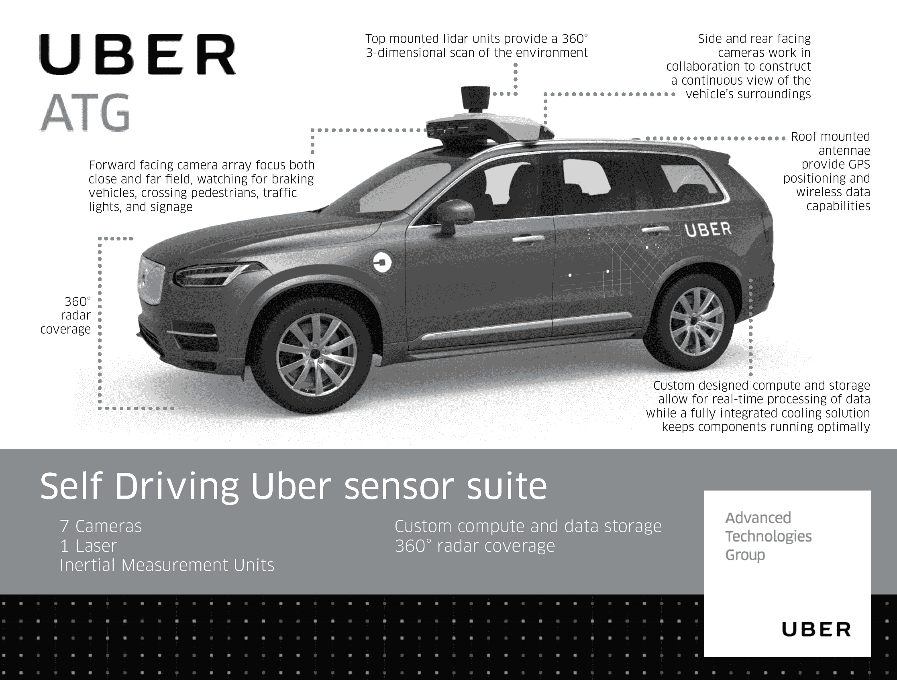
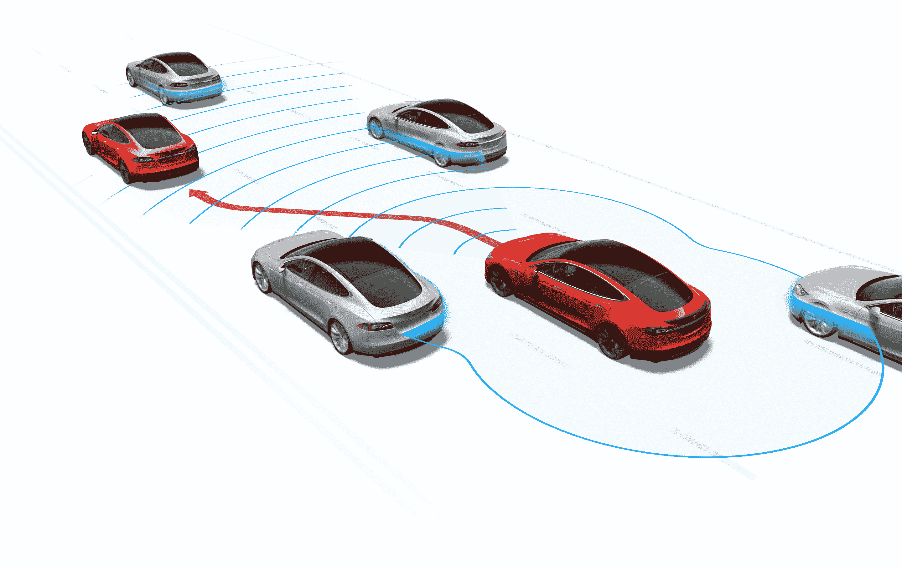
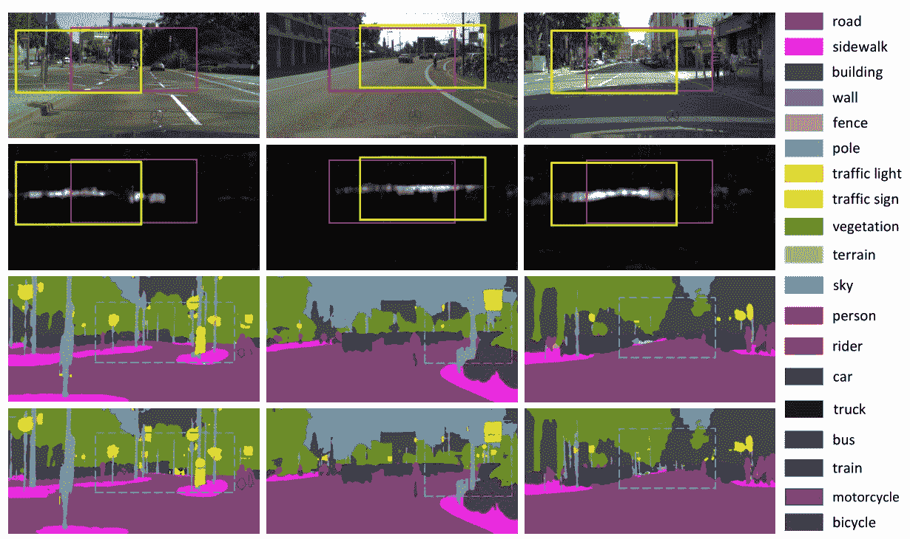

# 以下是优步的自动驾驶汽车应该如何检测行人——第 971 页

> 原文：<https://web.archive.org/web/https://techcrunch.com/2018/03/19/heres-how-ubers-self-driving-cars-are-supposed-to-detect-pedestrians/971/>

优步制造的自动驾驶汽车撞死了一名行人。这是第一次这样的事件，肯定会像过去没有其他自动驾驶汽车交互一样受到审查。但从表面上看，很难理解除了整个系统的故障，这种情况是如何发生的，因为整辆车本质上是围绕防止这种情况发生而设计的。

意外进入车辆路径的东西几乎是自动驾驶汽车工程师关注的第一个紧急事件。情况可能是多种多样的——一辆停下的汽车、一只鹿、一个行人——而这些系统都是为了尽早检测到它们、识别它们并采取适当的行动而设计的。可能是减速，停止，转向，任何东西。

[优步的](https://web.archive.org/web/20200628164548/https://crunchbase.com/organization/uber) 车辆配备了几种不同的成像系统，既可以执行普通任务(监控附近的车辆、标志和车道标线)，也可以执行刚刚描述的特殊任务。本案中至少有四辆不同的车接走了受害者。

**顶装激光雷达。**这些汽车顶部的桶形物品是一个[激光雷达，或光探测和测距](https://web.archive.org/web/20200628164548/https://techcrunch.com/2017/02/12/wtf-is-lidar/)，该系统每秒钟产生汽车周围多次的 3D 图像。使用红外激光脉冲从物体反弹并返回到传感器，激光雷达可以在白天或晚上探测到静态和移动物体的相当详细的信息。

这是一个激光雷达创建的图像的例子，虽然不是特别是优步车辆会看到什么。

大雪和大雾会模糊激光雷达的激光，其精度会随着距离的增加而降低，但对于从几英尺到几百英尺的任何东西，它都是一种非常宝贵的成像工具，几乎每辆自动驾驶汽车上都有。

如果操作正确，激光雷达装置应该能够识别出问题中的人，如果他们没有完全被遮挡，而他们仍然在 100 多英尺之外，并将他们的存在传递给整理图像的“大脑”。

**前置雷达。**雷达和激光雷达一样，发出信号并等待信号反弹，但它使用的是无线电波，而不是光。这使得它更能抵抗干扰，因为无线电可以穿过雪和雾，但也降低了它的分辨率并改变了它的范围轮廓。

特斯拉的自动驾驶主要依靠雷达。

根据优步使用的雷达装置——可能前后都有多个，以提供 360 度的覆盖范围——范围可能会有很大不同。如果它是为了补充激光雷达，它有可能会有相当大的重叠，但更多的是为了识别其他汽车和更大的障碍。

一个人的雷达特征不那么容易识别，但很可能他们至少会出现，从而确认激光雷达检测到的东西。

**短距和远距光学相机。**激光雷达和雷达非常适合定位形状，但它们不适合阅读标志，判断事物的颜色等等。这是可见光相机的工作，它们有复杂的[计算机视觉算法](https://web.archive.org/web/20200628164548/https://techcrunch.com/2017/02/12/wtf-is-lidar/)在图像上实时运行。

优步车上的摄像头会观察指示刹车车辆(突然闯红灯)、交通灯、行人穿越等的指示模式。特别是在汽车的前端，将使用多个角度和多种类型的摄像机，以便获得汽车驶入的场景的完整画面。

检测人是最常尝试的计算机视觉问题之一，做这件事的算法已经相当不错了。通常所说的“分割”图像，通常还包括识别标志、树木、人行道等等。

也就是说，晚上可能会很难。但这是一个显而易见的问题，其答案是前两个系统，不分昼夜地工作。即使在一片漆黑中，一个穿着全黑的人也会出现在激光雷达和雷达上，警告汽车或许应该减速，并准备好在前灯中看到那个人。这可能就是为什么自动驾驶汽车上不常见夜视系统的原因(我不能肯定优步车上没有夜视系统，但这似乎不太可能)。

**安全驾驶员。**将一个人称为一个系统可能听起来有些愤世嫉俗，但这些汽车中的安全驾驶员在很大程度上扮演了一个通用故障保险的角色。人们非常擅长检测事物，即使我们没有从眼睛里射出激光。我们的反应时间不是最好的，但如果很明显汽车不会做出反应，或者反应错误，受过训练的安全驾驶员会做出正确的反应。

值得一提的是，还有一个中央计算单元，它从这些来源获得输入，并创建自己的更完整的汽车周围世界的表示。例如，一个人可能会消失在系统传感器前的一辆汽车后面，一两秒钟内不再可见，但这并不意味着他们不再存在。这超越了简单的物体识别，并开始引入更广泛的智能概念，如物体持久性、预测行动等。

它也可以说是任何自动驾驶汽车系统中最先进、保护最严密的部分，因此一直处于保密状态。

尚不清楚这场悲剧是在什么情况下发生的，但这辆车肯定配备了旨在并且应该检测到这个人并使汽车做出适当反应的技术。此外，如果一个系统不起作用，另一个系统应该足够了——多重故障恢复只在高风险的事情上实用，如在公共道路上驾驶。

随着优步、当地执法部门、联邦当局和其他机构对事故的调查，我们将了解更多情况。