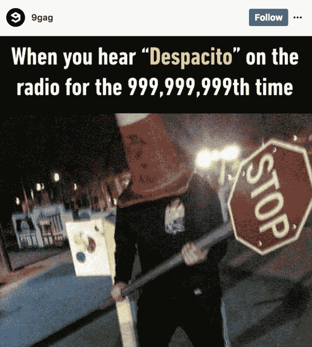
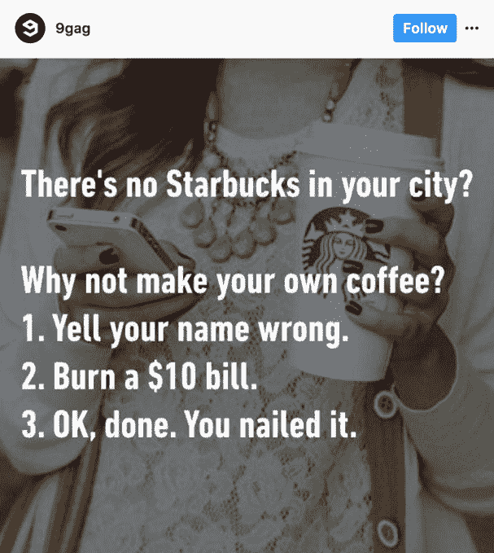

# 9GAG 首席执行官陈纪匡谈全球幽默和受众发展

> 原文：<https://web.archive.org/web/https://techcrunch.com/2017/07/26/9gag-ceo-ray-chan-building-a-healthy-community-is-a-never-ending-battle/>

如果你喜欢迷失在迷因和社交媒体中，你无疑会在某个时候偶然发现 [9GAG](https://web.archive.org/web/20221209140016/https://9gag.com/) 。9GAG 是一家总部位于香港的网站，托管和分发有趣的图片、视频和模因。在[的受众方面](https://web.archive.org/web/20221209140016/https://tubularlabs.com/leaderboards)，它与 UNILAD 和 LADBible 等内容托管和分发网站不相上下。9GAG 拥有 4110 万 Instagram 粉丝，是 Instagram 上全球最大的媒体娱乐品牌之一。

那么，在一家以让互联网变得更有趣为唯一使命的公司背后，到底是什么在运作呢？

以下是 9GAG 首席执行官兼联合创始人陈纪匡和首席运营官·莉莲·梁对受众发展、全球幽默以及在香港运营一家媒体初创公司的看法。我们的对话经过了编辑，以保持长度和清晰度。

**TC: 9GAG 是脸书和 Instagram 上关注度最高、参与度最高的网站和社交账户之一。是怎么开始的？**

RC:我们在 2008 年建立了这个网站。我们最初的想法是，“我们可以发布有趣的内容来看吗？”那时候，脸书还没那么受欢迎。我们刚刚制作了自己的网站，上面有有趣的图片和有趣的视频。几年来，我们一直把它当作一个副业，而不是生意。一开始更像是一种爱好。但是后来我们在 2011 年加入了 500 家创业公司，然后融资。之后在 2012 年加入 Y Combinator。

你在 Instagram 上有 4110 万粉丝，在脸书上有 3650 万页面“赞”。现在你对哪些社交平台最感兴趣？

RC: 当你看社交媒体时，它总是有起伏。我觉得 Instagram 肯定还是很有意思的。故事和直播视频是我们团队一直关注的。如果你谈论所有的客户，我们是最受关注的前 30 名。如果把名人拿走，那我们就是第六。

**TC: 9GAG 在美国社交网络上很流行，但这些网络很多在中国都是受限的。尽管你的主要受众存在于其他地方，但你是否试图锁定中国用户？**

因为我们在香港，所以我们能看到中国流行什么。但是香港不同于中国的其他地方。我们很容易理解美国文化。但东南亚市场的大玩家是韩国的 Line 和 Kakao。它们中的大多数都是由中国互联网公司支持的，不知何故，我们也看到了一种趋势，即许多美国应用程序都受到了它们的启发。像微信这样的中国应用可以做得更多。

但我们还没有积极瞄准中国市场。我们每月有 1.5 亿活跃用户，但其中很多用户不在中国。我们的大多数用户来自美国和德国。我们的网站尚未在中国推出。但是看起来第二大视频应用市场是中国。YouTube 被屏蔽了，所以我们都在拼命寻找视频内容。

人类还是算法决定了 9GAG.com 的趋势？你如何选择在你的社交渠道上进一步分发什么？

RC:我们所有的内容都是用户提交的。有时他们会创建自己的内容，这是我们鼓励的。有时他们会从其他网站找到内容。但是我们总是把功劳归于最初的创造者。

我们在很大程度上依赖我们的社区来投票表决内容，我们也关注帖子的参与度。例如，如果你得到很多评论和很多分享，然后我们选择它，它会上升到一个更受欢迎的页面，我们称之为趋势。我们有一个由八个人组成的小团队，他们选择在社交媒体平台上与大家分享的内容。

【T2

**TC:你用什么标准来定义成功？**

RC:我们关注脸书洞察和 Instagram 指标。我们还测量视频观看量。但更有趣的是，我们有一个秘密的使命，将内容从世界的一个地方介绍到世界的另一个地方。

主流娱乐总是来自好莱坞，但也有一些有趣的内容和优秀的创作者来自日本、泰国和菲律宾。我们也想帮助他们，因为我们觉得他们资源不足。这是我们作为一个平台想要做得更多的地方。

你如何描述世界不同地区的观众在幽默感上的相似之处？

RC:在我们的网站上，排名靠前的国家是美国、德国，第三名是荷兰。然后是法国。所以它相当国际化。我们发现的一件事是，在不同的国家、民族和文化中，用户仍然能够理解彼此的幽默。一个国家的一个人分享的笑话对另一个国家的人来说仍然是有趣的，这不是基于他们的位置，而是基于他们的生活经历。

一个例子是，当学生从大学毕业时，无论他们来自哪个国家，他们都关注同样的事情。他们也关心找工作、家庭问题和浪漫关系。大学生互相谈论考试和家庭作业。他们在生活中面临相似的挑战，对吗？这就是为什么他们能和其他国家的人产生共鸣，他们觉得很神奇，“嘿，你怎么从巴西来却能理解我的痛苦？”我认为这种幽默有助于我们拥有一个国际社会。这样的经历会改变你的生活、你的观点和你的幽默感。

**TC:幽默是很好的逃避方式，但互联网也是千禧一代了解政治、科技和时事的资源。你认为幽默比悲剧更吸引人吗？**

LH:幽默和悲剧都是娱乐界流行的类型。相比之下，幽默在互联网领域更容易、更快地发展壮大，尤其是在社交/病毒视频领域。幽默需要一个转折来建立笑话。悲剧需要一个语境和情节，需要更长的时间来建立故事情节。我们将幽默视为一种生活方式，受到全球观众的欢迎。乐趣不一定与政治、技术和及时的事件相冲突。

[gallery ids="1516741，1516744，1516743，1516742，1516745"]

幽默是主观的，尤其是像你这样的全球观众。笑话很容易接近种族主义和性别歧视的范畴。你如何确定什么时候内容是不适当的或者属于仇恨言论的范畴？

RC:这是一个艰难的挑战。幽默很有个性。有些人幽默感很差。这也取决于他们的文化。如果你来自德国，你可能比来自中国的人对纳粹笑话更敏感。敏感的话题出现了，但我们看到的是我们的用户完全理解这一点。他们相当开放，他们没有很强的歧视意识。他们真的很支持并对其他文化持开放态度。如果你去掉内容，他们是聪明人，从一个健康的社区学习。

如果有人创造了一个开恐怖主义玩笑的模因，并在 9GAG 上获得了大量支持票，你会怎么做？

RC:首先，这些是用户创建的。所以你会有类似仇恨言论和歧视性帖子的内容从系统中溜走。其中一些内容是从其他网站窃取的。但是我们活跃的社区报道了这些内容。在我们的系统中，我们的服务员看着它，他们决定，“嘿，这是令人不快的事情。”然后我们把它拿掉。这有点像社会的规则。你不能限制内容，但你可以非常迅速地做出反应，在内容伤害到他人之前将其删除。建设健康社区是一场永无止境的战斗。

【T2

**TC:在香港创业是什么感觉？你如何描述风险资本和技术人才的可及性？**

RC:有挑战性。但如果很容易，就不好玩了。如果你想要资金和人才足够努力，在香港还是可以得到的。但是你可能要比硅谷的人更努力。我认为这是一个有趣的挑战。在香港，公司的运营成本普遍较低。如果你在制造硬件，回到中国获得原型会更容易。在旧金山，人才济济，容易获得资金，但成本非常高。我不认为任何一个城市或国家是创业的理想场所。

我觉得在香港，人们一般都很有创业精神。香港是一个非常小的城市，但它是一个全球化的城市，一个世界顶级的金融城市。所以生活水平很高。我认为这证明了香港人非常善于解决问题。但我们确实有来自世界其他地方的队友，但我们故意显得矮小。如今，你不一定需要一个大团队来建立一个大的影响。

这是一个硬币的两面，挑战和机遇。当创业公司成功时，它有助于学生知道毕业后，他们不必为政府工作或在银行工作。在不同的行业，他们还有其他有趣的机会。

9GAG 的下一步是什么？

RC:在功能方面，我们正在整合视频上传和观看，而以前我们关注的是图片和 gif。我们对使用标签功能感兴趣。我们还想建立一个更大的创作者网络。但目标是让人们体验不同类型的乐趣。现在，不是每个人都知道 9GAG。我们想让千禧一代想到互联网上的乐趣时，他们会立即想到 9GAG。