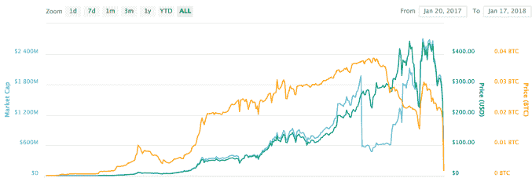
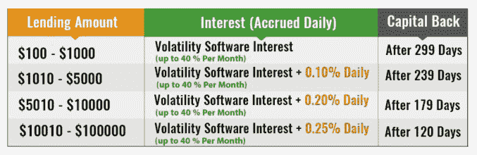

# 被指控经营庞氏骗局的 Bitconnect 关闭了 

> 原文：<https://web.archive.org/web/https://techcrunch.com/2018/01/16/Bitconnect-which-has-been-accused-of-running-a-ponzi-scheme-shuts-down/>

# 被指控经营庞氏骗局的 Bitconnect 关闭

Bitconnect 是一个借贷和交换平台，长期以来被密码界的许多人怀疑是一个庞氏骗局，它已经宣布关闭。

在[其网站](https://web.archive.org/web/20221230140654/https://bitconnect.co/system-news/94/changes-coming-for-the-bitconnect-system-halt-of-lending-and-exchange-platform)上的一份新闻稿中，该平台表示，关闭是由于围绕该平台的“持续负面报道”、来自得克萨斯州和北卡罗莱纳州证券委员会的两封停止信，以及对该平台的持续 DDoS 攻击。

虽然该平台表示他们将以 363.62 美元(过去 15 天令牌的平均价格)的价格退还所有未偿贷款，但 Bitconnect 令牌目前的交易价格下跌了约 80%，价值不到 40 美元，因此尽管用户可能已经在 BCC-equivalent 上获得了完整，但许多人肯定在美元或比特币方面遭受了严重的财务损失(这是他们最初投资的方式)。

加密货币社区的许多人公开指责 Bitconnnect 经营庞氏骗局，[包括以太坊创始人 Vitalik Buterin](https://web.archive.org/web/20221230140654/https://twitter.com/VitalikButerin/status/936482205865353216) 。

该平台由一种名为 BCC(不要与 [BCH 或比特币现金](https://web.archive.org/web/20221230140654/https://techcrunch.com/2017/08/02/wtf-is-bitcoin-cash-and-is-it-worth-anything/)混淆)的令牌驱动，由于交易平台已经关闭，该令牌基本上毫无用处。最近，这种代币从几个小时前的 200 多美元暴跌了 80%以上，跌至 37 美元左右。

如果你不熟悉这个平台，Bitconnect 是一个匿名运营的网站，用户可以将他们的加密货币借给该公司，以换取巨额回报，具体取决于贷款的期限。例如，一笔 10，000 美元、为期 180 天的贷款据称每月能给你带来 40%的回报，每天还有 0.20%的红利。

Bitconnect 还有一个蓬勃发展的多级推荐功能，这也使它有点类似于金字塔计划，成千上万的社交媒体用户试图使用他们的推荐代码来推动注册。

该平台表示，它为使用 Bitconnnect 交易机器人和“波动性交易软件”的用户创造了回报，通常平均每天约 1%。

当然，从市场波动中获利是一种合法的交易策略，也是许多对冲基金和机构交易员使用的策略。但 Bitconnect 承诺(和支付)超大且有保证的回报让许多人认为这是一个用新抵押贷款支付现有贷款利息的庞氏骗局。

下面的图表将确定使用该平台的用户数量。

所有 Bitconnect 贷款都以美元计价，但必须以该平台的本地加密货币 BCC 进行。因此，为了进行贷款，用户必须将比特币存入平台，然后以任何市场价兑换成 BCC。贷款利息和本金也只能以密件形式支付，这意味着在贷款期限结束后，用户必须将其兑换回比特币(如果需要，还可以兑换成美元)。

要求 BCC 参与贷款计划导致 BCC 的需求(和价格)自然飙升。在不到一年的时间里，这种货币从不到一美元(市值以百万计)涨到了 430 美元左右的历史高点，市值超过 26 亿美元。

但是现在由于代币没有其他用途，它的价格可能会继续下跌。该公司确实表示，他们的 Bitconnect X 交易平台的 [ICO 仍将继续，](https://web.archive.org/web/20221230140654/https://bitconnect.co/system-news/94/changes-coming-for-the-bitconnect-system-halt-of-lending-and-exchange-platform)，BCC 令牌的交易将继续进行。