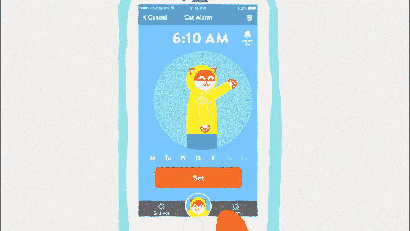

# 一家饮料公司收购并关闭了雨披天气应用 

> 原文：<https://web.archive.org/web/https://techcrunch.com/2018/05/29/a-beverage-company-bought-and-shuttered-the-poncho-weather-app/>

# 一家饮料公司购买并关闭了雨披天气应用程序

他们说你无法预测天气。收购往往也是如此。例如，如果你昨天告诉我，可爱的天气应用 Poncho 将被一家直接面向消费者的饮料公司收购并关闭，我会告诉你，这就像一只同样是气象学家的猫一样可信。

然而，我们在这里。高端饮料制造商 Dirty Lemon 以 10 美元一杯的价格通过短信销售产品，该公司已经购买了这款广受欢迎的应用。该公司在一份新闻稿中确认了此次收购[，其中包含了首席执行官扎克·诺曼丁(Zak Normandin)的以下时髦话语:“这一合作伙伴关系推进了我们的愿景，即通过扩大我们作为一个组织的技术能力，建立一个无摩擦的对话平台。”](https://web.archive.org/web/20221208035304/https://www.businesswire.com/news/home/20180529005820/en/DIRTY-LEMON-Acquires-Poncho---Solidifies-Status)

嗯，是的，很明显。

Poncho 更直白地描述了这一切对这款应用的命运意味着什么。“这意味着不再有天气…预报，”该公司的首页上写道。“显然天气还是会变好的，哈哈。我希望你每次看到它都会想起我，除非是恶劣的天气，在这种情况下，请想想竞争对手的天气服务。”

对于 Poncho 本身来说，这意味着该公司的首席执行官 Sam Mandel 将担任 Dirty Lemon 的顾问，团队的其他成员将并入其母公司。这些员工将致力于帮助改善这家饮料公司基于短信的销售模式。

Mandel [告诉 Fast Company](https://web.archive.org/web/20221208035304/https://www.fastcompany.com/40578222/exclusive-weather-app-poncho-has-been-acquired-by-a-boutique-beverage-company) 这项服务最终未能将其产品货币化，尽管[通过去年在《应用星球》上的亮相筹集了 200 万美元](https://web.archive.org/web/20221208035304/https://techcrunch.com/2017/08/14/poncho-weather-service-picks-up-2-4-million-from-lightspeed-venture-partners/)。“我们无法达到临界质量，”他说。“打造一款独立引人注目的产品是一项挑战[……]。”

显然，对于 Dirty Lemon 昂贵的饮料业务来说，情况并非如此。