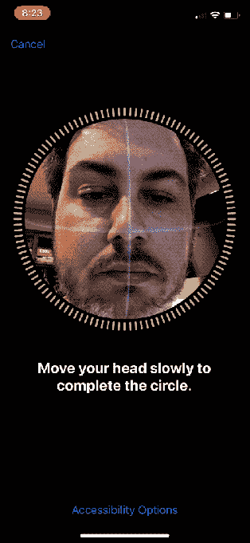

# 近距离观察 iPhone X 面部映射的功能和风险 

> 原文：<https://web.archive.org/web/https://techcrunch.com/2017/11/04/a-closer-look-at-the-capabilities-and-risks-of-iphone-x-face-mapping/>

周五[苹果](https://web.archive.org/web/20221006042157/https://beta.techcrunch.com/2017/11/03/iphone-x-apple-store-line/) 粉丝排队购买新发布的 iPhone X:苹果认为这款旗舰智能手机的更新足以跳过一个数字。撕 iPhone 9。

这款闪亮的新硬件包括一个前置传感器模块，位于现在臭名昭著的“凹口”中，该凹口从(近)边到边显示器的顶部取出一个难看但必要的部分，从而使智能手机能够感知和绘制深度——包括面部特征。

因此，iPhone X 知道是你的脸*在看着它，并能做出相应的反应，例如，在锁屏上显示通知的全部内容，而如果别人在看，它只是一个普通的通知。所以你好上下文计算。此外，共享设备还有额外的障碍。*

Face ID 已经引起了很多人的兴奋，但转向面部生物识别确实引起了隐私问题——考虑到人类的脸天生是一种表情丰富的媒介，不可避免地传达了许多关于其主人的信息，而他们不一定意识到这一点。

随着时间的推移，你不能说一张脸比一个手指能讲述更多的故事。因此，当 iPhone X 开始到达第一批买家手中时，仔细看看苹果是什么(而不是在这里做什么)是值得的…

## **Face ID**

iPhone X 的前置传感器模块的核心用途——苹果称之为原深感摄像头系统——是为一种基于面部生物特征的新认证机制提供动力。苹果的品牌名称是 Face ID。

要使用 Face ID iPhone X，用户需要在原深感摄像头前倾斜面部来注册他们的面部生物特征。(注意:完整的 Face ID 注册过程需要两次扫描，所以需要的时间比下面的 GIF 稍长。)

面部生物识别系统取代了其他 iPhone(包括新款 iPhone 8/8 Plus)仍在使用的触控 ID 指纹生物识别系统。

每部 iPhone X 只能为 Face ID 注册一张人脸，而触控 ID 则允许多个指纹。因此，共享设备就不那么容易了，尽管你仍然可以共享你的密码。

正如我们在之前的[细节中所掩盖的那样，苹果无法获得用户注册 Face ID 时注册的深度映射面部蓝图。iPhone X 用户面部的数学模型被加密并存储在本地设备的一个安全区域中。](https://web.archive.org/web/20221006042157/https://beta.techcrunch.com/2017/09/15/interview-apples-craig-federighi-answers-some-burning-questions-about-face-id/)

随着时间的推移，Face ID 还会学习，在日常使用中，也就是在成功解锁后，如果系统认为它们对“增加未来匹配”有用，用户面部的一些额外的数学表示也可以被创建并存储在安全的飞地中，正如苹果[关于 Face ID](https://web.archive.org/web/20221006042157/https://images.apple.com/business/docs/FaceID_Security_Guide.pdf) 的白皮书所述。如果你戴上眼镜、蓄起胡须、改变发型等等，Face ID 就能适应这种情况。

这里的关键点是，Face ID 数据永远不会离开用户的手机(或实际上是安全的飞地)。任何想要将 Face ID 认证整合到他们的应用程序中的 iOS 应用程序开发者也无法访问它。相反，身份验证是通过专用的身份验证 API 进行的，该 API 在将输入信号与安全区域中存储的 Face ID 数据进行比较后，仅返回肯定或否定的响应。

参议员艾尔·弗兰肯写信给苹果公司，要求在[正是这类问题](https://web.archive.org/web/20221006042157/https://beta.techcrunch.com/2017/10/17/apple-responds-to-senator-frankens-face-id-privacy-concerns/)上得到保证。苹果的回应信还证实，除了上面提到的零星 Face ID 增强功能，它通常不会在日常解锁期间保留面部图像。

“在正常解锁操作中捕捉到的面部图像不会被保存，而是在计算出数学表示与注册的 Face ID 数据进行比较后立即被丢弃，”苹果公司告诉弗兰肯。

苹果的白皮书进一步充实了 Face ID 的功能——例如，当有人试图解锁 iPhone X 时，原深感摄像头的点投影模块“投影并读取超过 3 万个红外点，形成一张专注的脸的深度图”(该系统还跟踪凝视，这意味着用户必须主动看着手机的脸才能激活 Face ID)，以及捕捉 2D 红外图像(通过模块的红外摄像头)。这也使得 Face ID 可以在黑暗中工作。

“这些数据被用来创建一系列 2D 图像和深度图，这些图像和深度图经过数字签名后被发送到安全区域，”白皮书继续说道。“为了对抗数字和物理欺骗，原深感摄像头将 2D 图像和深度图捕捉的序列随机化，并投射特定于设备的随机模式。A11 仿生处理器的神经引擎的一部分——在安全区域内受到保护——将这些数据转换为数学表示，并将该表示与注册的面部数据进行比较。这些注册的面部数据本身就是你的面部在各种姿势下的数学表示。”

因此，只要你对苹果的安全和工程能力有信心，Face ID 的架构应该会让你相信，解锁你的设备并在各种应用程序中验证你身份的核心加密面部蓝图永远不会在任何地方共享。

但 Face ID 实际上只是 iPhone X 的原深感摄像头模块所实现的技术的尖端。

## **通过 ARKit 进行面部追踪**

苹果还打算通过深度传感模块让开发者跟踪他们的面部表情，特别是面部跟踪增强现实，为 iPhone X 用户提供华丽而富有感染力的消费体验。AR 通常是苹果关注的一个巨大的新领域——苹果在今年夏天的 WWDC 活动中展示了其 ARKit 支持框架，供开发者构建增强现实应用。

虽然 ARKit 并不局限于 iPhone X，但通过前置摄像头进行面部跟踪的 ARKit 却是如此。因此，这是苹果新款旗舰智能手机的一大新功能。

“ARKit 和 iPhone X 在 AR 应用程序中实现了强大的人脸跟踪的革命性功能。看看你的应用程序如何检测用户面部的位置、拓扑结构和表情，所有这些都是高精度和实时的，”苹果在其[开发者网站](https://web.archive.org/web/20221006042157/https://developer.apple.com/videos/play/fall2017/601/)上写道，并继续标记该 API 的一些潜在用途——例如应用“实时自拍效果”或让用户的面部表情“驱动 3D 角色”。

消费者展示这里的可能性当然是苹果的新 animoji。也就是苹果发布 iPhone X 时在舞台上演示的动画表情符号，用户可以虚拟地戴上一个表情符号，就像戴上一个面具一样，然后记录下自己说的话(和面部表情)。

因此，iPhone X 用户可以自动“戴上”外星人表情符号。或者是猪。狐狸。或者 3D 便便。

但是，这仅仅是开始。通过 iPhone X，开发人员可以访问 ARKit 进行面部跟踪，以增强他们自己的面部增强体验——例如 Snap 应用程序中已经展示的面具。

“这项新功能能够在六个自由度上实现鲁棒的人脸检测和位置跟踪。苹果写道:“面部表情也会被实时跟踪，你的应用程序会提供拟合的三角形网格和加权参数，代表被检测面部的 50 多种特定肌肉运动。”

现在值得强调的是，使用这个 API 的开发人员并不能访问原深感摄像头系统可以捕获的每个数据点。这也不是在字面上重现被锁在安全飞地中的 Face ID 模型——苹果吹嘘这种模型足够精确，故障率低至百万分之一。

但是开发者显然被允许使用一些非常详细的面部地图。足以让他们建立强大的用户体验——比如 Snap 的花式面膜，看起来真的像 facepaint 一样粘在人们的皮肤上…

潜在的，足够让他们读懂一个人的面部表情在说什么——关于他们的感受，他们喜欢或不喜欢什么。

(iPhone X 上的另一个 API 提供了通过原深感摄像头进行 AV 捕捉的功能——苹果公司称“返回一个代表原深感摄像头全部功能的捕捉设备”，表明该 API 返回照片+视频+深度数据(尽管可能不是苹果公司用于 Face ID 的全分辨率)——可能旨在支持额外的视觉特效，如照片应用程序的背景模糊。)

现在我们来了解一下苹果在做什么。是的，它在保护你面部的数学模型，它使用 iPhone X 的深度传感硬件来生成，并通过 Face ID 成为解锁你的智能手机和认证你身份的关键。

但它也在规范和鼓励将面部映射和面部跟踪用于各种其他目的。

当然是娱乐性的，比如 animoji 和自拍镜头。甚至是帮助人们虚拟试戴配饰这样的小事情(见: [Warby Parker](https://web.archive.org/web/20221006042157/https://twitter.com/jstheoriginal/status/926825123088175105) 第一个尝试的人)。或者由面部表情驱动的易访问性界面。(我们采访的一位 iOS 开发者，计算器应用程序 PCalc 的开发者詹姆斯·汤姆逊说，他很好奇“你是否可以将面部跟踪作为一种辅助工具，用于那些可能没有(或没有)良好运动控制的人，作为一种替代控制方法”。)

然而，不需要太多的想象力，就可以想到某些公司和开发商可能真的想将面部表情的实时跟踪用于其他用途:超敏感的表情定向广告，从而为广告/营销目的提供更细粒度的用户特征。这当然是对隐私的又一次科技打击。

很明显，苹果很清楚这里的潜在风险。在其 [App Store 审查指南](https://web.archive.org/web/20221006042157/https://developer.apple.com/app-store/review/guidelines/)中的条款规定，开发者必须获得“安全用户同意”才能收集“面部深度映射信息”，还明确禁止开发者将通过原深感摄像头系统收集的数据用于广告或营销目的。

在开发者指南第 5.1.2 (iii)条中，苹果写道:

> 从 HomeKit API 或深度和/或面部映射工具(如 ARKit、相机 API 或照片 API)收集的数据不得用于广告或其他基于使用的数据挖掘，包括第三方。

它还禁止开发人员使用 iPhone X 的深度感应模块试图创建用户档案，以识别和跟踪手机的匿名用户——在 5.1.2 (i)中写道:

> 您不得试图、协助或鼓励他人根据从深度和/或面部映射工具(例如 ARKit、相机 API 或照片 API)收集的数据，或您所说的以“匿名化”、“聚合”或其他不可识别的方式收集的数据来识别匿名用户或重建用户档案。

而政策中的另一条款(2.5.13)要求开发者不得将原深感摄像头系统的面部映射功能用于账户认证目的。

相反，开发者需要坚持使用苹果提供的用于与 Face ID 接口的专用 API(和/或其他 iOS 认证机制)。所以基本上，开发者不能使用 iPhone X 的传感器硬件来尝试构建他们自己版本的“Face ID”并将其部署在 iPhone X 上(如你所料)。

他们还禁止 13 岁以下的孩子使用面部识别进行身份验证。

> 使用面部识别进行帐户认证的应用程序必须使用 [LocalAuthentication](https://web.archive.org/web/20221006042157/https://developer.apple.com/documentation/localauthentication/) (而不是 ARKit 或其他面部识别技术)，并且必须为 13 岁以下的用户使用备用认证方法。

面部数据的敏感程度几乎无需多言。因此，苹果显然旨在设定参数，缩小(如果不是完全消除)对其旗舰硬件现在提供的深度和面部跟踪工具的潜在滥用的担忧。通过控制对关键传感器硬件的访问(通过 API)，以及其开发者必须遵守的政策，否则将面临被其应用商店拒之门外的风险，并被禁止利用其应用赚钱。

“在苹果的生态系统中，保护用户隐私是最重要的，在处理个人数据时，你应该小心谨慎，以确保你遵守了适用的法律和[苹果开发者计划许可协议](https://web.archive.org/web/20221006042157/https://developer.apple.com/terms/)的条款，更不用说客户的期望了，”苹果在其开发者指南中写道。

更广泛的问题是，这家科技巨头将能够在多大程度上监管每一位 iOS 应用开发者，以确保他们和他们的应用遵守其规则。(我们要求苹果就此话题进行采访，但在撰写本文时，苹果尚未提供发言人。)

苹果向 iOS 开发者提供的深度数据——由于 iPhone 7 Plus 的双摄像头，这些开发者以前只能在更低的分辨率下使用该设备——可以说，由于 iPhone X 中的额外传感器硬件，现在可以更容易地构建面部跟踪应用程序。

尽管开发者尚未在这方面受到苹果的广泛激励——因为深度感应功能目前仍仅限于少数 iPhone 型号。

虽然过去任何被授权访问 iPhone 摄像头硬件的 iOS 应用程序都有可能使用来自前置摄像头的视频，例如，试图通过算法跟踪面部表情(即通过推断深度)，这也是事实。

因此，关于面部数据和 iPhone 的隐私风险并不是全新的，只是由于 iPhone X 上更好的硬件，可能有了更好的定义。

## **关于同意的问题**

在同意方面，值得注意的是，用户也必须主动让特定的应用程序访问相机，以便它能够访问 iOS 的面部映射和/或深度数据 API。

“你的应用描述应该让人们知道访问的类型(例如，位置、联系人、日历等。)是由你的应用程序请求的，如果用户不授予权限，应用程序的哪些方面将无法工作，”苹果指示开发者。

应用程序也不能从后台的 API 中提取数据。因此，即使用户已经同意应用程序访问相机，他们也必须主动使用应用程序，以便能够获取面部映射和/或深度数据。因此，应用程序应该不可能持续跟踪用户——除非用户继续使用他们的应用程序。

尽管公平地说，用户未能阅读和/或正确理解数字服务的条款和条件仍然是一个长期存在的问题。(苹果有时会授予某些应用程序额外的权限[——例如，苹果临时赋予优步记录 iPhone 用户屏幕的权限，即使该应用程序在后台运行。但这是个例外，而不是常规。)](https://web.archive.org/web/20221006042157/https://gizmodo.com/researchers-uber-s-ios-app-had-secret-permissions-that-1819177235)

除此之外，某些将摄像头作为其核心主张一部分的流行应用程序，例如脸书、Snap、Instagram 等社交共享应用程序，可能会要求用户在使用该应用程序时访问 TrueDepth API。

因此，用户的“选择”可能是被他们最喜欢的应用程序面部跟踪，或者完全放弃使用该应用程序…

我们采访的一名 iOS 开发人员淡化了与 TrueDepth 模块中额外的传感器硬件相关的隐私担忧的扩大，他辩称:“在一定程度上，如果用户允许使用 2D 前置摄像头，你就可以用它做一些事情——增加的深度数据并不会真正改变什么。”

另一位用户表示，苹果通过新 API 提供的深度数据的分辨率仍然“相对较低”，同时也是比 iPhone 7 Plus 深度数据“略高的分辨率数据”。尽管这个开发者还没有测试出 TrueDepth API 来证明他们的假设。

“我使用过 iOS 11 深度数据 API(在 WWDC 推出的那些；他们告诉我们，他们至少在 iPhone 7 Plus 上提供的数据是非常低的分辨率(< 1MP)。

我们接触的大多数 iOS 开发者仍然在等待获得 iPhone X，以便能够开始使用 API，看看有什么可能。

不过，最终将由个人 iPhone X 用户决定他们是否信任特定的公司/应用程序开发商，让他们访问摄像头，从而访问苹果在 iPhone X 上放在开发商手中的面部跟踪和面部映射工具包。

然而，用户同意的问题可能是一个棘手的问题，特别是鉴于欧盟对公司如何处理和处理个人数据的监管越来越严格。

《GDPR》(通用数据保护条例)将于明年 5 月在欧盟 28 个成员国生效，并为处理欧盟公民个人数据的公司设定了新的责任和义务——包括扩大个人数据的定义。

由于美国科技巨头拥有许多欧盟用户，欧洲的新规定实际上有望提高主要应用程序的隐私标准——这要归功于违反欧盟规定的公司面临更高罚款的风险。

GDPR 法案下的责任也可以延伸到公司雇佣的代表其处理个人数据的任何第三方实体——尽管尚不完全清楚，就苹果而言，考虑到它自己与 iOS 开发者的业务关系，它是否会以任何方式对 iOS 开发者处理应用用户个人数据的方式承担责任。或者某个特定应用程序的所有风险和责任是否将由它的开发者(以及他们自己的任何子处理器)承担。

毫无疑问，欧盟的规定已经在告知苹果如何形成自己与应用程序开发者的合同安排——例如，规定开发者必须获得用户的适当同意，以便它可以证明自己采取了适当的合同措施来保护用户数据。同时也限制了开发者可以对数据做什么，正如上面详细描述的条款所示。

不过，苹果让开发者更容易大规模地绘制和追踪用户的面部也带来了风险。福克斯罗斯柴尔德律师事务所(Fox Rothschild)的合伙人、隐私和网络安全专家斯科特·弗尼克(Scott Vernick)表示同意:“每次你在生态系统中引入一个新的参与者，你就在制造漏洞。”。“因为这是一个……你如何监管所有这些应用开发者的问题？”

有一点是明确的:应用程序开发者处理欧盟用户的个人数据需要获得的许可级别——面部数据绝对是个人数据——将在明年大幅提高。

因此，举例来说，Snap 目前在询问 iPhone X 用户相机权限时向他们显示的通用措辞(见下面的截屏)不太可能符合欧洲明年即将出台的同意标准——因为它甚至没有指定它使用相机访问权限的目的。也没有说它是否在进行面部追踪。一个模糊的“和更多”在将来可能是不够的…

[gallery ids="1563601，1563600"]

GDPR 还赋予欧盟公民询问公司掌握哪些个人数据的权利，以及要求删除他们个人数据的权利——这要求公司制定流程，以 A)准确了解他们掌握的每个用户的个人数据，以及 B)制定能够按需删除特定用户数据的系统。

Vernick 认为，GDPR 可能会在 iPhone X 支持的面部跟踪等功能方面产生重大影响——他说，使用苹果工具的开发者需要确保他们获得了用户的“适当披露”和“适当同意”，否则他们可能会面临违反即将出台的法律的风险。

“鉴于 GDPR 将于 2018 年 5 月生效，披露和同意的问题在欧盟方面变得难以置信地放大，”他说。“我认为，你会看到欧盟方面对第三方到底在获取什么信息相当感兴趣。因为他们想要确保获得适当的同意，而且还要确保与数据删除等相关的适当技术问题。”

当面部映射和跟踪开始起作用时，在 GDPR 下适当的同意看起来像什么？例如，一个应用程序可以只说它想使用相机吗——就像 Snap 一样——而不指定它可能会跟踪你的表情吗？

> 为了让 GDPR 满意，这种同意必须是公开的、臭名昭著的。

“如果你只是从 GDPR 的角度来看，我认为必须有一个非常臭名昭著的和彻底的披露，”弗尼克回应说。“我还没有想清楚这种同意是来自脸书，还是来自应用程序开发者本身或应用程序，但无论如何，不管谁对这种同意负责，正如我们在美国所说，这种同意必须是公开和臭名昭著的，才能让 GDPR 满意。”

“首先，GDPR 的设计前提是，默认情况下，数据是消费者的数据。这不是科技公司的数据，也不是应用开发者的数据，”他继续说道。“GDPR 的前提是，每一个控制或处理欧盟公民数据的国家都必须就应用程序、产品或服务的每一种用途获得具体同意。你还必须给予欧盟公民删除这些信息的权利。或者收回并移动它。因此，这些一般规则在这里同样适用，甚至更加适用。”

当被问及他是否认为 GDPR 将有效地提高美国数字服务用户以及欧盟用户的隐私标准时，韦尔尼克说:“这显然取决于公司，以及他们的业务有多少与欧盟有关，有多少实际上只是基于美国，但我实际上认为，作为一个监管问题，你会看到这种趋同。”

“欧盟和各州之间的监管分歧或监管分离将会减少，”他补充道。“我不认为它会立即发生，但如果欧盟法规和 GDPR 法规中非常普遍和优先考虑的事情，如果你没有看到它们蔓延到美国……[可能]只有一个标准在技术上更有效，所以你不必跟踪两个方案，我一点也不会感到惊讶。

“我认为，如果你愿意接受欧盟制定的标准，监管环境将会改善。”

在 GDPR 的背景下，苹果自己决定加密并只在本地存储用户的敏感面部生物识别数据是完全合理的——帮助它将自己的风险和责任降至最低。

“如果你以加密并存储在本地为前提，那就太好了。如果应用程序开发者离开这个前提，即使是以部分方式，即使他们没有完整的(面部)地图和所有的坐标，如果事实上存在非法访问，这也会产生风险。就获得任何其他个人身份信息的相同风险而言，”Vernick 说。

“每次你收集数据的时候，你都把自己暴露在执法机关面前，因为执法机关通常在某个时候想要一部分，”他补充道。“现在，苹果公司似乎已经阻止了这一点，它说它不能放弃它没有的东西，因为信息不是存储在苹果公司，而是存储在设备上……但如果这一原则受到任何方式或应用程序开发者的侵蚀，你就会成为这种事情的目标——这将引发一系列问题，比如执法部门到底在寻找什么，为什么要寻找它，等等。

"至少这些是面部识别带来的一些法律挑战."