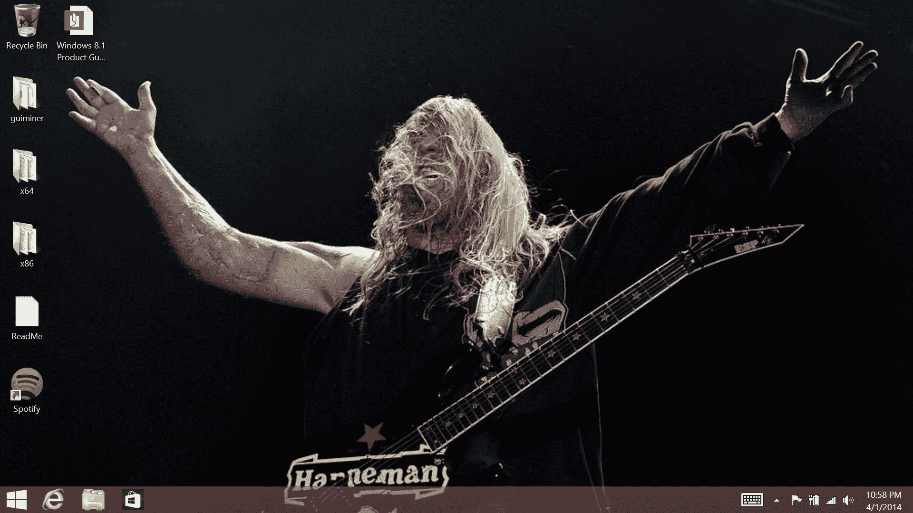
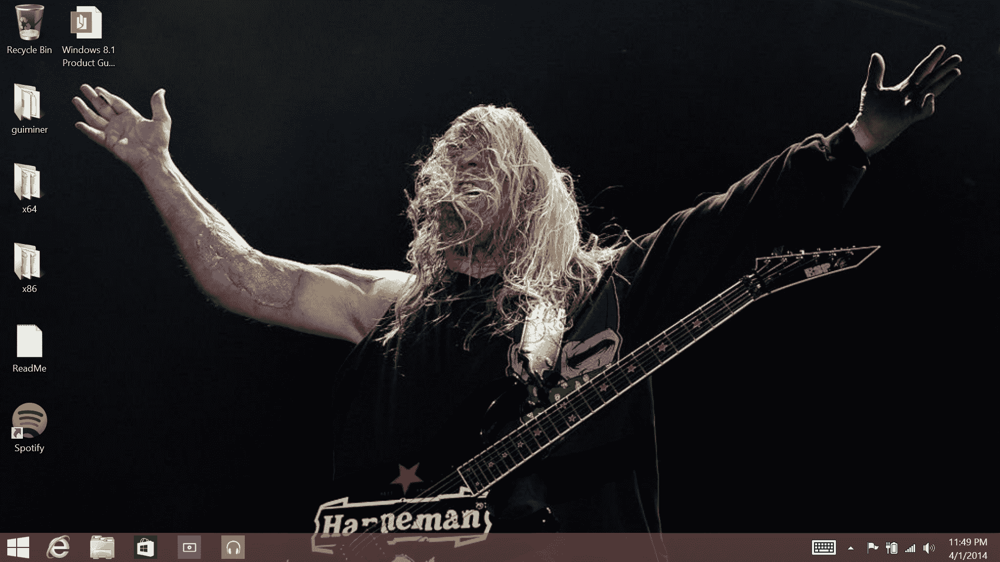
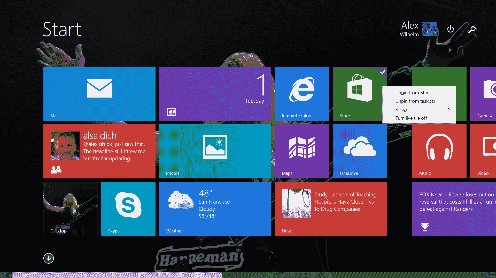
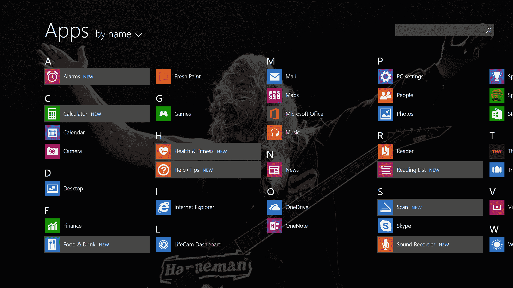

# 深入了解 Windows 8.1 更新 1 

> 原文：<https://web.archive.org/web/https://techcrunch.com/2014/04/02/a-closer-look-at-windows-8-1-update-1/>

正如 TechCrunch 此前报道的那样，微软今天详细介绍了 Windows 8.1 更新 1，宣布从 4 月 8 日开始，新代码将开始向全球操作系统用户推出。这将是通过 Windows Update 的逐步部署，所以不要设置警报。

我昨天会见了微软，讨论了这一更新，该公司喜欢称之为“激光聚焦”那些仍然是键盘和鼠标孩子的用户，而不是触摸优先的用户。微软告诉 TechCrunch，用户对触摸环境下的 Windows 的满意度很高，是有史以来任何版本 Windows 的最高水平，但键盘和鼠标用户的热情较低。

任何试图在不支持触摸的设备上运行 Windows 8 的人都可以证明这一点。因此，微软已经准备了一系列更新，使其新代码可以很好地安装在传统个人电脑上。其他更新包括，如重建 8.1，以更好地坐在廉价的硬件。让我们从那里开始。

## 设备支持

如果你是一家 OEM 厂商，想要销售 Windows 设备，你想要的是硬件灵活性。因此，在 Update 1 中，微软重新配置了 Windows 8.1，使其能够与 1gb 内存和 16gb 内部存储的设备一起工作。该公司戏称这些设备为 116 设备。

考虑到这一点，Windows 映像——在原始设备制造商为了追求类似利润而添加的垃圾和臃肿软件之前——已经被缩小了 60%。

这些轻量级、动力不足的设备还包括一种处理应用程序退出的更新方法。如果你用的是 116 的设备，你用 impact 处理器的机会很小。所以，微软将暂停更多的应用程序，使用尽可能少的内存，以防止应用程序完全冷启动；如果你缺少兆赫，等待时间可以从零到六十螺旋上升。

我们什么时候能在野外看到 116 设备？这取决于原始设备制造商，微软告诉 TechCrunch。

## 用户界面调整

转到软件更新，让我们深入了解一下有哪些新功能。首先:新的默认启动设置。如果你的设备是触摸优先的，Windows 8.1 Update 1——多好的名字！—将引导至 Metro 开始屏幕。比方说，如果你在台式机上，设备将引导至台式机。这里的目标是尽可能自然地使用新窗口。

Update 1 如何决定从哪里引导你？Windows 8.1 依靠原始设备制造商做出的电源选择来决定你拥有什么样的机器。例如，台式机很少进行节能调整。

正如所料，泄露，等等是的，在更新 1 中，Windows 商店现在默认固定在桌面任务栏上:

不出所料，根据微软的说法，测试表明，当他们在桌面上默认添加商店的快捷方式时，会有更多的人使用商店。这是另一个对微软很重要的小变化，因为该公司决心推动 Windows 8 商店应用的更多使用。你知道这种做法:更多的下载为开发者提供了积极的激励，他们将增加对 Windows 8.1 本身的投资，刺激更好的最终用户体验，微软希望利用这种体验来增强 Windows 并击败竞争平台。

此外，您还可以将其他应用程序固定在任务栏上:

在我们的会面中，我提出将 Metro 应用程序添加到桌面体验中是两个界面之间的一座桥梁。微软同意了。一座桥有多宽，它将管理什么样的交通是一个新问题。

延续统一桌面和 Windows 应用商店应用的主题，Metro 应用将像其他应用一样在任务栏上显示实时预览。

还存在其他调整。你现在可以在开始屏幕中右键点击应用程序来编辑它们的设置，这在以前是一种更多的触摸驱动的交互方式。

如果你将鼠标移至 Metro 应用程序的顶部，会出现一个包含“X”的栏，让你关闭该应用程序。长期以来，杀死 Metro 应用程序需要长时间向下滑动，如果你的屏幕不支持触摸输入，这将变得更加困难。这是一个很好的变化，出于某种原因，不可能截图。

此外，在 Metro 应用程序中，你可以用鼠标用力向下滑动来打开任务栏。没有强有力的输入，它不会被触发。这可以防止误报。类似的工作也在角落里进行。如果你用鼠标将光标移到 Update 1 的上角，它不会立即显示另一个你可以切换到的应用程序的图标。这又一次防止了误报，让键盘鼠标能够不受干扰地与应用程序的上斜坡进行交互。

微软还改变了某些文件类别的默认设置。从桌面启动一个图像，您现在将拥有类似 Windows 7 的体验。如果您有某些默认设置，您可以保留它们，但 Microsoft 会将其他默认设置分流到新的默认设置。这将减少桌面到地铁的颠簸。

继续，在更新 1 搜索和电源软按钮已被添加到开始屏幕用户界面。根据微软的说法——这让我的脑袋爆炸——他们收到的最大反馈是人们不知道如何关闭他们的电脑，或者找到搜索。讽刺的是，微软必须迎合更大的市场，所以增加了新的按钮。

最后，当你安装了新的应用程序来唤醒你的记忆时，微软会提醒你。所有应用视图现在也将突出显示新的应用。看起来是这样的:

这就是现在的要点。随着时间的推移，我们会有更多的想法。系好安全带。

【T2