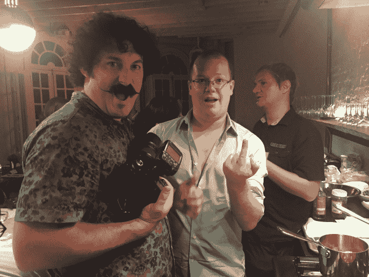

# 与厨师沃森的约会 

> 原文：<https://web.archive.org/web/https://techcrunch.com/2015/10/11/a-date-with-chef-watson/>

## 因在 2011 年赢得 Jeopardy 而闻名的 IBM 超级计算机沃森(Watson)现在也是一名厨师。

IBM 搜索了一群世界顶级厨师，然后添加了他们的少量知识和一大堆他们可以从以太网中提取的所有烹饪、食物和化合物数据，以制作[厨师沃森](https://web.archive.org/web/20221210033716/https://www.ibmchefwatson.com/)，这是一个超级计算机程序，旨在给我们提供人类想不到的怪异和美妙的食谱。

例如，像玉米粉圆饼上的牛肉和无花果，上面覆盖着磨碎的咖啡豆。

IBM 最近邀请我在上周的一次主厨沃森启发的三道菜晚餐上尝试上述混合物。出于娱乐目的，我强迫喜欢挖苦人的 TechCrunch 作家亚历克斯·威廉(Alex Wilhelm)和我一起去。

对于旧金山来说，这是一个异常温暖的夜晚，我和亚历克斯艰难地爬上一些黑暗和蜿蜒的楼梯，进入一个隐藏的娱乐空间。我们是最后一个到达位于旧金山北海滩附近的 Cookhouse 的 20 多名 IBM 高管和媒体成员的现场。

“把你的东西放在那边，然后来拿杯鸡尾酒，”一个助手告诉我们，递给我一杯普罗塞克、小豆蔻、百里香和酸橙叶的混合物(另一种来自沃森的奇怪的提神混合物)。

亚历克斯·威廉作为亚历克斯·威廉与 IBM 活动摄影师。背景是厨师沃森首席工程师弗洛里安·皮内尔。

烹饪教育学院(ICE)与 IBM 合作，与烹饪大师(以及美食网的剁碎冠军)詹姆斯·布里肖尼(James Briscione)一起创造了时髦的用餐体验。Briscione 主厨利用 Watson 为我们制作了晚餐，但他告诉我们，实际上并不是 IBM 的超级计算机在做饭，而是我们在做饭。

亚历克斯很快推断出翻转芹菜和几个鸡肉汉堡将是最容易的部分，志愿我们作为烧烤任务的贡品。在等待肉煮熟的时候，除了在它看起来准备好的时候翻面之外，你没有什么可以做的，所以当其他人都在切肉的时候，我们喝着鸡尾酒，拍着不可分的食物照片。

鸡肉汉堡是主菜的一部分，由鸡肉、罗勒、芫荽和布里干酪组成。草莓在我们旁边的炉子上的平底锅里煨着，融化了汁液，变成了柔软的糊状物，Briscione 后来用它来做草莓番茄酱。

这顿饭是布里斯班自己想出来的吗？鸡肉汉堡还不算太离谱，但是鸡肉汉堡上的草莓酱就开始变得奇怪了(它尝起来像果酱，我认为它实际上只是鸡肉汉堡上的果酱，他们称之为番茄酱)。

“沃森教会了我真正的创造力，”布里斯班在我们开始挖掘之前告诉观众。“作为一名厨师，你要花很多时间去构思和创造一道菜，而你所有的精力都浪费在挑选食材上了。”

布里肖尼指着一道看起来像填充水果卷的开胃菜。“你可能吃过这样的东西，”他指着一盘红色的小卷片说。“一份烤甜菜沙拉，配有松露盐、松露调味汁、一些山羊奶酪和杏仁。这是获取这些成分的简单方法。”

取而代之的是，Briscione 将这些成分、甜菜和块菌制成水果皮，用山羊奶酪填充，然后蘸上烤杏仁。“这就是我们的想法。我们如何获取新信息，关注它，并利用它变得更有创造力，”他说。

[gallery ids="1222036，1222040，1222041，1222042，1222039，12222046，12222053，1222043，12222044，12222045，1222047，1222048，12222055，12222049，12222050，122050

但你不必是顶级餐厅或烹饪机构的主厨，也可以从沃森的美食家头脑中挑选。像你、我和亚历克斯这样的非烹饪手艺人也可以使用厨师沃森的网络应用程序制作我们自己的混合物。

晚饭后，我去了网站创建我自己的潜在灵感食谱。你可以从选择一种或几种配料开始。沃森会为你提供一些想法，但你可以更深入地选择一种风格的饭菜(美国、亚洲、某人的生日)或一种菜肴(烧烤、泡菜、玛格丽塔)，沃森会从那里做出一些东西。

厨师沃森项目的工程负责人弗洛里安·皮内尔解释说，它的工作原理是将每道菜的配料中的某些化学化合物放在一起。厨师沃森最推荐的一些配料是咖啡、茶和啤酒，因为它们用途广泛。例如，咖啡含有 100 多种有用的风味化合物。

> 作为一名厨师，你花了很多时间去构思和创造一道菜，而你所有的精力都浪费在挑选食材上了。主厨詹姆斯·布里斯班

IBM 告诉我们，厨师沃森已经帮助发现了一些相近的成分，它们在一起会更好地工作，这是人们不会本能地想到的。“例如，我们发现苹果与橄榄油中的芳香化合物比黄油更相似，”皮内尔说。

沃森比在网上搜索数百种可能有用的食谱要容易得多。我也喜欢我可以输入一种(或两种或三种)我可能需要做些什么的多余成分，它会为我带来想法，但它不会取代我们的人类厨师。至少现在还没有。

在厨房里做实验仍然有一些令人愉快的事情。就我而言，这有时会导致歇斯底里的结果，值得开怀大笑，并发誓下次只点 Postmates，但这也促使许多厨师有了新的烹饪发现。

IBM 希望沃森能在创意过程中助一臂之力，而不是取代人类厨师——并提供更多方式来取悦我们的味蕾，而不仅仅是少量数据和科学提示。