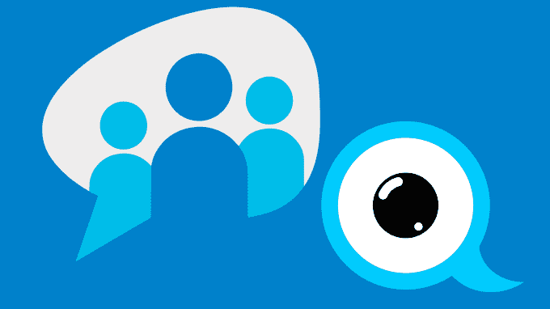

# 去中心化的网络将把权力还给在线的人们

> 原文：<https://web.archive.org/web/https://techcrunch.com/2016/10/09/a-decentralized-web-would-give-power-back-to-the-people-online/>

马修·霍奇森撰稿人

马修·霍奇森是

[Matrix.org](https://web.archive.org/web/20221209025548/http://matrix.org/)

，一个统一聊天、VoIP 和物联网技术的非营利性开源项目。

最近谷歌推出了视频通话工具(没错，又一个)。Google Hangouts 已经被企业边缘化，Google Duo 应该是视频通话领域的下一个大事件。

所以现在我们有了微软的 Skype，苹果的 Facetime，还有谷歌的 Duo。每个大公司都有自己的同等服务，每个公司都被困在自己的泡沫中。这些服务可能很棒，但它们并不完全是我们在互联网建立的梦幻年代所想象的。

如果你还记得的话，网络和互联网的最初目的是建立一个普通的中立网络，每个人都可以平等地参与其中，为人类造福。幸运的是，有一个新兴的运动将网络带回这个愿景，它甚至涉及到了网络诞生以来的一些关键人物。它被称为去中心化 Web 或 Web 3.0，描述了一种在互联网上建立服务的新兴趋势，这种服务不依赖于任何单一的“中心”组织来运行。

那么网络最初的梦想发生了什么？在第一次互联网泡沫期间，大部分利他主义都消失了，因为人们意识到，在这种中性结构上创造价值的一个简单方法是建立收集、捕捉和货币化信息的集中式服务。

搜索引擎(如谷歌)、社交网络(如脸书)、聊天应用(如 WhatsApp)通过在互联网上提供集中服务而发展壮大。例如，脸书对互联网的未来愿景是只提供其认可的集中服务子集(Internet.org 和免费基础服务)。

与此同时，它禁用了基本的互联网自由，如通过 URL 链接内容的能力(迫使你只能在脸书境内分享内容)或搜索引擎索引其内容的能力(脸书搜索功能除外)。

去中心化的网络设想了一个未来的世界，在那里，通信、货币、出版、社交网络、搜索、存档等服务不是由单一组织拥有的集中服务提供的，而是由人民自己的社区提供的技术提供的。他们的用户。

去中心化的核心思想是，一个服务的运营并不是盲目地托付给任何一个单一的无所不能的公司。相反，服务的责任是共享的:也许是跨多个联邦服务器运行，也许是以完全“分布式”的对等模型跨客户端应用程序运行。

尽管社区可能是“拜占庭式”的，没有任何理由相互信任或依赖，但描述去中心化服务行为的规则旨在迫使参与者公平行事，以便完全参与，严重依赖于 Merkle 树和数字签名等加密技术，以允许参与者相互问责。

去中心化的网络必然支持三个基本领域:隐私、数据可移植性和安全性。

*   **隐私:**去中心化迫使人们更加关注数据隐私。数据分布在整个网络中，端到端加密技术对于确保只有授权用户才能读写至关重要。对数据本身的访问完全由网络在算法上控制，这与更集中的网络相反，在更集中的网络中，网络的所有者通常具有对数据的完全访问权，这有助于客户简档和广告定位。
*   **数据可移植性:**在一个分散的环境中，用户拥有自己的数据，并选择与谁共享这些数据。此外，当他们离开一个给定的服务提供者时，他们仍然保持对它的控制(假设服务甚至有服务提供者的概念)。这很重要。如果我今天想从通用汽车公司转到宝马公司，为什么我不能随身携带我的驾驶记录？这同样适用于聊天平台历史记录或健康记录。
*   **安全:**最后，我们生活在一个安全威胁不断增加的世界。在中央集权的环境下，筒仓越大，吸引坏演员的蜜罐就越大。分散式环境就其一般性质而言更安全，不会受到黑客攻击、渗透、收购、破产或其他危害，因为它们从一开始就被构建为存在于公众监督之下。

正如互联网本身引发了一场大规模的重新平衡，将许多不同的互不相连的局域网连接起来，并提供了一个新的中立的公共基础，将它们连接起来，现在我们看到同样的模式再次发生，因为技术的出现为更高层次的服务提供了一个新的中立的公共基础。就像 Web 2.0 一样，Web 3.0 入侵的第一波浪潮已经在我们中间走过好几年了。

Git 作为一个完全去中心化的版本控制系统取得了巨大的成功——几乎完全取代了 Subversion 这样的中心化系统。众所周知，比特币展示了一种货币如何在没有任何中央权威的情况下存在，这与贝宝(Paypal)等中央权威形成了鲜明对比。Diaspora 旨在为脸书提供一个分散的替代方案。Freenet 为去中心化的网站、电子邮件和文件共享铺平了道路。

不太出名的是，StatusNet(现在叫做 GNU Social)提供了一个去中心化的 Twitter 替代品。XMPP 的建立是为了给 AOL Instant Messenger、ICQ、MSN 和其他消息孤岛提供一个分散的替代方案。

然而，这些技术一直处于边缘地位——是极客们的最爱，他们发明了这些技术，并愿意原谅它们在大众市场上的缺点，但令人沮丧的是，它们远未成为主流。潮流正在改变。公众的时代精神终于意识到，完全依赖大规模孤立的社区平台并不完全符合用户的最佳利益。

至关重要的是，新一代分散式创业公司得到了主流行业的关注，真正预示着新时代的到来。

Blockstack 和以太坊展示了区块链如何不仅仅是一种加密货币，而是作为一套通用的构建模块，用于构建需要强烈共识的去中心化系统。IPFS 和 Dat 项目提供了完全去中心化的数据结构，数据的所有权和责任由所有访问它的人共享，而不是托管在一个单独的位置。

当前势头的真正转变发生在 6 月份由互联网档案馆组织的去中心化网络峰会上。该活动聚集了许多最初的[“互联网和万维网之父”](https://web.archive.org/web/20221209025548/https://blog.archive.org/2016/06/16/decentralized-web-summit-with-tim-berners-lee-vint-cerf-and-polyfill/)来讨论“锁定网络开放”的方法，并重塑一个“更可靠、更隐私、更有趣”的网络

互联网档案馆的创始人布鲁斯特·卡尔(Brewster Kahle)亲眼目睹了去中心化技术的加速发展，同时考虑如何将集中的互联网档案馆迁移到去中心化:由使用它的社区运营和托管，而不是作为一个脆弱和易受攻击的单一服务。

此外，蒂姆·伯纳斯·李、温顿·瑟夫、布鲁斯特本人以及许多互联网老派人士在峰会上的热情出席表明，去中心化的转变第一次引起了当权派的注意，甚至得到了他们的认可。

蒂姆·伯纳斯·李[说](https://web.archive.org/web/20221209025548/https://archive.org/details/DWebSummit2016_Keynote_Tim_Berners_Lee):

> 网络被设计成去中心化的，这样每个人都可以通过拥有自己的域名和自己的网络服务器来参与其中，但这并没有成功。相反，我们遇到了个人数据被锁在这些筒仓中的情况。[……]因此，这个提议是为了恢复去中心化网络的理念。
> 
> 给人们带回力量。我们认为，我们将通过调整来进行一场社会革命:我们将使用网络技术，但我们将以这样一种方式使用它，即我们将你使用的应用程序与你使用的数据分开。

我们现在看到的挑战是使这些新技术成熟，并把它们完全推向大众市场。在商业上，去中心化有巨大的价值:虽然当前的筒仓可能会被冲走，但新的筒仓总会出现在新的公共基础之上，就像最初的网络一样。

Github 是这方面的标杆:一家价值 20 亿美元的公司，完全建立在 Git 的分散技术之上的增值服务——尽管用户可以在任何时候带走他们的数据并离开。

同样，随着新的机遇在这个勇敢的新世界中出现，我们希望看到新一波公司提供分散的基础设施和商业上可行的服务。

最终，很难预测 Web 3.0 将把我们带向什么样的最终方向，而这正是问题所在。通过将网络从少数玩家手中解放出来，这将不可避免地促成创新的激增，并让优先考虑用户利益的服务蓬勃发展。

苹果、谷歌、微软和其他公司都把自己的利益放在心上(他们应该如此)，但这意味着用户通常可以被视为纯粹的收入来源，完全是以用户为代价的。

随着去中心化的网络吸引了主流开发者社区的兴趣和热情，很难说会出现什么样的新经济，他们会发明什么样的新技术和服务。有一点可以肯定的是，他们会一如既往地支持他们的社区和用户群，就像他们的创造者的利益一样。