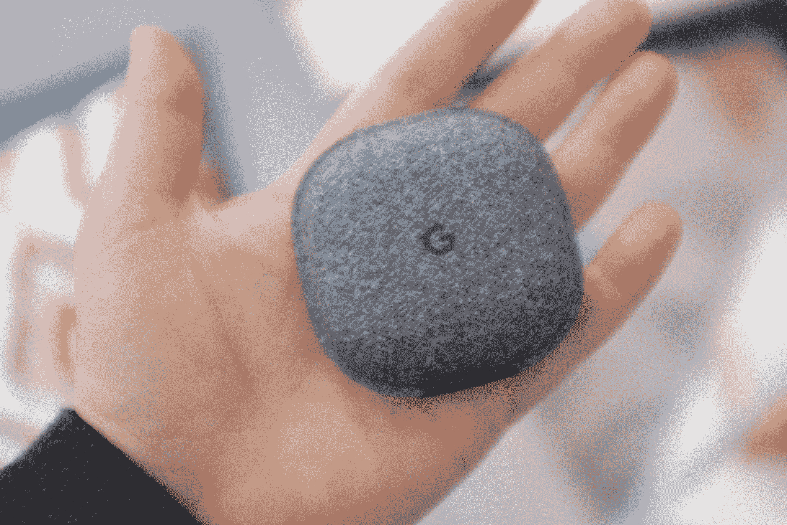

# 谷歌 Pixel Buds TechCrunch 令人失望的首次亮相

> 原文：<https://web.archive.org/web/https://techcrunch.com/2017/11/15/a-disappointing-debut-for-googles-pixel-buds/>

像素芽是一种必然性。当谷歌拥抱智能手机时代精神，放弃 Pixel 2 的耳机插孔时，耳机应运而生。

该公司的第一款蓝牙耳机售价 159 美元，试图缓解这种过渡，并为 Assistant 进入目前由 Alexa 主导的世界提供了另一个机会。如果谷歌能够完美地实现这一目标，这将是一个不错的消费电子炼金术，但最终结果更像是一个大杂烩。

Pixel Buds 是一种勇敢的努力，旨在脱颖而出，同时拥抱该领域几乎每个名字都采用的趋势，导致产品有时令人鼓舞，有时令人困惑，但大多数情况下还不错。它们是你真正想要喜欢的那种产品——但现在还没有。

## 个案研究

Pixel Buds 的案例是一个很好的迹象，任何一家公司都希望在熟悉的事物上注入独特的元素。如果 AirPods 的外壳看起来像一个 Glide 牙线自动售货机，那么谷歌的外壳就像一个快餐汉堡容器。这是一款翻盖手机，材料比苹果或三星的产品柔软得多。它也明显变大了。它可以很好地放在你的口袋里，但是会留下一个更大的凸起。

像竞争对手一样，这种情况下也有双重作用，既保护花蕾，让他们在一个地方，同时提供一些备用电池。谷歌对 Pixel Buds 电池的评价与 AirPods 大致相同，电池可以使用五个小时，另外还可以充电四次。总的来说，只要你记得把它们插回去，它就能帮你度过一天。

外部覆盖着灰色织物——这是一种很好的触摸，使其在美学上与谷歌 Home 系列的其他产品保持一致。它的手感也很好，很柔软，不像竞争对手的冷塑料。尽管如此，还是很难摆脱这种感觉，即这个案子有点站不住脚。随着时间的推移，很容易想象东西会磨损，或者在反复打开和关闭后，将顶部和底部连接在一起的薄塑料铰链会撕裂。

此外，我承认这是一个小小的狡辩，但要打开它有点困难。我通常最后不得不将一个指甲滑入前面的细缝中，以撬开顶部和底部。里面有两个小孔，花蕾可以用来充电。这也有点挤。与 AirPods 的磁性插槽或 IconX 的呼吸空间不同，我发现自己必须扭转像素芽才能让充电通知亮起。

然后还有脐带的问题。

## 次要绳索

我反复思考是否喜欢有一根绳子连接着花蕾。至少，这是它与最近涌现的许多其他蓝牙产品的区别。先来点专业的怎么样？

*   不用的时候，它们会放在你的脖子上
*   他们更难失去
*   额外的松弛提供了顶部的环，有助于保持它们在你的耳朵里

到目前为止，一切顺利，对吧？至于缺点，一目了然:把东西放回箱子里很痛苦。我的意思是，你会找到窍门的，别担心，但这需要一些努力。事实上，谷歌发送了一个动画 GIF 来展示如何正确地将线、芽和所有东西放进箱子里。

我把它包含在这里，因为它很方便。而且有很多错误的做法。相信我。即使你做得正确，你仍然会发现电缆不时会溢出来，无法完全关闭。不过，硬件还有一个更紧迫的问题，不仅仅是那根有时令人讨厌的电线。我花了很长时间才把这些东西装好。

像 AirPods 一样，Pixel Buds 由硬塑料制成，没有柔软、柔软的硅胶尖端。这意味着他们是不可原谅的——如果他们不适合，他们就不适合。至少对我来说，像素芽并不适合。当然，结果会因人而异，但我在 AirPods 上没有遇到太多麻烦。就像把它们放进箱子一样，像素芽需要一些机动动作来获得一个很好的配合。

一旦你做了几次，你就会找到窍门了。但是开始的几次尝试，这些东西一直从我的耳朵里掉出来。没有像 IconX 上那样的硅胶尖端意味着你不会得到紧密的密封。像素芽会让一些环境噪音进入——当你在繁忙的城市街道上时，这可能是一件好事，但在你自己家里的舒适性方面，这几乎不是理想的聆听体验。

就蓝牙耳塞而言，这种尴尬的配合最终会损害实际上相当好的音频。这是该公司超越苹果的一个关键点——当然也是重要的一点。我曾经尝试过很多更好的有线耳机，但谷歌在便利性和声音之间取得了平衡，这方面做得很好——只是令人失望的是，它被这么多糟糕的东西所拖累。

包括让耳机真正运转起来。

## 成对出现

从一些早期的在线反馈来看，我并不是唯一一个有这种想法的人。快速配对被认为是新芽的标志之一(推而广之，也是 Android 的标志之一)，但仍有一些问题需要解决。和其他人一样，我发现自己必须通过按住外壳内部的一个按钮并通过蓝牙设置来手动将 Pixel Buds 与 Pixel 2 配对。

这不是世界末日，但当你将这一卖点定位为可以与苹果的 W2 芯片竞争的东西时，当你不得不求助于更符合标准配对的东西时，这是一个相当大的遗憾。同样，结果可能会有所不同，但这似乎不是一个孤立的事件。当它工作正常时(就像我将 Libratone 耳机与 Pixel 2 配对时一样)，这是一个很好的简单的入门过程。效果好的时候。

## 宾至如归

谷歌助手是该产品的亮点之一。与 Pixel 2 一样，该硬件建立在该公司投入上下文搜索和人工智能的大部分工作基础上，以一个方便的包提供它。右侧耳塞可兼作触摸面板。触摸并保持特工风格点燃助理。双击触发通知。没有什么是你还没有在手机上的，但这是一种比直接对着手机说话更容易的与语音界面交互的方式。

然后，当然，还有翻译，那个在 10 月份让我们大吃一惊的杀手锏。这确实非常非常酷——不是这种要消除人类语言障碍的酷，但仍然很酷。我发现了一些关于人们在使用它时遇到的问题的报告。我没有这个问题，但是这里的实现仍然有点不稳定。这不是我们以为上个月承诺的现实生活中的巴别鱼。首先，它暂时需要一部 Pixel 手机。这没什么好惊讶的。谷歌确实想为自己的产品保留一些很酷的技巧。你还需要下载谷歌翻译应用到你的手机上，并启用你想翻译的语言(从 40 种语言列表中)。

然后，你需要按住右边的耳塞，向 Assistant 发出命令，Pixel Buds 就会听到语音并做出相应的翻译。功能仍然有限——但它是有效的。自然，翻译会有一点滞后，而且只适用于较短的短语。它也遇到了试图在嘈杂的环境中识别语音的常见问题，但它仍然是一个令人印象深刻的技巧。

它可以减轻出国旅行的一些麻烦，并且无疑将在未来的迭代中继续变得更好。翻译有潜力成为真正的杀手级应用，但就像其他芽一样，它感觉更像是未来的暗示

## 萌芽中的失望

像素芽有许多第一代产品的特征。有软件问题和奇怪的硬件选择。这可能是谷歌今年最受期待的硬件产品，一系列有趣的想法和勇敢的尝试都被包装在一个无法交付的产品中，这是一个令人失望的表现。

就在几年前，它们可能是市场上最引人注目的蓝牙耳机的竞争者。但考虑到竞争对手取得的巨大进步，它们大多会发出沉闷的撞击声。希望他们不冷不热的反应不会阻止谷歌的进一步发展，因为一个伟大产品的种子已经在这里了。但就目前情况来看，有更好的地方来花你的 159 美元。