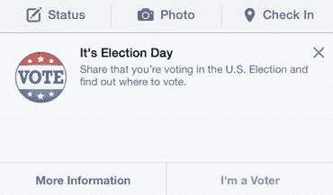

# 一次脸书黑客对更大民主的攻击 

> 原文：<https://web.archive.org/web/https://techcrunch.com/2014/12/09/a-facebook-hack-to-a-greater-democracy/>

More posts by this contributor

**编者按:** *Alex Teu 是 [odrive](https://web.archive.org/web/20221007125541/http://www.odrive.com/) 的执行副总裁。*

中期选举一个月后，共和党欢欣鼓舞，民主党步履蹒跚。但是民主受到了巨大的冲击。

根据纽约时报的报道，这次选举是 72 年来最糟糕的一次。T21 全国合格人口中只有 36.3%参加了投票。纽约只吸引了 28.8%。加州和德克萨斯州也吸引了不到三分之一的人。我们国家的首都华盛顿特区吸引了 30.3%的选票。骇人听闻。

为什么投票率这么低？当然，没有总统选举，但毫无疑问，冷漠统治了这一天。我对消除冷漠没有太大的希望或建议，但有一线希望:事实证明，当投票变得更容易时，更多的人会去投票。在科罗拉多州和俄勒冈州，允许他们的公民通过邮件投票，这两个州的投票率分别是第四和第五高(分别是 53%和 52%)。

我们是一个冷漠、分心和幻灭的国家。让我们承认这一点。

我的一个同事想让投票，但没有，因为她没有登记。让更容易注册每个人。

我确实投了票，但除了加利福尼亚州州长办公室、我帮助的一名候选人的当地学校董事会竞选以及两个提案(加利福尼亚州的一件怪事)之外，我知道的并不多。我的“研究”主要包括阅读命题的标题描述，以及候选人的姓名识别。这就是为什么现任者通常会赢，广告会起作用。我的过失。

选举日那天，脸书在每个美国用户的新闻页面上方张贴了投票提醒横幅。你不会错过的。

脸书在2010 年选举中使用了类似的旗帜，研究表明的努力导致在全国增加了34 万张选票。

喜欢也好，喜欢也好，讨厌也好，脸书吸引了我们的注意力。用户统计证实了这一点:全球日活跃用户 8.64 亿，美国和加拿大 dau 1.52 亿。

为了国家和民主，我们需要 T21 征召脸书服役。我半开玩笑地说，但事情已经到了这一步。这是我的建议:

*   选民登记。将您的驾照或身份证上传到脸书，注册到投票。
*   候选人和问题信息库。这个应该是中立的。我知道，说起来容易做起来难。或许可以让每个候选人和支持某个问题到的小组用 500 字对和的立场进行总结。那真的是大多数人能够保持专注的 max。
*   脸书直选。

顺便说一句，我不能因为这个激进的想法而居功。的内核的想法是由戴夫·艾格斯在他的小说《圈子》中提出的，该小说讲述了一家科技公司以了解其用户的一切为美德。是参考到 脸书还是谷歌？两者都有？

艾格斯滑稽而黑暗地描绘了一个奥威尔式的社会，一家私人公司知道你的每一个行动，每一个想法。我很清楚这种滑坡，但现在是时候到至少考虑一下我们如何利用技术到让更容易投票，经常投票和明智投票。邮寄选票很好，但这还不是我们所能做到的最好的。