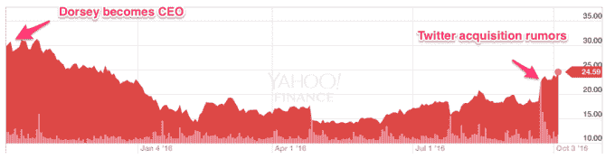
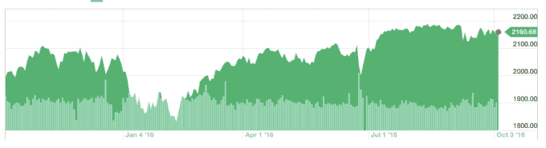
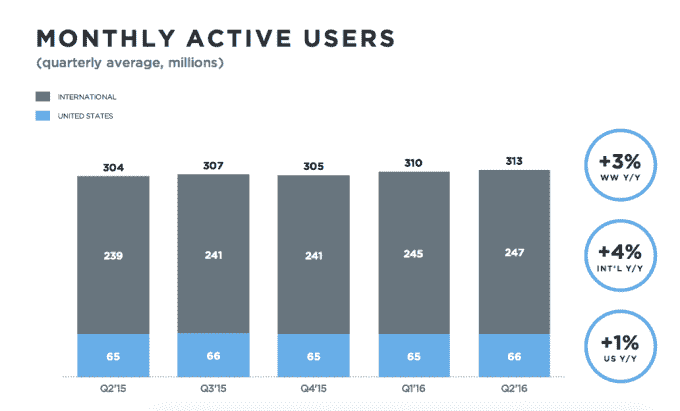
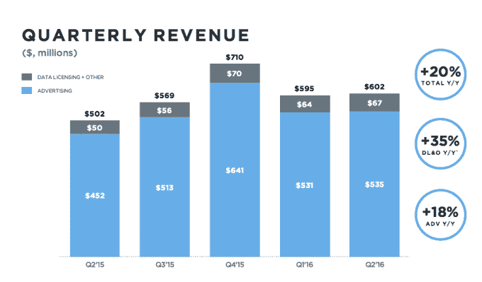
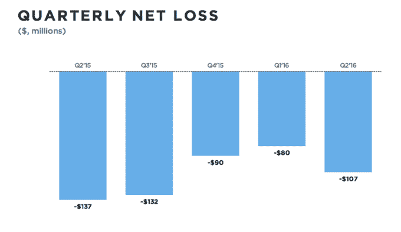

# 一些图表总结了杰克·多西担任 Twitter 首席执行官 TechCrunch 的第一年

> 原文：<https://web.archive.org/web/https://techcrunch.com/2016/10/05/a-few-charts-that-sum-up-jack-dorseys-first-year-as-twitter-ceo/>

杰克·多西，推特周年快乐。事情似乎并不顺利，但隧道的尽头有一线光明——Twitter 可能会被科技行业(或[娱乐行业](https://web.archive.org/web/20221006232559/https://beta.techcrunch.com/2016/09/26/yep-disney-is-in-talks-with-bankers-about-possible-twitter-acqisition/))某处的[某个人收购。](https://web.archive.org/web/20221006232559/https://beta.techcrunch.com/2016/09/23/salesforce-google-twitter/)

公平地说，多尔西从他的前任(们)那里继承的公司，包括一系列前产品负责人和首席执行官迪克·科斯特罗，一开始并没有那么好。但多尔西的回归被认为是 Twitter 的回归，希望他能进来，改变现状，让公司最终扭亏为盈，让华尔街高兴。

因此，在过去一个月左右的时间里，人们就该公司是否应该保持独立，或者作为一个更大帝国的一部分是否有意义做出了很多决定，这个帝国可以投入更多资源来发展它。每一个都有自然的论据——Twitter 是新闻(还有体育)的首选来源之一！)，但像 Salesforce 这样的公司可以为它注入额外的活力，让用户群更广泛地增长。或许该公司再次需要新鲜血液。

多尔西试图在他的任期内使这项服务不那么混乱，例如[改变推文的呈现方式](https://web.archive.org/web/20221006232559/https://beta.techcrunch.com/2016/02/10/twitter-will-now-put-recommended-not-recent-tweets-at-the-top-of-your-timeline/)并删除一些[对媒体类型的字符限制](https://web.archive.org/web/20221006232559/https://beta.techcrunch.com/2016/09/19/twitters-new-simpler-rules-for-character-counts-in-tweets-go-live/)。但这家公司仍然饱受困惑、难以入伙、当然还有骚扰的困扰。

所以，转机还是没有真正发生。让我们快速浏览一下多尔西领导下的 Twitter 的一些图表。

作为参考，这里有一张标准普尔 500 一年的图表:

让我们看看该公司上个季度报告的用户群，这是华尔街和 Twitter 的主要症结所在:

因此，几乎没有任何增长(甚至一度出现小幅下降)。嗯。收入增长呢？在亚当贝恩(Adam Bain)的领导下，这暂时不是一个大问题，尽管一切仍源于用户增长。

Twitter 仍然在亏损:

最后一个简单的问题，不完全是*的图表——它支付了多少股票薪酬:*

 *

让我们以一些最近的头条新闻来结束这整件事:

所以，你可能感觉到了一点趋势:向现场视频的巨大转变，*一些打击骚扰和其他问题的尝试(尽管没有成功)，当然，在多尔西的领导下，结果乏善可陈。*

对于多尔西来说，这是一段艰难的旅程，最终可能会以最终出售给一家公司而告终。当然，任何事情都可能在最后一刻发生变化，但目前 Twitter 似乎需要调整自己——无论是通过日益激烈的内部变革，还是在新的所有权下引入新的领导层来实现这一点。而且总有明年！

Twitter 的第三季度收益将于本月晚些时候公布，很难相信这可能是我们在可预见的未来最后一次看到该公司的胆量。它可能会像 LinkedIn 一样以最后的结束语结束:“鉴于即将进行的合并，LinkedIn 将不会更新 2016 财年的前景，也不会举行 2016 年第二季度业务业绩的电话会议。”*