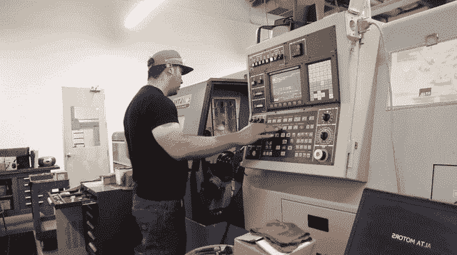
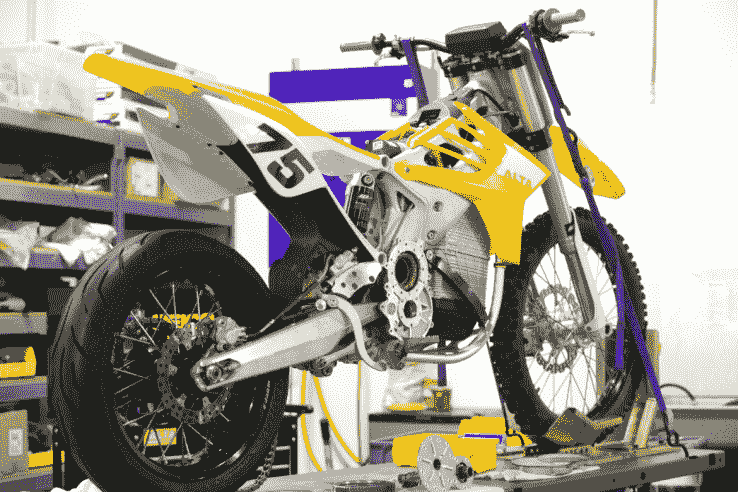

# Alta Motors 全电动摩托车工厂初探 

> 原文：<https://web.archive.org/web/https://techcrunch.com/2016/08/15/a-first-look-at-alta-motors-all-electric-motorcycle-factory/>

摩托车制造商 [Alta Motors](https://web.archive.org/web/20221007050625/https://www.crunchbase.com/organization/brd-motorcycles#/entity) 打开了他们在加州布里斯班的新工厂的大门，TechCrunch 在现场先睹为快。

这家工厂距离旧金山市中心很近，是一座低矮而不起眼的混凝土建筑。车内出奇的安静，部分原因是 Alta 生产的摩托车都是全电动的，这些摩托车的最终组装都是手工完成的。

这家初创公司的旗舰产品 [Redshift MX](https://web.archive.org/web/20221007050625/http://www.altamotors.co/machine/redshift-mx/) 是一款新上市的越野摩托车，零售价为 14995 美元。

该公司还生产这种自行车的街头合法版本，名为[红移 SM](https://web.archive.org/web/20221007050625/http://www.altamotors.co/machine/redshift-sm/) ，售价 15495 美元。

为什么建造他们自己的工厂，而不是外包给以摩托车制造闻名的市场，尤其是日本，雅马哈和其他公司的故乡？

[gallery ids="1369594，1369595，1369596，1369597，1369599，1369634，1369633"]

Alta Motors 的首席执行官兼联合创始人 Marc Fenigstein 说:“我们在内部做的一切都比外包做得更快、更便宜、产量更高。最困难的部分是建立一个供应链，按照质量和成本按时交付我们需要的所有 460 个零件。”

对于不熟悉的人来说，前身为 BRD 摩托车公司的 Alta Motors 是成功避免耗尽或淡出的电动汽车制造商之一，而 Mission Motors、Coda 和 Aptera 等其他公司已经倒闭，Brammo 和 Fisker 也在转型和裁员。

Fenigstein 说，该公司红移自行车的一个特别之处是，它的电池比摩托车上的任何其他电池每磅多行驶 80%。红移自行车从 0 加速到 60 只需 3.3 秒。

该公司声称，在轮胎不断增加和失去牵引力的环境下，Redshift 的电动传动系统和软件比传统的汽油动力自行车，甚至是高性能的自行车，能为骑车人提供更高程度的控制。

Alta 有 50 名全职员工，生产所有驱动摩托车的电子设备，以及包含电池的包装。他们从其他供应商那里购买电池、车轮、轮胎、刹车和悬挂系统。

他们自行车的电池特别重约 70 磅。Alta Motors 首席技术官和联合创始人德里克·多雷斯泰恩(Derek Dorresteyn)表示，这款车的重量为 30 公斤，发电量为 5.8 千瓦时。

Dorresteyn 指出，全电动自行车不需要像汽油动力自行车一样的维护，包括更换机油、更换空气过滤器和频繁的发动机改造。

这一点，以及与燃气自行车相当或更好的加速度，使得红移对那些不想花太多时间在骑行或比赛上来修理东西的骑手很有吸引力。

在 3 年内，Alta 计划在国际上销售红移和其他全电动产品。

这可能会使这家旧金山初创公司与中国的 Gogoro 等公司以及其他美国电动汽车摩托车制造商竞争，如[Zero motors](https://web.archive.org/web/20221007050625/http://zeromotorcycles.com/)和 [Harley-Davidson](https://web.archive.org/web/20221007050625/http://harley-davidson.com/) ，后者计划最终发布一款电动自行车。

Dorresteyn 和 Fenigstein 拒绝详细说明 Alta 可能开发的其他车辆以及何时开发，但他们表示，他们的技术可以用于全球大量生产的小型摩托车和小型摩托车。

迄今为止，Alta 已经筹集了 1750 万美元的股权融资，另外还有 200 万美元的风险债务融资。

该公司的顾问和天使投资者包括特斯拉的最初创始人和电池技术发明人[马丁·艾伯哈德](https://web.archive.org/web/20221007050625/https://beta.techcrunch.com/gallery/a-brief-history-of-tesla/)，以及 EnduroCross 发明人和将平地赛道摩托车赛引入极限运动会的人[埃里克·佩龙纳德](https://web.archive.org/web/20221007050625/http://ericperonnard.com/)。